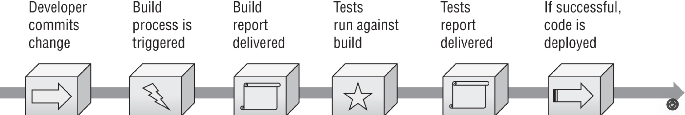

# DevSecOps: Automating Secure Deployments with GitHub Actions

**Goal:** Integrate CI/CD into my existing projects to automate builds, enforce security gates, and deploy code securely ensuring that “**when I update my site, security is included by default.**”


In a modern [DevSecOps model](https://www.redhat.com/en/topics/devops/what-is-devsecops), security is not a final checkpoint; it is an integral part of the development lifecycle.

My objective was to transform my GitHub repository from a simple backup into a fully functional, security-aware deployment pipeline.

## Continous Integration and Continous Deployment. CI/CD



**pipeline**: sequence of automated steps

**My Workflow:**

* **Push Code** → GitHub triggers the pipeline.
* **Security Audit** → Check for vulnerabilities (pnpm audit).
* **Build** → Compile the project (Astro).
* **Secure Deploy** → Sync files to my managed hosting environment via SSH key (no passwords).

>Automatic upload via SFTP after build.


## Setting Up Continuous Integration (CI)

The first step is to ensure my code builds correctly every time I push.

### Creating the Workflow File

Inside my project, I created the workflow directory and file:

```
mkdir -p .github/workflows/
touch .github/workflows/build.yml
```

**Adding the Security Gate**

A build that succeeds is useless if it contains vulnerabilities. I added a Security Audit step that acts as a gatekeeper. If vulnerabilities [high/critical] are found, the pipeline stops, preventing unsafe code from deploying.

Security Audit Workflow:

`touch .github/workflows/security-audit.yml`


```
name: Security Audit

on:
  push:
    branches: [main]
  pull_request:

jobs:
  audit:
    runs-on: ubuntu-latest

    steps:
      - uses: actions/checkout@v4

      - name: Setup pnpm
        uses: pnpm/action-setup@v3
        with:
          version: '10'

      - name: Setup Node.js
        uses: actions/setup-node@v4
        with:
          node-version: '20'
          cache: "pnpm"

      - name: Install dependencies
        run: pnpm install --frozen-lockfile

      - name: Run security audit
        # Fails the build if high/critical vulnerabilities are found
        run: pnpm audit --audit-level=high
        
      - name: Upload audit report
        uses: actions/upload-artifact@v4
        with:
          name: audit-report
          path: audit-report.json

```

The Strategy:

* **Workflow 1 (CI/CD Gate)**: build.yml includes the audit. If pnpm audit finds high-severity issues, the build fails. Purpose: "Do NOT deploy unsafe code."
* **Workflow 2 (Monitoring)**: A separate report generation to track vulnerabilities over time. Purpose: “Trend analysis and long-term improvement.”

#### Push it to GitHub     

```
git add .
git commit -m "Add CI build test"
git push
```

I checked if it works:

```
On my repo on GitHub
Clicked the “Actions” tab
```

I see
```
a workflow called “Test Build”
status: 🟢 success 
```
 


## Preparing the Server for Secure Deployment

To deploy securely, the golden rule is to never use root or a personal admin account.

In my case, this was straightforward: I do not have **root** privileges from the start. This is very common in managed hosting environments, where the provider restricts administrative access for security and stability.

### Generating and Managing SSH Keys

```
ssh-keygen -t ed25519 -C "ci-cd-deploy-key" -f ~/.ssh/deploy_key
```

**Copying the Public Key to the Server:**

`ssh-copy-id -i ~/.ssh/deploy_key.pub deploy@my-server-ip`


**Check folder access**

`ls -la /var/www` 

output
```
lrwxrwxrwx 1 root root 11 Apr 23 12:00 /var/www```


**Securing Permissions (Critical): If permissions are too open, SSH will reject the key.**


```
# On the server
chmod 700 ~/.ssh
chmod 600 ~/.ssh/authorized_keys
chown -R deploy:deploy ~/.ssh
```


**Verification:**

```
ssh deploy@my-server-ip
# Should connect without a password
ls -la /var/www/html # Should show write access
# output
lrwxrwxrwx 1 root root 11 Apr 23 12:00 /var/www/html
```


# Automating the Deployment
Now, I combined the build, audit, and deployment into a single, secure workflow.

### Storing Secrets Securely
I never commit private keys to GitHub. Instead, I stored them as Repository Secrets:

1. Settings → Secrets and variables → Actions.
2. I created the following secrets:
	* `SSH_PRIVATE_KEY`: The content of my deploy_key (private part).
	* `SSH_HOST`: My server IP or domain.
	* `SSH_USER`: deploy
	* `SSH_PORT`: 22

>Note: each secret must be introduce one by one: In GitHub repository settings, create these four secrets.


## The Final Deployment Workflow (deploy.yml)


This workflow handles everything: Build → Audit → Deploy.


```
name: Secure CI/CD Deploy

on:
  push:
    branches: [main]

jobs:
  deploy:
    runs-on: ubuntu-latest

    steps:
      - name: Checkout code
        uses: actions/checkout@v4

      - name: Setup Node.js
        uses: actions/setup-node@v4
        with:
          node-version: '24'

      - name: Install pnpm
        run: npm install -g pnpm

      - name: Install dependencies
        run: pnpm install

      # Security Gate: Block deployment if vulnerabilities exist
      - name: Audit dependencies
        run: pnpm audit --audit-level=high

      # Build the project
      - name: Build project
        run: pnpm run build

      # Setup SSH Key for Deployment
      - name: Set up SSH key
        env:
          SSH_PRIVATE_KEY: ${{ secrets.SSH_PRIVATE_KEY }}
          SSH_HOST: ${{ secrets.SSH_HOST }}
          SSH_PORT: ${{ secrets.SSH_PORT }}
        run: |
          mkdir -p ~/.ssh
          echo "$SSH_PRIVATE_KEY" > ~/.ssh/deploy_git
          chmod 700 ~/.ssh
          chmod 600 ~/.ssh/deploy_git
          # Prevent "Host key verification failed"
          ssh-keyscan -p $SSH_PORT $SSH_HOST >> ~/.ssh/known_hosts

      # Deploy via rsync (Clean Sync)
      - name: Deploy to server
        run: |
          rsync -avz --delete \
            -e "ssh -i ~/.ssh/deploy_git -p ${{ secrets.SSH_PORT }}" \
            ./dist/ \
            ${{ secrets.SSH_USER }}@${{ secrets.SSH_HOST }}:/var/www/html/
                        
```

* **SSH Key Authentication**: No passwords are ever transmitted or stored.
* **Restricted User:** The deploy user cannot run sudo or access system files, only /var/www/html.
* **Audit Gate:** `pnpm audit --audit-level=high` ensures that if a new vulnerability is introduced, the deployment fails automatically.
* **Clean Sync (--delete)**: rsync removes files from the server that no longer exist in the build, preventing "zombie" files from accumulating.
            

## Testing the Pipeline

To verify the setup, I made a small change to my code:

```
git add .
git commit -m "Test secure CI/CD deployment"
git push
```

### Conclusion

This project transformed my workflow from **“I’ll just use GitHub as a backup for my code”** to an automated, and secure pipeline.

By integrating CI/CD with Security Audits and Secure Deployment, I have achieved a DevSecOps workflow. Every time I push code, I know that:

It has been tested.
It has been scanned for vulnerabilities.
It is deployed securely without exposing credentials.

**Acknowledging Limitations & Next Steps** Honestly, I recognize there is room for improvement. Ideally, I would add rollback mechanisms and release versioning folders to enable instant recovery if a deployment fails. However, I found myself constrained by my platform’s limitations.

That said, this is a learning journey. I’ll invest the time to explore solutions that work within my constraints. Automation is a full part of security, and every iteration brings me closer to a more resilient system.

**Be your own guru.**


