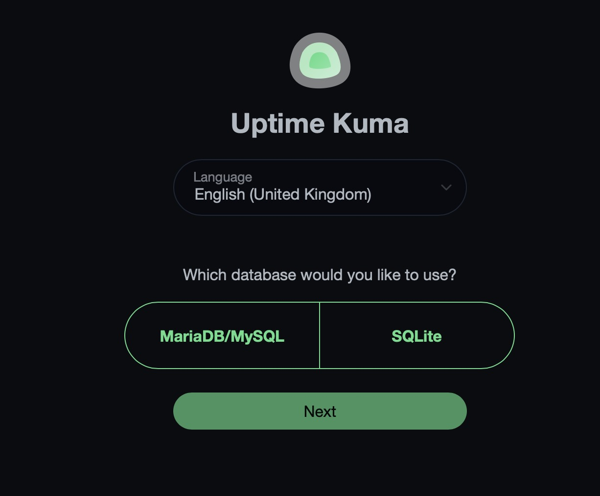
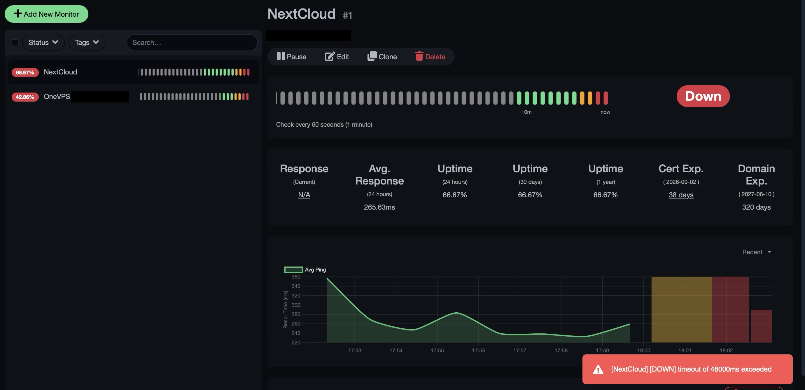
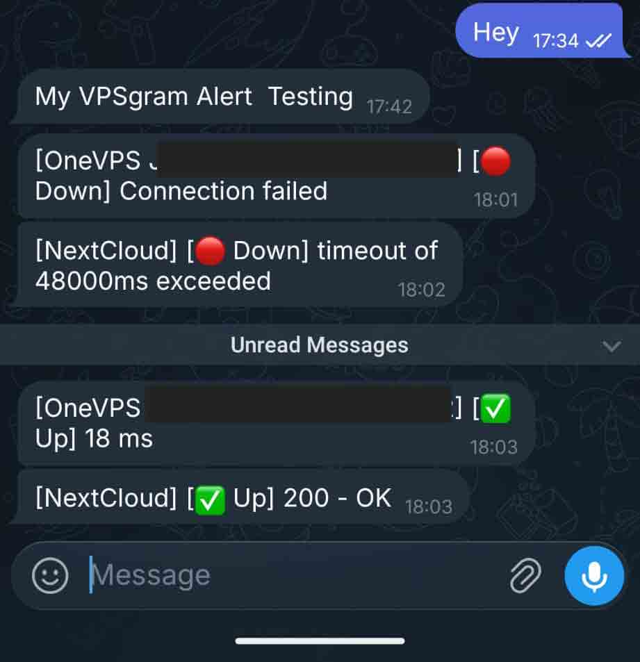

# Monitoring as a Security Control: A Complete Guide to External Uptime Monitoring

When most people think “cybersecurity,” they picture firewalls, encryption, and penetration tests. But there’s a pillar of the CIA Triad: **Availability**.

If a service is down, confidentiality and integrity become moot. An attacker doesn’t need to exfiltrate data or tamper with records if they can simply make your infrastructure disappear from the internet.

This piece walks through my approach to building an external monitoring and alerting pipeline for my homelab and personal infrastructure designed with security intent at every decision point.


> image source: https://github.com/louislam/uptime-kuma


## The Problem: Blind Spots in Personal Infrastructure

Running self-hosted services means wearing multiple hats: **sysadmin, network engineer**, and when things break **first responder**. The question that kept nagging me was simple: If one of my services goes down right now, how long before I notice?

Without monitoring, the answer is usually “**whenever I happen to check**” or, worse, “**when someone else tells me.**” In a professional environment, that’s called flying blind. In a security context, it’s a gap in situational awareness.

Availability monitoring closes that gap. It’s not glamorous, but it’s the kind of control that separates reactive infrastructure from resilient infrastructure.

## Choosing the Right Tool: Security Over Convenience

I evaluated several monitoring solutions before landing on [Uptime Kuma](https://uptimekuma.co/), a lightweight, self-hosted monitoring tool. The decision came down to a few security-minded considerations:

- **Self-hosted by default.** I didn’t want my monitoring data, IP addresses, service URLs, uptime patterns flowing through a third-party SaaS platform. Those telemetry streams are a metadata goldmine. Keeping monitoring on-premises means the only entity that sees my infrastructure map is me.

- **Minimal dependencies.** Uptime Kuma runs on SQLite, not a full database server. This wasn’t just about simplicity; it was about attack surface reduction. Every additional service I deploy is another component to patch, another credential to rotate, another potential entry point.

- **SQLite backups are trivial:** one file, copy it, done. That makes it easy to fold into existing backup routines without introducing new complexity or additional services to monitor (the irony of needing to monitor your monitoring tool’s database is a rabbit hole I’d rather avoid).

- **Lightweight footprint.** Running on a Proxmox LXC container means minimal resource overhead, minimal services running, and minimal exposure. A handful of heartbeat checks every 60 seconds doesn’t justify a full VM with a full OS attack surface.

## Step 1: Deploying Uptime Kuma on Proxmox


## Why Proxmox LXC?

Proxmox is one of my favourites working enviroments and it has a community script library that builds a ready-to-use LXC container with Uptime Kuma pre-installed. This saves manual installation of Debian, Node.js, and dependencies. However and this is important for anyone deploying similar infrastructure the deployment method requires security awareness.


### Deployment Procedure

1. **Access the Proxmox Shell**

 * Open the Proxmox web UI
 * Click your node
 * Select Shell (top right toolbar)

1. **Run the Community Script**

 * Paste and execute this command:

```
bash -c "$(wget -qLO - https://github.com/community-scripts/ProxmoxVE/raw/main/ct/uptimekuma.sh)"
```
	
This pattern fetch a remote script and pipe it into a shell is convenient but carries inherent supply chain risk. The script executes with whatever privileges the current user has, and its contents could change between the time you review it and the time it runs. It’s a well-known, widely-used community project with transparent source and active maintenance, which significantly reduces (but doesn’t eliminate) the risk.
		
**Verify, then execute**. I treat any `curl | bash` one-liner the same way I'd treat a third-party binary or dependency—inspect the source, understand what it does, and accept the residual risk consciously.


1. **Follow the Prompts**
 
 Answer its prompts (default settings are fine).

2. **Note the Assignment**

	The script builds the LXC container, installs Uptime Kuma, and prints the access URL:

```
	Uptime Kuma should be reachable by going to the following URL.
	http://192.168.x.x:3001
```

3.  **Initial Configuration**

## Out-of-Band Alerting: Separating the Signal Path from the Monitored Path

Once the script completes, open `http://<your-ip>:3001` in your browser. You'll see the Uptime Kuma setup screen asking you to create an admin username/password.




### Database Choice: Why SQLite Instead of PostgreSQL/MariaDB?

During configuration, you’ll be asked to select a database backend. I chose SQLite, and here’s the security reasoning behind that choice:

* **Zero setup**: No separate database container, no credentials to manage.
* **Maintenance**: One less moving part = one less thing to secure, patch, and monitor.
* **Irony check**: It’s ironic to add a whole database server to a tool whose job is watching for things breaking
* **Backups**: Just copying one file (kuma.db), trivial to include in regular backup/recovery routines.

Uptime Kuma is a lightweight monitoring tool a handful of monitors pinging every 60 seconds. SQLite is appropriate for that scale. Adding PostgreSQL would increase complexity without measurable benefit while expanding the attack surface I need to maintain.


## Step 2: Configuring Telegram Notifications

I wanted alerts pushed to me in near real-time rather than having to check a dashboard, so I wired Uptime Kuma into Telegram as my **out-of-band notification channel**.


This design decision matters from a security perspective: if your monitoring tool sends alerts through the same infrastructure it’s monitoring, you’ve created a single point of failure. If the network goes down, the monitoring detects it but the alert can’t reach you because the alert delivery path is also down.

Telegram notifications travel through a **separate network path, provider, and device**. If my server is unreachable, my monitoring fires an alert that still reaches my phone through Telegram’s infrastructure.


### Step 2.1: Find and Open BotFather


* On Telegram, tap the search bar and type: **BotFather**
* Look for the one with the blue verified checkmark the official username is exactly **@BotFather**
* Tap to open the chat
* **Security warning**: Watch out for fake lookalikes without the checkmark. Impersonation of BotFather is a known phishing vector.

### Step 2.2: Start the Conversation

* Type `/start` and send it
* BotFather replies with a menu of commands it understands

### Step 2.3: Create Your Bot

* Type `/newbot` and send it
* Follow the instructions:
* It asks for a display name (can be anything, e.g., “Homelab Monitor”)
* Then a username ending in bot (must be unique, e.g., homelab_alert_bot)

### Step 2.4: Get Your Token

If the username is available, BotFather replies with a success message containing:

```
Use this token to access the HTTP API:
123456789:ABCdefGHIjklMNOpqrsTUVwxyz
```

Copy this token. This is a credential that grants API access to send messages through your bot. Store it securely never commit it to version control, and rotate it if exposed.

### Step 2.5: Send Your Bot a Message

* In Telegram, search for the username you gave your bot
* Open the chat with it
* Send any message (this establishes the conversation thread)

### Step 2.6: Get Your Chat ID

* Open a browser (phone or laptop, doesn’t matter)
* Go to this URL, replacing `<TOKEN>` with your actual bot token:

```
https://api.telegram.org/bot<TOKEN>/getUpdates
```

For example, if your token is `123456789:ABCdefGHIjklMNOpqrsTUVwxyz`:


```
https://api.telegram.org/bot123456789:ABCdefGHIjklMNOpqrsTUVwxyz/getUpdates
```

* You’ll receive a JSON response. Look for the `"chat"` object inside `result[0].message.chat`.
* The number next to `"id"` is your chat_id (e.g., "chat":{"id":987654321, ...})

### Step 2.7: Add the Telegram Notification in Uptime Kuma

* Open Uptime Kuma in your browser: `http://<your-lxc-ip>:3001`
* Log in with the admin account you created
* Click your profile icon (top right) → Settings
In the left menu, click Notifications
* Click Setup Notification (or the “+ New” button)

### Step 2.8: Fill in the Notification Form

* **Notification Type** : Select Telegram from dropdown
* **Friendly Name**: Anything memorable, e.g., “Telegram Alerts”
* **Bot Token**: Paste your token (123456789:ABCdefGHIjklMNOpqrsTUVwxyz)
* **Chat ID**: Paste your `chat_id` number
Apply on all existing monitors: Turn ON (auto-applies to future monitors, saves reconfiguration work)

### Step 2.9: Test It

* Click the Test button before saving
* Check your Telegram you should receive a message from your bot within seconds (e.g., “Uptime Kuma Alert Testing”)
* If successful, click Save


## Step 3: Adding Monitors in Uptime Kuma

I set up two distinct monitors not for exhaustive coverage, but because each answers a different question from a security detection standpoint:


* **Cloud/application layer**: Is my service responding?
* **Network/host layer**: Is my server reachable?

Having both matters because **different failure modes signal different threats**.

### Monitor 1: My Cloud (HTTPS Check)

This monitors my application at the application layer.

* In Uptime Kuma, click + Add New Monitor
* Monitor Type → HTTP(s)
* Friendly Name → MyCloud
* URL → Your cloud’s address, e.g., https://my-domain.com
* Heartbeat Interval → 60 seconds
* Retries → 2 (avoids false alerts on a single blip)
* Heartbeat Retry Interval → 30 seconds
* Scroll to Notifications → Ensure your Telegram notification toggle is ON
* Click Save

**What this detects**: Application crashes, reverse proxy misconfiguration, expired certificates, or attacks degrading availability (resource exhaustion, DDoS indicators, or operational interruption).


### Monitor 2: Server Reachability (TCP Port Check)

This monitors infrastructure at the network layer.


* Click + Add New Monitor again
* Monitor Type → TCP Port (or Ping — TCP on port 22 is more reliable since some hosts block ICMP ping)
* Friendly Name → MyServer (SSH port)
* Hostname → Your server’s IP address
* Port → 22 (SSH)
* Same interval/retry settings as above (60s heartbeat, 2 retries, 30s retry interval)
* Click Save

**What this detects**: Power outages, network failures, hypervisor issues, or intentional host shutdown. Some cloud providers block ICMP, so TCP on a known-open port is more reliable than standard ping.


## Testing the System

To validate the setup works end-to-end, I temporarily disrupted two of my monitored services and observed the alerting behavior.



The monitoring correctly detected the unavailability after the configured retry window passed.



Within minutes, I received a push notification on my mobile device through Telegram. This confirmed the **out-of-band alerting** path was functioning independently of the monitored infrastructure.


## Where This Fits in a Broader Security Posture

Availability monitoring is one layer in what should be a defense-in-depth strategy. On its own, it tells you something is wrong. It doesn’t tell me why or who caused it. That’s where logging, intrusion detection, and log correlation come in building toward a fuller picture of what happened during the window when availability dropped.

But without the monitoring layer, Idon’t even know there’s a window to investigate. That’s the foundational value: I can’t respond to an incident you never detected.

In professional security operations, this maps to the Detect and Respond functions in the NIST Cybersecurity Framework. Monitoring is the front end of detection. Alerting is the trigger for response. Even at a personal/homelab scale, the principles scale down without losing their intent.


**Be your own guru**


