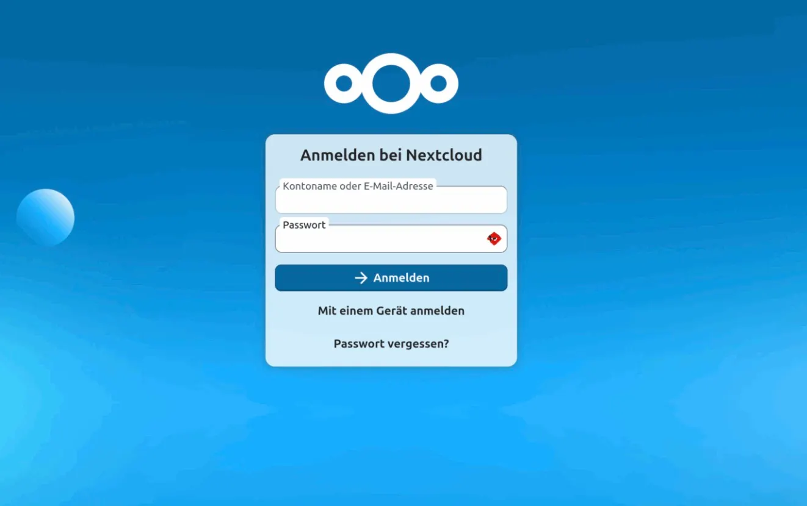
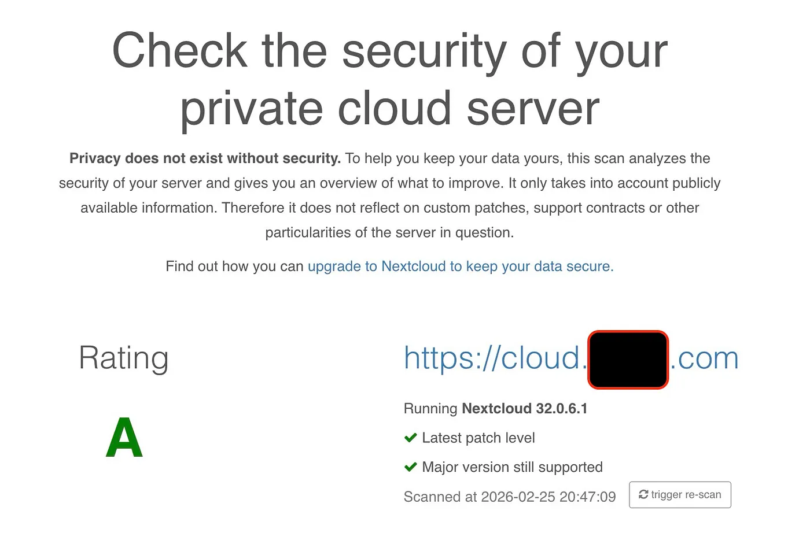
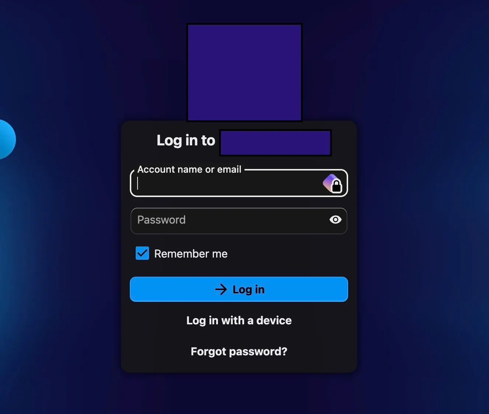

# Build Your Own Self-Hosted Infrastructure with Nextcloud for Small Enterprises

This guide walks you through deploying a production-ready, self-hosted Nextcloud instance on a VPS using Docker, Caddy Server, and solid security best practices a powerful and cost-effective solution that’s especially well-suited for small businesses looking to maintain control over their data.

## 🎯 Project Goals

* Self-hosted cloud: cloud.mydomain.com
* 🔐 Secure, hardened, independent infrastructure

### Requirements

Before starting, you’ll need a few essential components to build your self-hosted cloud infrastructure.

* Domain name
* VPS (Virtual Private Server)

For this project, I’m using a basic plan:

* Around 10€ per month
* 100GB SSD storage
* 2 vCPU
* Ubuntu Server

## Step 1 — Preparing environment

Connecting to the VPS

`ssh administrator@MY_SERVER_IP`

Become root for updating

```
sudo -i
apt update && apt upgrade -y
```

### Why?

* Install security updates
* Ensure clean environment
* Reduce vulnerability surface

### DNS Configuration

Inside your hosting DNS panel create an A record to point a subdomain to your VPS IP.

An **A record (Address record)** connects:

* A domain or subdomain
* To an IPv4 address

Type: A →Hostname (e.g cloud)→Value: `YOUR_VPS_IPV4 (example: 123.45.67.89`) →TTL: Default

### What this does
If your domain is: www.mydomain.com
Final structure: https://cloud.mydomain.com

### Why use a subdomain?

* Avoids breaking existing site
* Avoids path routing complexity
* Clean architecture
* Professional setup

### Directory Structure

```
mkdir -p /srv/nextcloud
cd /srv/nextcloud
```

/srv?
Linux convention: 

`/srv`= data for services provided by the server

Nextcloud is a service so this is the cleanest structure.

## Step 2— Install Docker

Docker is a containerization platform that allows applications to run in isolated environments called containers.

Instead of installing software directly on the server (which can create dependency conflicts and messy configurations), Docker packages everything the application needs into a lightweight, portable container.

**Benefits:**

* Clean separation between services
* Easy upgrades
* Reproducible environments
* Simplified maintenance

In this project, Nextcloud, MariaDB, and Redis all run inside containers.

```
apt install -y ca-certificates curl gnupg
install -m 0755 -d /etc/apt/keyrings
curl -fsSL https://download.docker.com/linux/ubuntu/gpg | gpg --dearmor -o /etc/apt/keyrings/docker.gpg
chmod a+r /etc/apt/keyrings/docker.gpg

echo \
  "deb [arch=$(dpkg --print-architecture) signed-by=/etc/apt/keyrings/docker.gpg] https://download.docker.com/linux/ubuntu \
  $(. /etc/os-release && echo "$VERSION_CODENAME") stable" | \
  tee /etc/apt/sources.list.d/docker.list > /dev/null

apt update
apt install -y docker-ce docker-ce-cli containerd.io docker-buildx-plugin docker-compose-plugin
```

`docker --version`

### Docker Compose Configuration

[Nextcloud](https://nextcloud.com/) is an open-source self-hosted cloud platform that allows you to store files, sync data, manage calendars, contacts, notes, and even collaborate in real time all on your own server.

Unlike commercial cloud providers, Nextcloud gives you full control over:

* Your data location
* Your security policies
* Your storage capacity
* Your privacy

inside your `/srv/nextcloud`

Create file

`nano docker-compose.yml`

```
services:

  db:
    image: mariadb:lts
    restart: always
    environment:
      MYSQL_ROOT_PASSWORD: mystrongrootpassword
      MYSQL_DATABASE: mysqldatabase
      MYSQL_USER: mysqluser
      MYSQL_PASSWORD: mystrongpassword
    volumes:
      - db_data:/var/lib/mysql

  redis:
    image: redis:alpine
    restart: always

  nextcloud:
    image: nextcloud:latest
    restart: always
    ports:
      - 8080:80
    environment:
      MYSQL_HOST: db
      MYSQL_DATABASE: mysqldatabase
      MYSQL_USER: mysqluser
      MYSQL_PASSWORD: mystrongpassword
      REDIS_HOST: redis
    volumes:
      - nextcloud_data:/var/www/html
    depends_on:
      - db
      - redis

volumes:
  db_data:
  nextcloud_data:

```

**NOTE:** I’ll explain redis later on this article.


**Start NextCloud**

`docker compose up -d`

## Step 3 — Install Caddy Server(HTTPS + Routing)

[CaddyServer](https://caddyserver.com/) is a modern web server and reverse proxy built for simplicity and security.

What makes Caddy special is its automatic HTTPS configuration. It integrates seamlessly with Let’s Encrypt and handles SSL certificates automatically no manual certificate management required.

It allows us to:

* Secure our domain with HTTPS
* Route traffic to internal Docker services
* Add security headers easily
* Reduce configuration complexity


For small-to-medium self-hosted infrastructures, Caddy is incredibly efficient and beginner-friendly.

```
apt install -y debian-keyring debian-archive-keyring apt-transport-https
curl -1sLf 'https://dl.cloudsmith.io/public/caddy/stable/gpg.key' | gpg --dearmor -o /usr/share/keyrings/caddy-stable-archive-keyring.gpg
curl -1sLf 'https://dl.cloudsmith.io/public/caddy/stable/debian.deb.txt' | tee /etc/apt/sources.list.d/caddy-stable.list

apt update
apt install caddy
```

**Configure:**

`nano /etc/caddy/Caddyfile`

```
cloud.mydomain.com {
    reverse_proxy localhost:8080
}
```
**Restart:**

`systemctl restart caddy`

Access your cloud and follow the instructions.

https://cloud.mydomain.com




## Step 4— Securing Nextcloud

`docker ps`

**Trusted Domains:**

This prevents domain spoofing errors.

Enter your nextcloud container.

Check your nextcloud container name

```
docker exec -it nextcloudContainerName bash
cd config
nano config.php
```

**Add:**

```
'trusted_domains' =>
array (
  0 => 'cloud.mydomain.com',
),

'overwrite.cli.url' => 'https://cloud.mydomain.com',
'overwriteprotocol' => 'https',
```

**Prevents:**

* Mixed content errors
* Redirect loops
* HTTP/HTTPS confusion

## Step 5 - Enable Redis (Performance Boost)

Redis is an in-memory data store used for caching and performance optimization.

With Redis enabled, Nextcloud:

* Handles file locking properly
* Improves responsiveness
* Reduces database load
* Performs better under concurrent access

In short: Redis transforms a basic installation into a production-ready one.

Already included in compose. [look section.- Docker Compose Configuration]

```
docker run -d \
  --name redis \
  --restart always \
  redis:alpine
  
```
## Step 6 — Enable Real Cron

In Nextcloud settings → Basic → Cron

On your VPS

`crontab -e`

add

```
*/5 * * * * docker exec -u www-data nextcloud php /var/www/html/cron.php

```

Meaning: every 5 minutes. Now background jobs run correctly.


## Step 7— Firewall Hardening (UFW)

Uncomplicated Firewall (UFW) is used to control which ports are accessible from the outside world.

`apt install ufw`

Default rules

```
ufw default deny incoming
ufw default allow outgoing
```

Allow only required port

```
ufw allow 22
ufw allow 80
ufw allow 443
ufw enable
```

**Why keep port 80 open?**

Let’s Encrypt (used automatically by Caddy) requires it for the HTTP-01 challenge.

Without port 80:

❌ No SSL certificate
❌ HTTPS fails

Always verify

`ufw status`

Exposed ports:

* 22 (SSH)
* 80 (HTTP)
* 443 (HTTPS)

Everything else remains internal and protected.

**Internal only:**

* 3306 (MySQL)
* 6379 (Redis)
* 8080 (Nextcloud internal)


## Step 8 — Fail2Ban

Fail2Ban monitors logs and automatically blocks IP addresses that show malicious behavior (such as repeated failed login attempts).

It adds an additional server-level layer of protection on top of Nextcloud’s internal brute-force protection.

```
apt install fail2ban
systemctl enable fail2ban
systemctl start fail2ban
```
Check

`sudo systemctl status fail2ban`

## Step 9 - Force HTTPS + Security Headers

* Enforces HTTPS (1 year)
* Prevents MIME sniffing
* Protects against clickjacking
* Improves browser trust

Edit Caddyfile:

`nano /etc/caddy/Caddyfile`


```
cloud.mydomain.com {
    reverse_proxy localhost:8080

    header {
        Strict-Transport-Security "max-age=31536000; includeSubDomains; preload"
        X-Content-Type-Options "nosniff"
        X-Frame-Options "SAMEORIGIN"
        Referrer-Policy "no-referrer"
    }
}

```

Reload:

`systemctl reload caddy`

Test headers at:

[Security Headers Scan](https://securityheaders.com)

## Step 10 — Docker Hardening

`docker ps`

You should NOT see: (mean they are exposed)

```
0.0.0.0:3306->3306
0.0.0.0:6379->6379

```

You should see:

```
3306/tcp
6379/tcp
```

## Automated Backup Script

**Create:**

`nano /srv/nextcloud/backup_nextcloud.sh`

**Script:**

```
#!/bin/bash

DB_CONTAINER="MYDBContainer"
DB_NAME="MYDBNAME"
DB_USER="MYDBUSER"
DB_PASSWORD="MY_DB_PASSWORD"
BACKUP_DIR="/srv/nextcloud/backups"
DATE=$(date +%F)
FILE="$BACKUP_DIR/backup_$DATE.sql.gz"

docker exec $DB_CONTAINER sh -c \
"exec mysqldump -u $DB_USER -p\"$DB_PASSWORD\" $DB_NAME" \
| gzip > $FILE

cd $BACKUP_DIR
ls -1t backup_*.sql.gz | tail -n +8 | xargs rm -f

```

Make executable:

`chmod +x /srv/nextcloud/backup_nextcloud.sh`

Automate daily at 3AM:

`0 3 * * * /srv/nextcloud/backup_nextcloud.sh`

**Final Result**

We now have:

* ✅ Self-hosted cloud infrastructure
* ✅ Automatic HTTPS
* ✅ Redis caching
* ✅ Firewall hardened
* ✅ Brute force protection
* ✅ Strict security headers
* ✅ Automated encrypted backups
* ✅ Clean Linux service structure

Final test: [https://scan.nextcloud.com/](https://scan.nextcloud.com/)






# Welcome to self-hosting. 🚀


