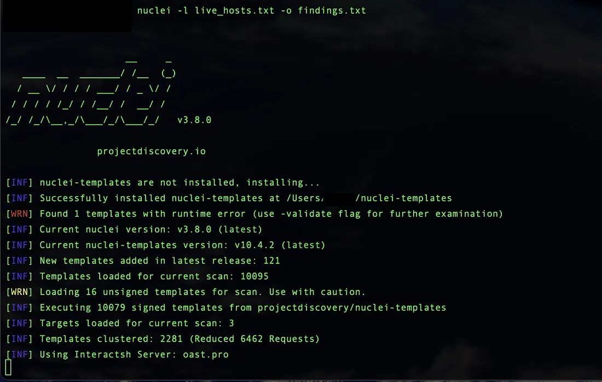

## Validating My External Attack Surface: A Production-Ready Nuclei Self-Audit Pipeline

Goal: Establish a reproducible, automated vulnerability scanning workflow using ProjectDiscovery’s open-source toolkit ([Subfinder](https://github.com/projectdiscovery/subfinder), [HTTPx](https://www.python-httpx.org/), [Nuclei](https://nuclei.ai/))


In the world of enterprise security, [Nessus](https://www.tenable.com/products/nessus) is the gold standard. It’s powerful, comprehensive, and widely trusted. However, as a beginner building my own security infrastructure and looking to understand the mechanics of scanning under the hood, I found the licensing model and ‘black box’ nature of proprietary tools to be a barrier to learning.


I wanted a solution that was:

* Transparent: I could see exactly how the checks worked.
* Automatable: Easy to script for my future CI/CD pipelines.
* Accessible: No complex activation keys or enterprise contracts.


This led me to Nuclei by [ProjectDiscovery](https://projectdiscovery.io/). While Nessus remains the industry benchmark for large-scale audits, Nuclei offered the perfect playground for me to learn Asset Discovery, Enumeration, and Vulnerability Scanning from the ground up.

Asset Discovery → Service Enumeration → Vulnerability Scanning.

While the initial setup involves simple CLI commands, a production-ready implementation requires automating this workflow, handling errors, managing secrets, and integrating results into a continuous monitoring loop. This article documents the journey from a manual test.

### The Toolchain: Why ProjectDiscovery?

Nuclei is a modern, template-driven vulnerability scanner. Unlike signature-based scanners that rely on static databases, Nuclei allows for custom logic to detect specific misconfigurations, exposed APIs, and CVEs with near-zero false positives when tuned correctly.

**The Workflow:**


* Subfinder: Passive subdomain enumeration (OSINT).
* HTTPx: Active probing to identify live hosts, titles, and tech stacks.
* Nuclei: Targeted vulnerability scanning against live assets.


### Implementation

**Environment Setup & Dependency Management**

To ensure a clean, reproducible environment, I utilized the ProjectDiscovery Tool Manager (PDTM). This avoids dependency hell and ensures all tools are updated to the latest stable versions.

**Prerequisites:**

* [Go Programming Language](https://go.dev/) (go)
* Shell Environment (Zsh/Bash)


Installation:

```
# Install PDTM
go install -v github.com/projectdiscovery/pdtm/cmd/pdtm@latest

# Install all ProjectDiscovery tools (Nuclei, Subfinder, HTTPx, etc.)
pdtm -ia

```

**Path Configuration:** I ensure the Go binary path is in my `$PATH` to execute tools globally:


```
# Add to ~/.zshrc or ~/.bashrc
export PATH=$PATH:$(go env GOPATH)/bin

# Reload shell
source ~/.zshrc
```


**Verification:**

`subfinder -h && httpx -h && nuclei -h`


### Asset Discovery with Subfinder

Before scanning for vulnerabilities, I needed to define the scope of my infrastructure. I can’t secure what I don’t know exists. Subfinder performs passive reconnaissance to identify all external-facing subdomains associated with my domains without sending direct traffic.


command

`subfinder -d mydomain.com -o subdomains.txt`

-d: Target domain.
-o: Output file for downstream processing.

**Why this matters:** This step often reveals forgotten development environments, staging servers, or assets that I might have forgotten to secure. Finding these early is critical for reducing my attack surface.


### Active Probing with HTTPx

Not all discovered subdomains are active. Scanning dead hosts wastes resources and generates noise. HTTPx takes the list from Subfinder and probes each host to determine if it's alive, what technology it's running, and its HTTP status code.

```
httpx -l subdomains.txt -o live_hosts.txt -title -status-code -silent
```

**Real-World Insight:** During this phase, I discovered a service I thought was running was actually down (returning a 502). This highlighted the importance of asset hygiene.

### Vulnerability Scanning with Nuclei

With a validated list of live hosts, Nuclei performs the core vulnerability assessment. It leverages a massive, community-maintained template library to check for thousands of known issues, from misconfigured headers to critical CVEs.

`nuclei -l live_hosts.txt -o findings.txt`




**Results & Validation:** Upon running the scan against my live infrastructure, no Critical or High-severity web vulnerabilities were detected.

**Important Clarification**: This scan specifically validates my Web Attack Surface (Ports 80/443). It confirms that:

* My web servers are running up-to-date software.
* My security headers (CSP, HSTS) are correctly configured.
* There are no known web-based CVEs exposed.

### Next Steps: Automation & Remediation

Running subfinder, httpx, and nuclei manually is a great way to test the tools, but it is not a security solution. In a production environment, security must be continuous, automated, and auditable.

To transform this from a “test” into a production-grade system, I need to implementing the following layers of complexity:

**Orchestration & Scheduling:**

* Instead of running commands manually, I will wrapping them in a Bash/Python script that handles dependencies and error checking.
* This script is scheduled via Cron (or a CI/CD pipeline like GitHub Actions) to run daily/weekly automatically.


**Secret Management:**

API keys (for Subfinder providers) and Nuclei templates require secure storage. I am moving away from hardcoded variables to using environment variables or a secret manager (like pass or HashiCorp Vault) to prevent credential leakage.

**Result Aggregation & Reporting:**

Raw JSON output from Nuclei is hard to read. I will build a parser to convert findings into a human-readable HTML report or a Slack/Email alert only when new Critical/High vulnerabilities are detected.

**False Positive Tuning:**

A production scanner must be quiet. I need creating a custom exclusion list (ignoring known safe endpoints) to reduce noise and ensure the team only sees actionable threats.

**Integration with Remediation:**

The ultimate goal is closed-loop security. When a vulnerability is found, the pipeline should ideally trigger a ticket in my project management tool (e.g., GitHub Issues) or even trigger an automated patch script.

**Be your own guru**


