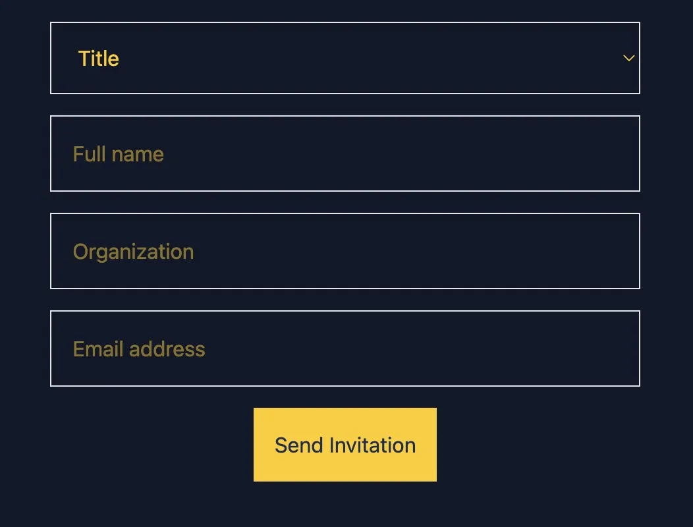
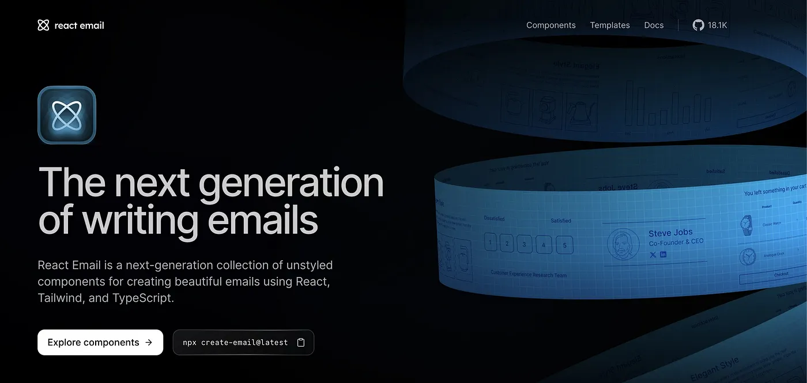
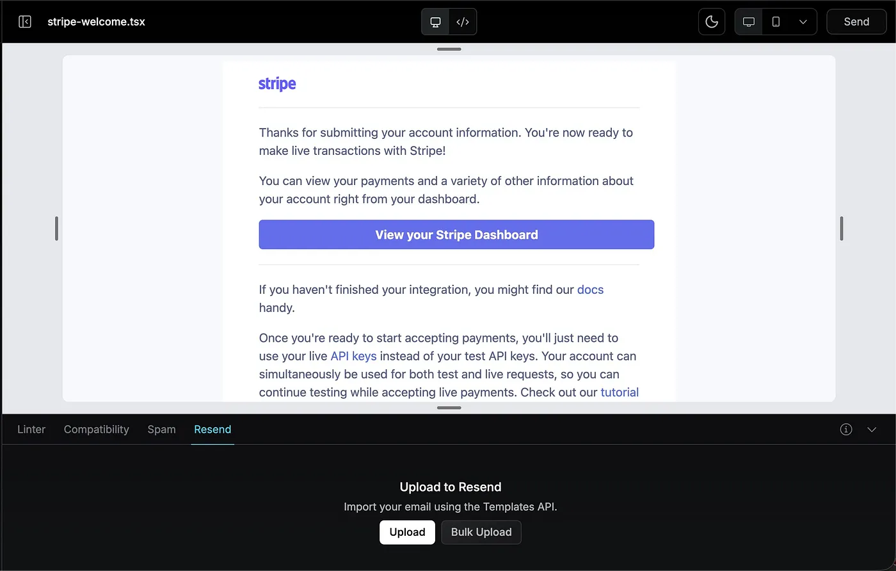
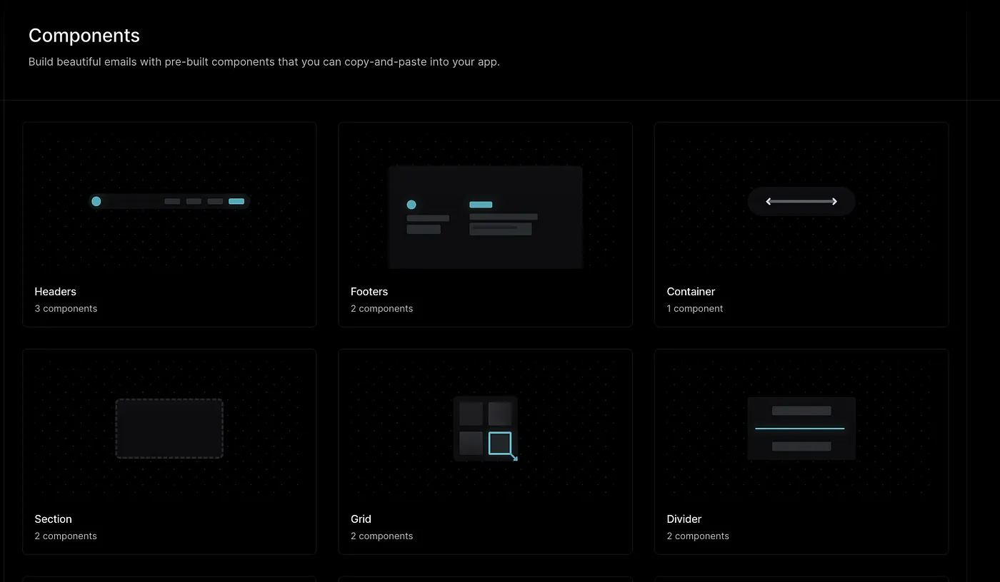
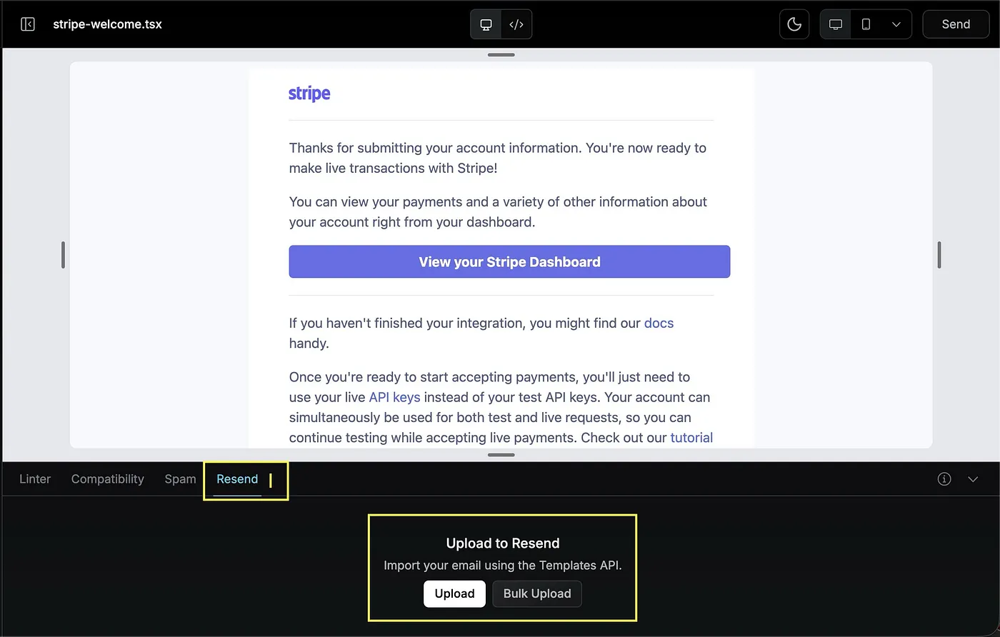
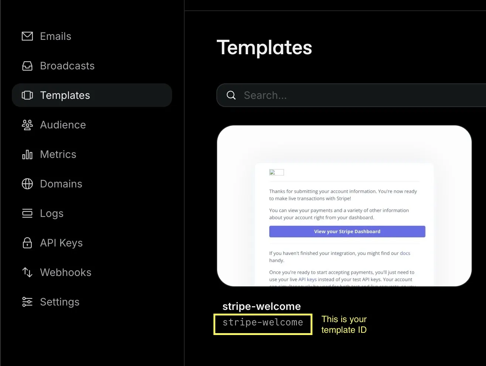
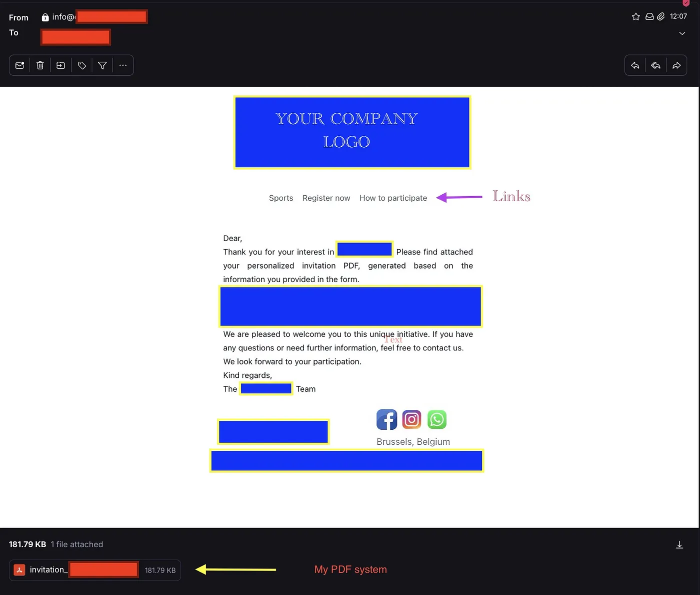

# How I Automated Invitation Emails with React-email, Resend, and Docker

I recently built a project where users can fill out a simple form on the frontend with their name, organization, and email. Once the form is submitted, the system automatically generates an official PDF invitation containing their information and sends it to them.

This already saved me a lot of time compared to doing everything manually.

However, there was one thing that bothered me.

The email being sent was **just plain text with the PDF** attached. It worked, but it didn’t look great. If you’ve ever received one of those emails, you know what I mean, just a block of text with no branding, no structure, nothing.

I wanted something more professional and visually appealing.

Something that looked like a real email:

* our company logo
* a clean layout
* a short message
* and links to our social networks

In other words, instead of sending a boring plain-text message, I wanted the invitation email to look polished and intentional.

That’s when I started looking for a way to design and send **modern HTML emails** directly from my project.

### The System


My project itself was already working before I started improving the emails.

The frontend is built with **Astro and Tailwind**, where users fill out a simple form with their information. Once they submit the form, the data is sent to my backend, which runs inside a **Docker container.**

From there, the backend processes the information and generates the invitation automatically.

To do this, I created a **Word document template** where I defined variables for the fields I wanted to personalize things like the participant’s name and organization. When the backend receives the form data, it replaces those variables with the user’s information and converts the document into a PDF invitation.

Finally, the system sends an email to the user with the generated PDF attached.

So the whole flow looks something like this:

```
User fills the form
        ↓
Frontend (Astro + Tailwind + my_own_API)
        ↓
Backend processes the data
        ↓
Word template variables are replaced
        ↓
PDF invitation is generated
        ↓
Email is sent with the PDF attachment
```

Technically, everything worked perfectly. The only missing piece was the **email itself**, which still looked very basic.



### Why I Chose React Email

When I started looking for a solution, React Email immediately caught my attention.

One of the reasons is that I like experimenting with new tools. Even though I’m not a **full-time developer**, I enjoy learning new technologies when building projects.

What I liked right away was that React Email felt very familiar. It works with components and Tailwind-style classes, which made it easier for me to understand and start building layouts without feeling overwhelmed.

This was perfect for my case because it allowed me to reuse concepts I already knew, while at the same time learning a bit of React along the way.

Another big advantage was the documentation. It’s clear, easy to follow, and getting started doesn’t require a complex setup.

Finally, there was one more reason why React Email fit perfectly into my project: **I was already using Resend in my system to send emails.**

Since **React Email and Resend** are designed to work together, integrating them into my existing backend turned out to be a very natural choice.




### What is React Email?


[React Email](https://react.email/) is a framework that lets you build HTML emails with React components. You can create reusable, responsive, and visually appealing emails without worrying about messy HTML tables or outdated email client quirks.

Before starting, check out the [documentation](https://react.email/docs/introduction) to get familiar with the setup and components.


### My Goal

Building a system to send official invitations by simply entering an email, organization, and name allowed recipients to receive a clean, professional email with a personalized PDF attachment.

The idea was simple: automation meets design. Instead of spending time manually sending invitations, the goal was to create a system that was fast, automated, and looked professional.

### Getting React Email Running Locally

React Email makes setup easy with create-email:

`pnpm create email`

This generates a starter project (react-email-starter) with sample email templates. From there:

```
cd react-email-starter
pnpm install
pnpm dev
```

Visit [http://localhost:3000](http://localhost:3000) to see live previews of your emails.



You can start adding your own email templates by creating .tsx files inside the emails folder:

```
cd emails
touch your-email-template.tsx
```

### React Email Basics : Designing the Email Template

If you’re new to React, don’t worry basic HTML knowledge is enough. Here’s the key structure:

*  Function Component — everything is inside a function:

```
export default function Email() {
  return (...);
}

```

*  Wrap JSX in `<Html>` and `<Body>`:

```
<Html>
  <Body>
    ...
  </Body>
</Html>
```

* Use table-based layout

email clients don’t support modern CSS well So instead of using:

`<div>`


**use:**

```
<Section>
  <Row>
    <Column>
      {/* Content goes here */}
    </Column>
  </Row>
</Section>

```

React Email components like Html, Body, Container, Section, Row, Column, Text, Img, Link, and Tailwind make building layouts intuitive and responsive.

**Example: A Simple Email Template**

Here’s an example using React Email components and Tailwind classes:

With React-email, I work with **components**, so if you’re used to **Tailwind**, this combination feels very natural.

[https://react.email/components](https://react.email/components)



Inside your: your-email-template.tsx


```
import * as React from "react";
import {
  Body, Button, Container, Html, Img, Link, Section, Row, Column, Text, Tailwind
} from "@react-email/components";

export function Email(props) {
  const { url } = props;

  return (
    <Html>
      <Tailwind>
        <Body className="bg-white font-sans">
          <Container>
            <Section>
              <Row>
                <Column align="center">
                  
                </Column>
              </Row>
              <Row className="mt-[40px]">
                <Column align="center">
                  <Text>
                    Dear ,<br/>
                    Here’s your personalized invitation PDF.
                  </Text>
                  <Button href={url}>View Invitation</Button>
                </Column>
              </Row>
            </Section>
          </Container>
        </Body>
      </Tailwind>
    </Html>
  );
}

export default Email;

```

After exploring React Email and once you have your final email design, the next step is to test it locally.

To deliver the emails, I used [Resend](https://react.email/docs/integrations/resend) (see the integrations section) a service built by the same team behind React Email, which makes it a great match for this setup.

**Create a server-side send script**

* I Installed dependencies:

`pnpm add resend @react-email/components`

* My script (send.ts): for Testing

```
import { Resend } from "resend";
import { Email } from "./emails/email-template";

const resend = new Resend("re_YOUR_REAL_API_KEY");

async function sendEmail() {
  await resend.emails.send({
    from: "you@yourdomain.com",
    to: "recipient@example.com",
    subject: "Your Official Invitation",
    react: Email({ url: "https://example.com" }),
  });
  console.log("Email sent!");
}

sendEmail();

```
**Important:** Resend requires a verified domain. Never expose API keys in frontend code they should always remain server-side and stored in a `.env` file.

I did the following:

* Created an resend’s account
* Added my domain
* Verified the DNS records


Ran the script with **tsx**:

Since I’m using pnpm and TypeScript, the first step is to install tsx

```
pnpm add -D tsx

#Then you can run your send script:
pnpm tsx send.ts

```
If successful, you’ll see:

>Email sent!


Architecture Overview

```
emails/email-template.tsx → Design
send.ts                    → Sends email (testing)
Resend                     → Delivers email
```

This setup allows you to edit and preview emails locally, then send them via Resend with full automation.

### Sending Emails with Resend

At this point, I’ve already installed the Resend dependencies and React Email components. The next step is to connect Resend to my project.


`pnpm add resend @react-email/components`

Set Up my Resend API Key

`npx react-email@latest resend setup`

React Email makes it easy to link Resend. When you run the setup, it will prompt you for your Resend API Key.

This will prompt you to enter your Resend API Key. You can get one by creating an account at [Resend](https://resend.com/), navigating to **API Keys → Create API Key**, and selecting Full Access.


### Uploading My Template

Once everything was ready locally, I ran my project:

* Then, in the browser at [http://localhost:3000](http://localhost:3000), I clicked the Resend tab in the toolbar and uploaded my `emails/email-template.tsx` template.
* After uploading, I confirmed in the **Resend dashboard → Templates** that my template appeared correctly and noted the **Template ID**, which I would use in my backend.



After uploading my template, I checked the Resend dashboard to make sure it appeared correctly. I also noted the Template ID, which I would need for sending emails from my backend.



### Moving to Production

Since I was integrating this into an existing project, I needed to deploy the backend properly using Docker and ensure that all secrets were handled securely.

### Environment Variables

I stored sensitive information in a `.env` file:

```
NODE_ENV=production
RESEND_API_KEY=YOUR_RESEND_API_KEY
EMAIL_FROM=info@yourdomain.com
RESEND_TEMPLATE_INVITATION=your_template_ID
PORT=5000
```

This ensures that API keys and configuration are **server-side only** and never exposed to the frontend.

To handle email sending in production, I created a dedicated service `resendEmailService.js`:

```
import { Resend } from "resend";
import dotenv from "dotenv";

dotenv.config();

const resend = new Resend(process.env.RESEND_API_KEY);

export async function sendResendEmailWithPdf(
  to,
  subject,
  variables,
  pdfBuffer,
) {
  const attachmentBase64 = pdfBuffer.toString("base64");

  const { data, error } = await resend.emails.send({
    from: process.env.EMAIL_FROM,
    to: [to],
    subject,

    template: {
      id: process.env.RESEND_TEMPLATE_INVITATION,
      variables: variables,
    },

    attachments: [
      {
        content: attachmentBase64,
        filename: "my_pdf_invitation_.pdf",
      },
    ],
  });

  if (error) throw new Error(JSON.stringify(error));

  return data;
}
```

This service handles:

* Sending emails via Resend
* Using a template for personalized invitations
* Attaching the PDF generated by the backend
* Keeping all sensitive credentials server-side

I decided to rebuild my Docker container because I wanted a clean environment. Whenever you update your `.env` file, it’s best to rebuild the container so all the environment variables are loaded correctly.

```
docker ps
docker stop backend_container
docker rm backend_container
```

After stopping and removing any existing container, I built a fresh Docker image and ran it with the updated environment variables. This ensures that my backend is running in a clean production environment with all the `.env` settings properly loaded.

```
docker build -t my-backend .
docker run -d -p 127.0.0.1:3000:3000 --env-file .env --name backend_container my-backend
```

With this setup, my backend runs inside Docker, Resend sends emails using my templates, and the React Email setup works seamlessly in production. Everything is now automated and ready to handle real users.

In other words, my system connects frontend → backend → PDF generation → email delivery in a fully automated workflow.

**Final result.**




At the end of the day, this project reminded me that you don’t need to be a professional developer to build your own systems. With curiosity, a willingness to learn, and the right tools, you can automate workflows, create polished outputs, and solve real problems on your own.

Experiment, tinker, and build the systems you wish existed not only to solve problems, but to save time for yourself.

And now… let’s go enjoy a little bit of sun! 🌞

**Be Your Own Guru**


