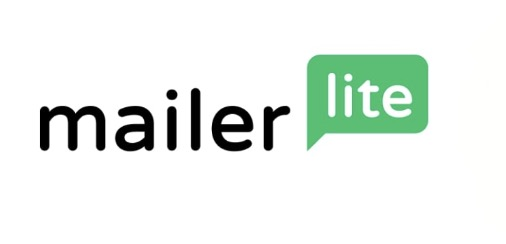

# Architecting Resilient Bulk Email: Subdomain Isolation and Reputation Management with MailerLite

In the realm of transactional and marketing email infrastructure, the difference between a high-deliverability campaign and a blacklisted IP often comes down to architectural discipline. As security practitioners, we rarely treat email as a monolithic channel.




This article explores a strategy for deploying bulk email using [MailerLite](https://www.mailerlite.com/), specifically focusing on [subdomain isolation](https://www.mailsoar.com/blog/guide/email-subdomain-vs-separate-domain/) to protect my primary domain’s reputation, and the implementation of SPF, DKIM, and DMARC to ensure authentication integrity.

## Why Subdomain Isolation?

Sending all traffic from `updates@yourdomain.com`. While convenient, this creates a single point of failure. If a marketing blast triggers spam filters or if a compromised list leads to high bounce rates, the reputation damage falls on my root domain (yourdomain.com). This can inadvertently block critical transactional emails (password resets, receipts) sent from the same domain.

**The Solution**: Isolate reputation by using a dedicated subdomain, such as `updates.yourdomain.com` or `notifications.yourdomain.com`.

* **Risk Containment**: If the subdomain gets flagged, my primary domain remains untouched.
* **Granular Analytics**: I can track deliverability metrics for specific campaigns independently.
* **Trust Signaling**: Major ESPs (Gmail, Outlook) often treat subdomains as distinct entities, allowing me to warm up new sending identities without risking core business communications.


## Infrastructure Setup: The MailerLite Integration

While MailerLite offers automated domain verification, I prefer manual configuration. Granting an external SaaS provider full administrative privileges over my DNS zone introduces unnecessary risk. By managing records manually, I retain strict control over my DNS hierarchy and can audit every change.

### Step 1: The Architecture of Trust (DNS Records)


To authenticate my identity and prevent spoofing, three pillars of email security must be implemented via DNS. Below is the standard configuration pattern for a subdomain like `notifications.yourdomain.com`.

### 1. SPF (Sender Policy Framework)

SPF defines which IP addresses are authorized to send email on behalf of my domain. It acts as the first line of defense against spoofing.

* Record Type: TXT
* Host: @ (or the subdomain prefix, depending on my DNS provider)
* Value: 
```
v=spf1 include:yourdomainproviders include:_spf.mlsend.com include:amazonses.com -all
```

**Note** the -all mechanism. This is a "hard fail," instructing receiving servers to reject any email not originating from the listed includes. While ~all (soft fail) is sometimes used during testing, production environments should aim for -all once stability is confirmed.


### DKIM (DomainKeys Identified Mail)

DKIM adds a cryptographic signature to my emails, allowing the receiver to verify that the message was indeed sent by me and hasn’t been altered in transit.

* **Record Type**: CNAME (for MailerLite's simplified setup) or TXT (standard)
* **Host**: litesrv._domainkey (or dkim._domainkey.notifications)
* **Value**: litesrv._domainkey.mlsend.com

### DMARC (Domain-based Message Authentication, Reporting, and Conformance)

DMARC ties SPF and DKIM together, providing a policy for how receivers should handle failures and enabling you to receive forensic reports.

* **Record Type**: TXT
* **Host**: _dmarc.notifications
* **Value**: (Example policy)

```
v=DMARC1; p=reject; rua=mailto:dmarc-reports@yourdomain.com
```

p=reject blocks unauthenticated emails, it is highly advisable to add a ruf tag for forensic reporting. This sends a copy of the failed message itself, which is crucial for debugging why legitimate emails are being blocked.

```
v=DMARC1; p=reject; rua=dmarc-reports@yourdomain.com; ruf=dmarc-forensic@yourdomain.com; adkim=s; aspf=s
```

**adkim=s** and **aspf=s**: Enforce "strict" alignment (the domain in the header must match the signing domain exactly, not just the organizational domain). This is stricter and more secure but harder to configure if you use third-party services that rewrite headers.


### Custom Domain Connection & A/MX Records

Beyond authentication, the delivery path requires specific routing records.

* **A Record**: Points the subdomain to the MailerLite sending infrastructure.

**Host**: updates (or notifications)

**Value**: [IP Address provided by MailerLite]

* **MX Record:** While less common for pure sending subdomains, some configurations require an MX record to handle bounces or replies.

* **Host**: updates (or notifications)
* **Value:** mail.litesrv.io

[Spoof checks](https://smartfense.com/en/resources/tools/spoof-check/)


## Conclusion: Professionalism as a Security Feature

Implementing a custom email domain with proper subdomain isolation is not merely a branding exercise; it is a fundamental security control. By separating my marketing traffic from my operational traffic, I ensure that a spike in spam complaints in one channel does not cripple my entire communication infrastructure.

Furthermore, the application of SPF, DKIM, and DMARC signals to the broader internet that I take email integrity seriously. In an era of pervasive phishing and business email compromise (BEC), these technical controls are part of my defense in depth.


**Be your own guru!**