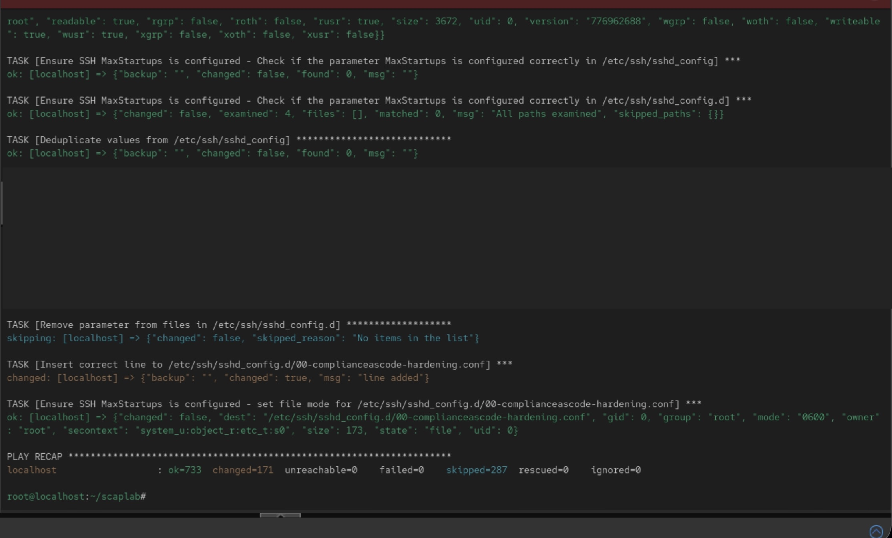

# Exercice SCAP : Audit et remédiation CIS Level 1 sur Rocky Linux 10

* **Système** : Rocky Linux 10 (VM Proxmox)
* **Profil** : xccdf_org.ssgproject.content_profile_cis_server_l1 (CIS Rocky/RHEL 10 Benchmark v1.0.1, Level 1, Server)

Rapports


* [Rapport avant remédiation](Rocky10.before-cis-report.html)
* [Rapport après remédiation](Rocky10.after-cis-report.html)


**Démarche**

```
# 1. Audit initial
sudo oscap xccdf eval \
--profile xccdf_org.ssgproject.content_profile_cis_server_l1 \
--results cis-scan-results.xml \
/usr/share/xml/scap/ssg/content/ssg-rl10-ds.xml

# 2. Génération du playbook à partir des résultats
oscap info cis-scan-results.xml | grep -A1 "Result ID"
oscap xccdf generate fix \
--fix-type ansible \
--result-id xccdf_org.open-scap_testresult_xccdf_org.ssgproject.content_profile_cis_server_l1 \
--output cis-remediation.yml \
cis-scan-results.xml

# 3. Relecture du playbook, simulation, puis exécution
ansible-playbook -i localhost, -c local cis-remediation.yml --check --diff
ansible-playbook -i localhost, -c local cis-remediation.yml

# 4. Audit final 

# 5. Publication des rapports (port rouvert après durcissement de firewalld)
sudo firewall-cmd --permanent --add-port=8000/tcp && sudo firewall-cmd --reload
python3 -m http.server 8000 --bind 0.0.0.0 
```

## Relecture du Playbook, simulation et exécution



## Resultats

||**Avant**|**Après**|
|---|---|---|
|Score |67.32%|94,66 %|
|Règles réussies |171|296 |
|Règles en échec |133 (5 other, 12 low, 112 medium, 4 high)| 9 (2 high, 5 medium, 1 low, 1 other)|

### Règles restées en échec et raisons

#### Disk Partitioning

* **Ensure /tmp Located On Separate Partition (low)** : aucune partition /tmp n'a été créée à l'installation. Ansible ne peut pas repartitionner un disque existant. 

#### Updating Software

* **Ensure Red Hat GPG Key Installed (high)** : faux positif. Rocky Linux signe ses paquets avec sa propre clé (RPM-GPG-KEY-Rocky-10), alors que la règle, héritée du contenu RHEL, cherche l'empreinte de la clé Red Hat. 

#### Stockage des mots de passe

* **Ensure all users last password change date is in the past (medium)** : la date de dernier changement dans `/etc/shadow` est postérieure à la date courante, probablement à cause d'un décalage de l'horloge de la VM à l'installation. Correction : chage -d $(date +%F) <utilisateur>.

#### Verify Proper Storage and Existence of Password Hashes

* **Enforce usage of pam_wheel with group parameter for su (medium)** : la configuration attendue (auth required pam_wheel.so use_uid group=sugroup avec un groupe existant et vide) n'a pas été appliquée correctement par le playbook. Elle doit être complétée manuellement.

#### Non-UEFI GRUB2 bootloader configuration

* **Set Boot Loader Password in grub2 (high)**: cette règle n'est pas corrigeable automatiquement, car le playbook ne peut pas définir de mot de passe. Il faut utiliser `grub2-setpassword`.

#### systemd-journald 

* **Enable systemd-journal-upload Service** : aucun serveur de logs centralisé (SIEM/collecteur) n'est configuré, donc le service ne peut pas démarrer.
* **Disable systemd-journal-remote Socket** : le socket est resté actif. Il peut être désactivé et masqué via systemctl.
* **Ensure journald and rsyslog Are Not Active Together** : les deux services de journalisation sont actifs, alors que CIS demande d'en choisir un seul.

#### SSH Server

* **Limit Users' SSH Access** : aucune liste de comptes autorisés (AllowUsers/AllowGroups) n'est définie. Le playbook ne peut pas deviner quels comptes autoriser.

## Règles que j'aurais exclues par tailoring

* **Ensure Red Hat GPG Key Installed** : règle non applicable à Rocky Linux, qui utilise sa propre clé de signature.
* **Enable systemd-journal-upload Service** : la machine n'envoie pas ses journaux vers un collecteur distant ou un SIEM. Activer ce service n'a pas de sens sans destination.
* **Set Boot Loader Password in grub2** : il s'agit d'une VM de laboratoire, et l'accès à la console Proxmox est restreint à l'administrateur.

