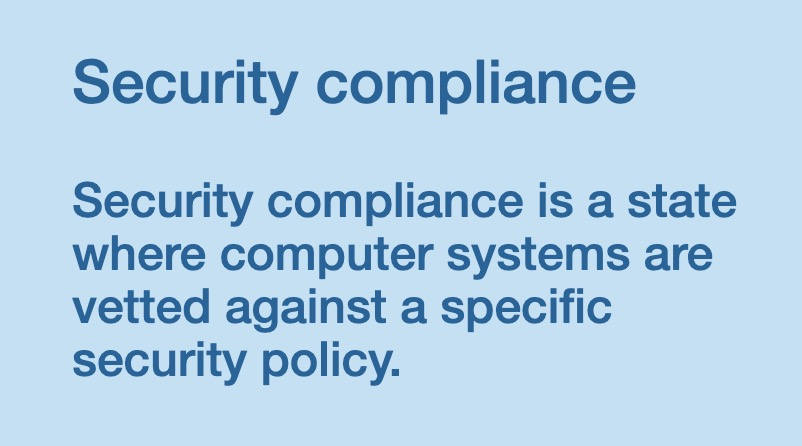
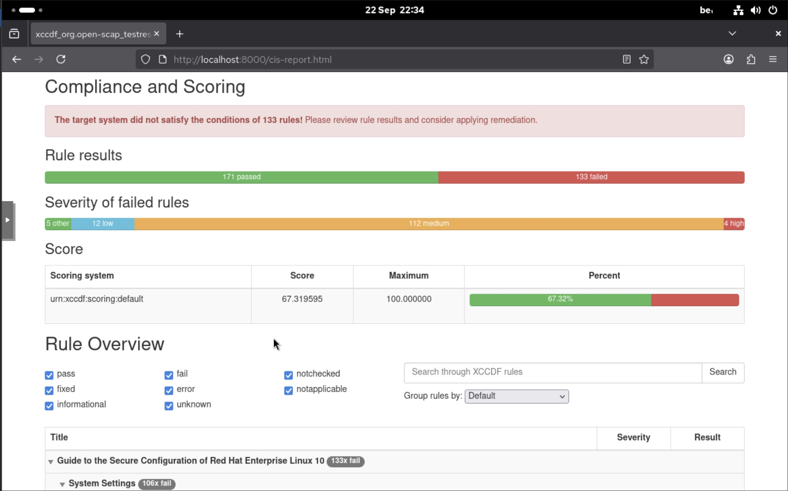
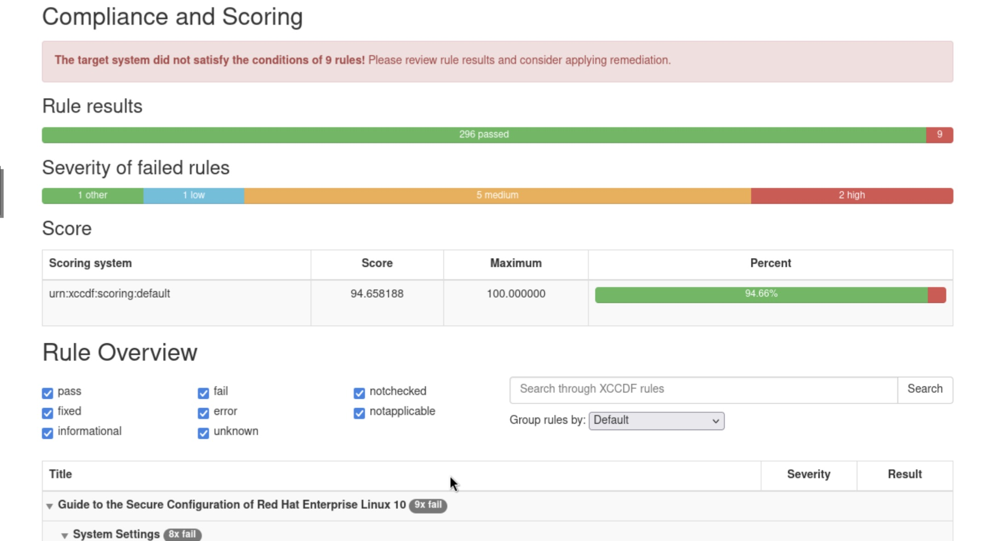

# OpenSCAP: A Hands-On Guide to Auditing and Automated Remediation with Ansible

*How to scan a Rocky Linux server against OSPP and CIS benchmarks, generate compliance reports, and fix findings with Ansible.*




Security compliance can feel abstract until you see a report showing 60% of your server's configuration failing a benchmark. [**OpenSCAP**](https://www.open-scap.org/) gives you that picture. It is an open-source implementation of the **Security Content Automation Protocol (SCAP)**, a NIST standard for expressing security policies in machine-readable form. With it, you can audit a Linux system against recognized baselines such as [**CIS**](https://www.cisecurity.org/cis-benchmarks) (Center for Internet Security) or [**OSPP**](https://static.open-scap.org/ssg-guides/ssg-centos7-guide-ospp.html) (Operating System Protection Profile), produce readable HTML reports, and generate remediation scripts or [**Ansible]**(https://docs.ansible.com/) playbooks automatically.

This article covers the full workflow on **Rocky Linux 10**: preparation, auditing, reading results, remediating with Ansible, and re-auditing to measure progress. It ends with a practical CIS Level 1 hardening.

---

## Snapshot Before You Harden

CIS remediation changes SSH, PAM, firewalld, sysctl, auditd, mount options, and more. Take a snapshot first.

Snapshots are a hypervisor-level feature. I'm using Proxmox, which captures the VM's disk (and optionally its RAM) from outside the guest, so Rocky Linux doesn't need to do anything. From my Proxmox host:

```bash
qm snapshot 100 pre-scap-snap --vmstate 1 --description "Full state before CIS remediation"
```

If something goes wrong:

```bash
qm rollback 100 pre-scap-snap
```

---

## Install OpenSCAP and the Security Content

```bash
sudo dnf install -y openscap-scanner openscap-utils scap-security-guide
```

- **openscap-scanner:** The `oscap` scanner.
- **openscap-utils:** `oscap-ssh`, `oscap-podman`, and `autotailor` for profile customization.
- **scap-security-guide:** The benchmark content (data streams and profiles).

The data streams are installed here:

```bash
ls -l /usr/share/xml/scap/ssg/content/
```

---

## Explore the `oscap` Command

`oscap` is modular, and its built-in help is worth reading:

```bash
oscap -h
oscap info -h
oscap xccdf -h
oscap xccdf eval -h
oscap xccdf generate -h
oscap xccdf generate fix -h
oscap xccdf generate guide -h
oscap-ssh -h
```

The file for Rocky Linux 10 is `ssg-rl10-ds.xml`. To list its profiles and read the CIS one:

```bash
oscap info /usr/share/xml/scap/ssg/content/ssg-rl10-ds.xml

oscap info --profile xccdf_org.ssgproject.content_profile_cis_server_l1 \
  /usr/share/xml/scap/ssg/content/ssg-rl10-ds.xml
```

---

## Running the Baseline Audit

```bash
mkdir -p ~/scaplab && cd ~/scaplab

sudo oscap xccdf eval \
  --profile xccdf_org.ssgproject.content_profile_cis_server_l1 \
  --results cis-scan-results.xml \
  --report "$(hostname -s).before-cis-report.html" \
  /usr/share/xml/scap/ssg/content/ssg-rl10-ds.xml
```

The `--report` flag writes the HTML report in the same pass, so you don't need a separate `oscap xccdf generate report` step.

### Reading the Results

| Result | Meaning |
|---|---|
| ✅ `pass` | Compliant |
| ❌ `fail` | Non-compliant; remediation needed |
| ⚪ `notapplicable` | Doesn't apply to this platform |
| 🔍 `notchecked` | No automated test; manual check required |
| ⚠️ `error` / `unknown` | The check itself couldn't complete |
| 🔧 `fixed` | Corrected by `--remediate` during the scan |

---

## Generating the Remediation Playbook

OpenSCAP can build an Ansible playbook from your scan results that targets only the rules that failed. First, get the TestResult ID, then generate the playbook:

```bash
oscap xccdf generate fix \
  --fix-type ansible \
  --result-id xccdf_org.open-scap_testresult_xccdf_org.ssgproject.content_profile_cis_server_l1 \
  --output cis-remediation.yml \
  cis-scan-results.xml
```

---

## Review, Dry-Run, Then Apply

### Install Ansible

```bash
sudo dnf install -y epel-release
sudo dnf install -y ansible-core dnf-utils \
  ansible-collection-community-general ansible-collection-ansible-posix
```

### Read the Playbook

```bash
less cis-remediation.yml
```

> ⚠️ Pay particular attention to tasks that touch **SSH, PAM, firewalld, and crypto policies**. These are the ones most likely to lock you out.

### Dry Run with a Diff

```bash
sudo ansible-playbook -i localhost, -c local cis-remediation.yml --check --diff
```

`--check` makes no changes, and `--diff` shows exactly what each task would modify.


### Real Run

Keep a second SSH session open in case the first one drops. Better still, create a non-root user with the correct permissions beforehand.

```bash
sudo ansible-playbook -i localhost, -c local cis-remediation.yml
```

Reboot afterward so kernel parameters, mount options, and service changes take effect:

```bash
needs-restarting -r
sudo reboot
```

---

## Re-Audit

```bash
sudo oscap xccdf eval \
  --profile xccdf_org.ssgproject.content_profile_cis_server_l1 \
  --results cis-after-results.xml \
  --report "$(hostname -s).after-cis-report.html" \
  /usr/share/xml/scap/ssg/content/ssg-rl10-ds.xml
```

---

## Publish the Reports

One side effect to expect: the CIS remediation hardens firewalld, so port 8000 could be closed afterward. Re-open it before serving the reports.

```bash
sudo firewall-cmd --permanent --add-port=8000/tcp && sudo firewall-cmd --reload
python3 -m http.server 8000 --bind 0.0.0.0 &
```

The reports are then available at `http://<server-ip>:8000/`.

### Compliance Before and After




---

## Conclusion

Enjoy your hardened Rocky Linux!

OpenSCAP turns a security baseline from a PDF you're supposed to read into something you can measure, automate, and re-check on a schedule, which makes compliance a repeatable process rather than a one-time project.