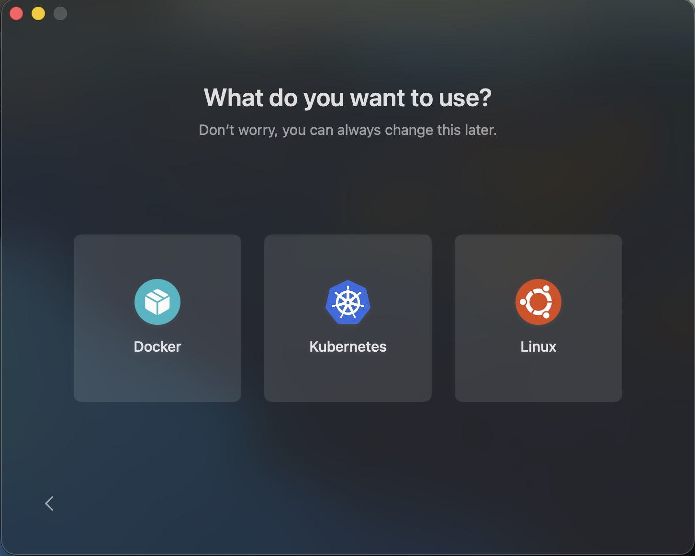
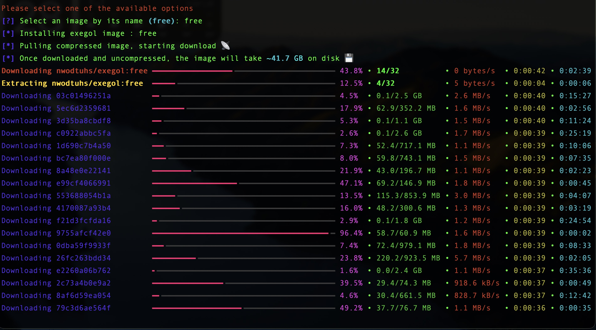
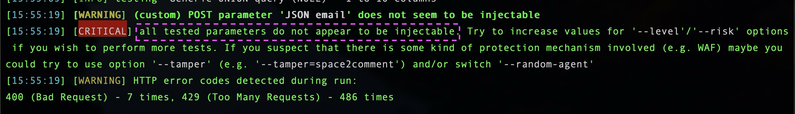

# Penetration Testing: Validating My Infrastructure Against SQL Injection with Exegol & SQLMap

Goal: Conduct an authorized penetration test on my own Dockerized microservice to detect and validate SQL Injection (SQLi) vulnerabilities using the Exegol offensive security framework and SQLMap.


To validate my security posture, I needed to simulate a real-world attack. I chose [Exegol](https://exegol.com/), a containerized offensive security environment, to run [SQLMap](https://sqlmap.org/), the industry-standard tool for automating SQL injection detection and exploitation.

**Disclaimer:** This assessment was performed strictly on my own infrastructure with explicit authorization. Unauthorized scanning or exploitation of third-party systems is illegal and unethical.


## Lab Environment: Setting Up Exegol

To ensure a clean, isolated, and reproducible testing environment, I used Exegol, which bundles hundreds of offensive tools in a single Docker container.

### Host Prerequisites (macOS)

I used [OrbStack](https://orbstack.dev/) as a lightweight, high-performance Docker alternative for macOS.

```
# Install OrbStack
brew install orbstack
docker context use orbstack

# Ensure Docker socket linkage
ln -sf /Users/<username>/.orbstack/run/docker.sock /var/run/docker.sock
```



[Exegol First Install](https://docs.exegol.com/first-install)


###  Installing Exegol
Exegol is installed via pipx to keep dependencies isolated.

```
# Install requirements
brew install git python pipx
pipx ensurepath
exec $SHELL

# Install Exegol wrapper
pipx install exegol

# Install the offensive image (The "Muscle")
exegol install
```




## Launching the Offensive Environment
Once the image is downloaded, I started the container:

```
exegol install
```

This launched a fully interactive Kali-like environment with SQLMap pre-installed and ready for testing.

**Target:** A custom Dockerized microservice (REST API) running in my production infrastructure. Input Method: JSON payload via POST request to an API endpoint. Objective: Determine if user inputs (test1, email, test2) passed to the API are properly sanitized and validated before being processed by the backend database.

Unlike a traditional web form that might rely on server-side rendering, this service exposes a direct API interface. If the input validation is weak, an attacker could inject malicious SQL commands directly into the database query, potentially leading to data exfiltration or destruction.


### Step 1: Request Interception & Analysis

Before launching an attack, I captured the exact HTTP request structure using Chrome DevTools (Network Tab).

**Configuration:**

* Enabled “Preserve Log” to capture the full transaction.
* Disabled Cache to ensure fresh requests.

**Identified Request:**

* Method: POST
* Endpoint: /api/submit
* Content-Type: application/json
* Payload:

```
{
  "Title": "Role A",
  "name": "User",
  "organization": "BlueProton",
  "email": "user@proton.me"
}
```

## Automated Scanning with SQLMap

**SQLMap** : Is an open source penetration testing tool that automates the process of detecting and exploiting SQL injection flaws and taking over of database servers.

I used [SQLMap](https://sqlmap.org/)to automate the detection process. SQLMap injects malicious payloads into parameters and analyzes the server’s response to detect anomalies indicative of SQLi.

[Documentation](https://github.com/sqlmapproject/sqlmap/wiki/Introduction)

### Initial Scan (Default Level)
I started with a standard scan to check for common vulnerabilities.

```
sqlmap -u "https://mysite.com/api/submit" \
--method POST \
--headers="Content-Type: application/json" \
--data='{"Title":"Role A","name":"user","organization":"BlueProton","email":"user@proton.me"}' \
--batch --dbs
```

* --batch: Non-interactive mode (assumes "yes" to prompts).
* --dbs: Enumerate database names if a vulnerability is found.

**Result:** No vulnerabilities detected at the default level.


## Parameter-Specific Testing

To ensure thoroughness, I targeted specific parameters individually, as some inputs might be sanitized while others are not.

```
# Test 'name' parameter
sqlmap -u "https://mysite.com/api/submit" --method POST --data='...' -p name --batch --dbs

# Test 'email' parameter
sqlmap -u "https://mysite.com/api/submit" --method POST --data='...' -p email --batch --dbs

```

## Increasing Detection Strength
Since the initial scan was negative, I increased the Level and Risk to force SQLMap to try more complex and intrusive payloads (e.g., time-based blind injections).

* **--level=5:** Tests the highest number of injection points (headers, cookies, user-agent, etc.).
* **--risk=3:** Uses the most aggressive payloads, including boolean-based and time-based blind injections.

```
sqlmap -u "https://mysite.com/api/submit" \
--method POST \
--headers="Content-Type: application/json" \
--data='{"Title":"Role B","name":"user","organization":"BlueProton","email":"user@proton.me"}' \
--level=5 --risk=3 --batch --dbs
```


**Outcome:** After exhaustive testing with maximum aggression, SQLMap returned no findings. The application successfully rejected or sanitized all injected payloads.




The clean scan results are an indicator of effective Input Validation and Parameterized Queries in my backend code.

## Why Did It Pass? (Technical Analysis)

My application implements multiple layers of defense before data ever reaches the database:

**Frontend Input Sanitization**

Before any data is sent to the backend, I enforce strict validation:

```
// Trim whitespace
const test1= data.test1.trim();
const email = data.email.trim();

// Regex validation for allowed characters only
if (!/^[\p{L}\s'-]{1,100}$/u.test(test1)) {
  return "Invalid test1";
}

// Email format validation
if (!/^[^\s@]+@[^\s@]+\.[^\s@]+$/.test(email)) {
  return "Invalid email";
}

// Whitelist validation for enumerated values
if (!["Role A", "Role B"].includes(title)) {
  return "Please select a valid title";
}

```

### Security Impact:

* **Character Whitelisting:** Only letters, spaces, hyphens, and apostrophes are allowed (Unicode-aware).
* **Length Limits:** Maximum 100 characters prevents buffer overflow attempts.
* **Type Enforcement:** Titles are restricted to a predefined whitelist (Role A, Role B), eliminating injection vectors entirely.


### Backend Parameterized Queries

Even if frontend validation is bypassed, the backend uses prepared statements that treat all input as data, not executable SQL code.

### Infrastructure-Level Protections

* **API Gateway:** My Caddy reverse proxy filters known malicious patterns.

### Automation vs. Manual Analysis

SQLMap is incredibly efficient for finding known patterns. However, the fact that it found nothing **doesn’t guarantee 100% securit**y. It confirms the absence of automated SQLi, but manual testing is required for logic flaws.


### Defense-in-Depth Works

The combination of:

* Secure Coding (Parameterized queries)
* Infrastructure Hardening (Firewalls, WAF)
* Automated Scanning (Trivy/Nuclei)
* Penetration Testing (SQLMap for now)

### Conclusion

The results were reassuring: my infrastructure held up under pressure. However, security is a continuous process. The absence of SQLi is just one milestone. The next challenge is to tackle Business Logic Errors and Authentication Bypasses using more advanced tools like Burp Suite.

The journey from “building” to “breaking” to “rebuilding” continues.

**Be your own guru.**


