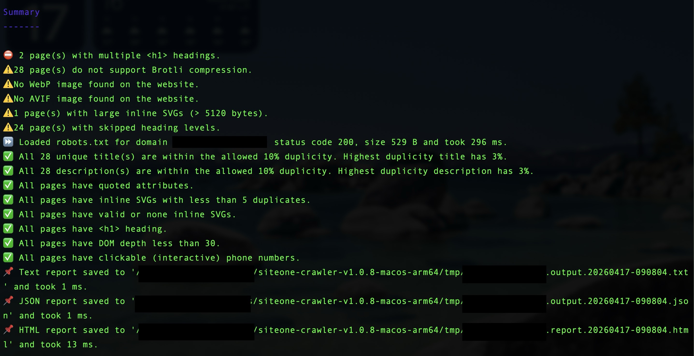
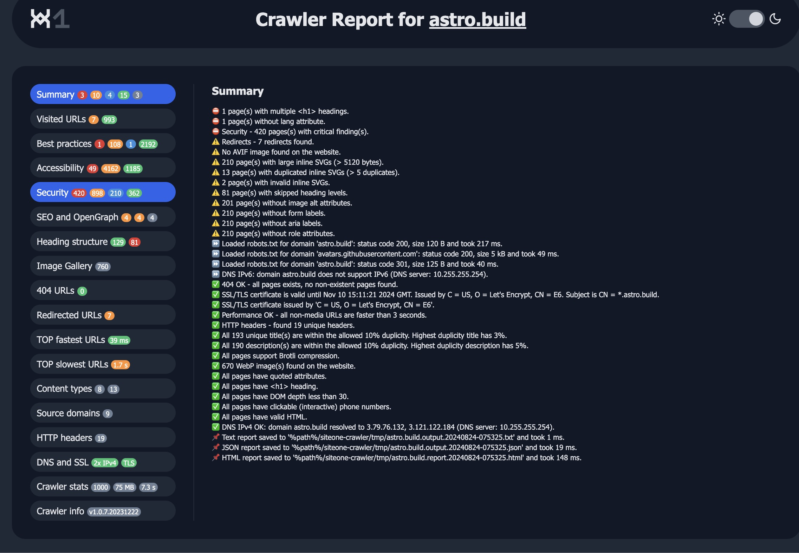
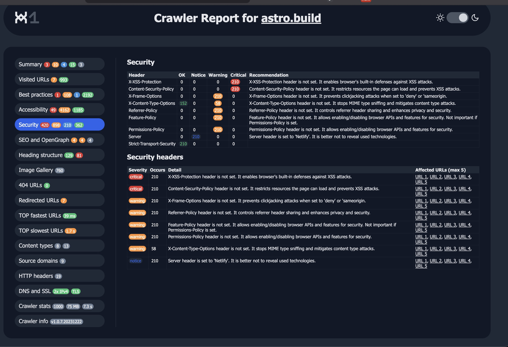

# SiteOne Crawler: Rapid Web Security & Compliance Auditing

>Goal: Automate the discovery of security misconfigurations and compliance gaps in web applications.

In the world of web security, visibility is the first step to defense. Before we can harden a system, we need to know its current state. This is where SiteOne Crawler shines.

This open-source tool allows for rapid, automated web audits, combining security scanning with SEO analysis. Within minutes, it generates a comprehensive HTML report highlighting potential vulnerabilities, missing security headers, and configuration errors.


* Pre-deployment checks: Ensuring new sites are secure before going live.
* Continuous monitoring: Regularly scanning production environments for regressions.
* Compliance validation: Checking against standards like OWASP Top 10 basics.

[Official Documentation](https://crawler.siteone.io/getting-started/quick-start-guide/)

# Installation: CLI for Efficiency

I prefer CLI tools for security operations because they are scriptable, fast, and integrate easily into automation pipelines (like CI/CD). However, SiteOne also offers a Desktop version for quick ad-hoc checks.

**Installation Steps:**


```
# Download the latest release (macOS ARM64 example)
wget https://github.com/janreges/siteone-crawler/releases/download/v1.0.8/siteone-crawler-v1.0.8-macos-arm64.tar.gz


# Extract and navigate
tar -xvzf siteone-crawler-v1.0.8-macos-arm64.tar.gz
cd siteone-crawler-v1.0.8-macos-x64
```
### Running a Full Security Audit

By default, the crawler performs a deep scan of the target URL, checking for:

* Missing Security Headers (HSTS, CSP, X-Frame-Options)
* Mixed Content Issues (HTTP resources on HTTPS pages)
* SSL/TLS Configuration
* Outdated Software Signatures

Command:

```
./crawler --url=https://crawler.siteone.io/
```

Output: The tool generates a timestamped HTML report:

```
./tmp/report.crawler.siteone.io.20231214-152604.html
```


>CLI output showing real-time security findings.


### Deep Dive: Isolating Security Findings

Sometimes, we need to focus strictly on the security posture rather than SEO metrics. By disabling non-essential assets (images, fonts, styles), we can speed up the scan and focus purely on the HTML structure and headers.

**Optimized Command for Security Scanning:**

```
./crawler \
  --url=https://crawler.siteone.io/ \
  --extra-columns='Title(30),Description(40),Keywords(40)' \
  --analyzer-filter-regex='/(seo|best)/i' \
  --disable-javascript  \
  --disable-styles \
  --disable-fonts \
  --disable-images \
  --disable-files \
  --hide-progress-bar
  
```

This approach reduces noise and allows the auditor to quickly identify:

* Critical Misconfigurations: Missing Content-Security-Policy or Strict-Transport-Security.
* Information Disclosure: Unnecessary server banners or verbose error messages.
* Structural Weaknesses: Broken links or insecure redirects.





### Why This Matters for Security by Design? 

In my "Build, Break, Test" philosophy, testing is non-negotiable.

Using tools like SiteOne Crawler allows me to:

* Validate Hardening: After applying .htaccess rules or CIS benchmarks, I run a scan to confirm the changes are effective.
* Identify Blind Spots: Automated scanners often catch things manual review misses, such as subtle mixed-content warnings.
* Document Compliance: The HTML reports serve as evidence of due diligence during audits.

**Conclusion:** SiteOne Crawler is a lightweight, powerful addition to any security engineer's toolkit. It bridges the gap between complex manual auditing and automated vulnerability scanning, making it perfect for rapid, iterative security improvements.

**Be your own guru.** 

