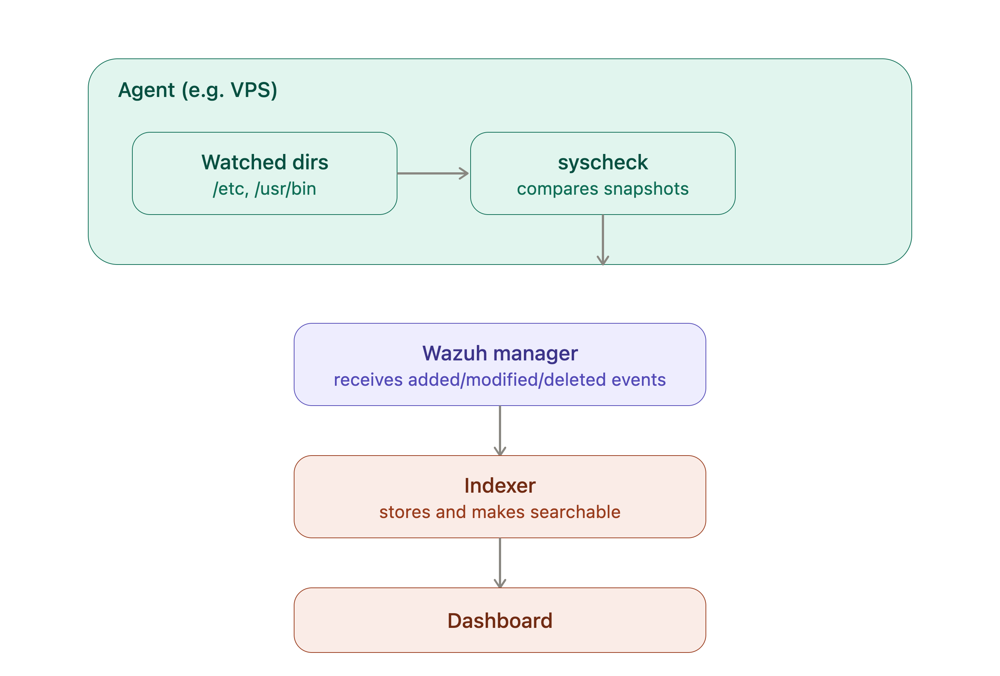

# File Integrity Monitoring (FIM) with Wazuh 

[FIM](https://documentation.wazuh.com/current/user-manual/capabilities/file-integrity/index.html) answers one simple question, continuously: *did something change that shouldn't have?* It watches specific files and directories, and the moment something is added, modified, or deleted, it tells you no signature database, no CVE matching, just "this changed, here's exactly what changed."



## How it works, in plain terms

Each Wazuh agent runs a component called `syscheck`. You tell it which directories to watch. On a schedule (and optionally on startup), it takes a snapshot  hashes, permissions, ownership, size of every file in those directories, and compares that snapshot to the last one. Differences get reported to the manager and show up in the dashboard.

It's per-agent, not global  each machine (your VPS, your laptop, the manager itself) needs its own FIM configuration, watching whatever's relevant to *that* machine.

## Configuring it

On the agent you want to monitor

```bash
sudo nano /var/ossec/etc/ossec.conf
```
(on macOS, the path is `/Library/Ossec/etc/ossec.conf` instead)

Find the `<syscheck>` block — it's usually already present but minimal or disabled by default — and set it up like this:

```xml
<syscheck>
  <disabled>no</disabled>
  <frequency>43200</frequency>
  <directories check_all="yes">/etc,/usr/bin,/usr/sbin</directories>
  <directories check_all="yes">/root</directories>
</syscheck>
```

What each part means:

- **`<disabled>no</disabled>`**  turns the module on. Obvious, but easy to miss if it was `yes` by default.
- **`<frequency>43200</frequency>`**  how often (in seconds) it runs a full scan. 43200 = 12 hours. You don't need this running every minute; file changes on a server are relatively infrequent, and a full scan has some CPU/disk cost.
- **`<directories check_all="yes">`**  the directories being watched. `check_all="yes"` means check everything about each file: hash, permissions, owner, size, modification time — not just "did the content change."
- **Which directories to pick**: start with the ones that matter most for a compromise — `/etc` (system configuration), `/usr/bin` and `/usr/sbin` (system binaries — if one of these changes unexpectedly, that's a serious signal), and `/root` if you use root's home directory for anything. You can add more later; don't try to watch the entire filesystem, that's noisy and mostly pointless (temp files, logs, and caches change constantly and aren't meaningful).

Apply the change:

```bash
sudo systemctl restart wazuh-agent
```

**Confirming it's actually working**

Don't just trust the config verify it. Create a harmless test file in a watched directory:

```
sudo touch /etc/test-fim-file.txt
sudo rm /etc/test-fim-file.txt
```

Both the creation and the deletion should show up as separate events once FIM catches up.

## Reading the results

In the dashboard: **Endpoint security → File Integrity Monitoring**, select the agent.

You'll see a table of events, each with:

- **File path**  exactly what changed
- **Event type**  `added`, `modified`, or `deleted`
- **Timestamp** when it happened

For a `modified` event, it'll often show what specifically changed: permissions, ownership, size, or the file's hash (meaning content changed, even if size stayed the same which is actually a more suspicious signal than a size change, since it suggests deliberate tampering rather than a normal edit).


## Real-time vs. scheduled 

By default, the config above checks on a schedule (every 12 hours in this example). For directories where I want to know immediately, Linux supports real-time monitoring using the kernel’s own file-change notification system:

```
<directories check_all="yes" realtime="yes">/etc</directories>
```
This adds `realtime="yes"` changes to that specific directory get reported almost instantly instead of waiting for the next scheduled scan. Trade-off: slightly more resource overhead, so I'd only add this to the directories that matter most (I use it on /etc, not on lower-priority paths), not everything I’m watching.

### Syscheck

When FIM first runs (on agent startup or first scan), syscheck builds a baseline: for every file in your watched directories, it records a set of attributes into a local database on the agent (`/var/ossec/queue/fim/db/ on Linux`). This isn't just "last modified time" it's a fuller fingerprint.

**What gets recorded per file**

* **Cryptographic hashes**: typically MD5, SHA1, and SHA256 of the file’s actual content (this is the important one: even if someone changes a file’s content but carefully resets its timestamp to look unchanged, the hash still won’t match)
* **File size**
* **Permissions** (`read/write/execute bits`)
* **Owner and group**
* Modification and change timestamps
inode number (on Linux the filesystem’s internal file identifier)

### Highest value, watch these on every machine

* `/etc`: All system configuration SSH config, cron, sudoers, PAM, firewall rules. If an attacker wants to persist or weaken your defenses, this is where they touch first.
* `/usr/bin, /usr/sbin`:System binaries. A replaced or trojaned binary here (a fake ls, ps, or ssh that hides malicious activity) is a classic rootkit technique.
* `/root` (or /home/myuser for my regular account): SSH keys, shell config (`.bashrc, .profile`), any scripts or credentials I keep there.

### Worth adding

* `/lib, /usr/lib` (or /lib64) : Shared libraries. Malware sometimes hooks into these instead of binaries directly less obvious, same effect.
* `/boot`: Kernel and boot configuration. Rarely changes; any modification here is a strong signal.
* `/var/www` : My actual application code a webshell dropped here is one of the most common real-world compromise indicators.
* Any directory holding application `secrets/`config: `.env` files, API keys, database credentials : Direct target for credential theft if compromised.

### NOT to watch noisy, low-value

* `/var/log`:changes constantly by design (that's what logs do); FIM here just generates noise. My log analysis is already handled separately by log collection, not FIM.
* `/tmp`, `/var/tmp` legitimately churns constantly from normal system/app activity.
* `/proc`, `/sys virtual filesystems`, not real files; monitoring these doesn't make sense for FIM.
* Package manager caches (`/var/cache/apt`, etc.) expected to change with every update.

### Practical starting config given this

```
<syscheck>
  <disabled>no</disabled>
  <frequency>43200</frequency>
  <directories check_all="yes" realtime="yes">/etc</directories>
  <directories check_all="yes">/usr/bin,/usr/sbin,/usr/lib</directories>
  <directories check_all="yes">/root</directories>
</syscheck>
```

Real-time only on `/etc` (highest value, lowest volume of legitimate churn) everything else on the scheduled cycle to keep resource usage reasonable on your hardware.


## The big picture


FIM on its own tells you what changed. It doesn’t tell you why, or automatically decide if it’s malicious that’s still a judgment call on your part, informed by context (did I just run an update? Am I expecting this?). Where it becomes genuinely powerful is combined with everything else in the stack: if a FIM alert on a suspicious binary change lines up with an SSH brute-force alert an hour earlier, or a new CVE just got flagged on the same package that’s not three separate coincidences, that’s a story starting to tell itself across modules. That correlation is really the whole point of running a SIEM instead of just tailing logs by hand.