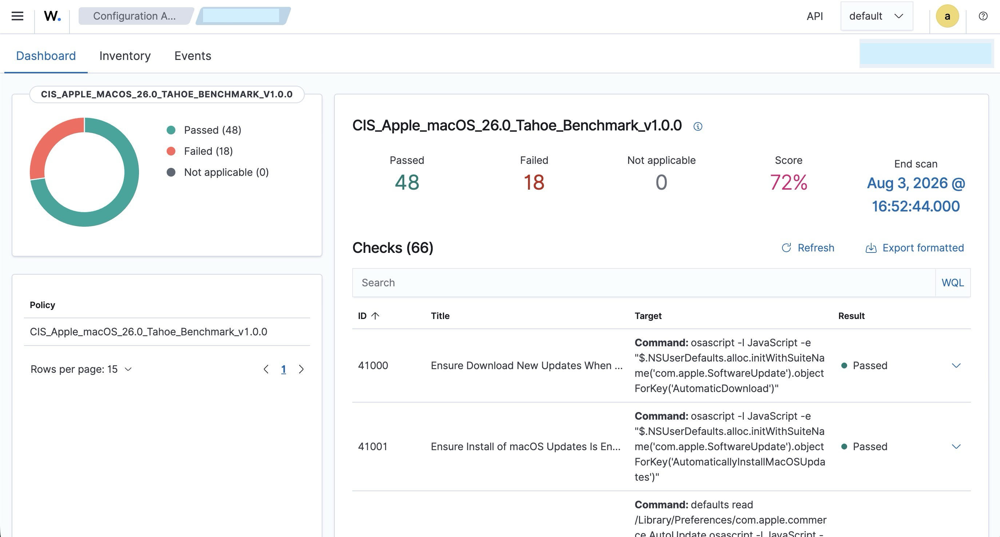
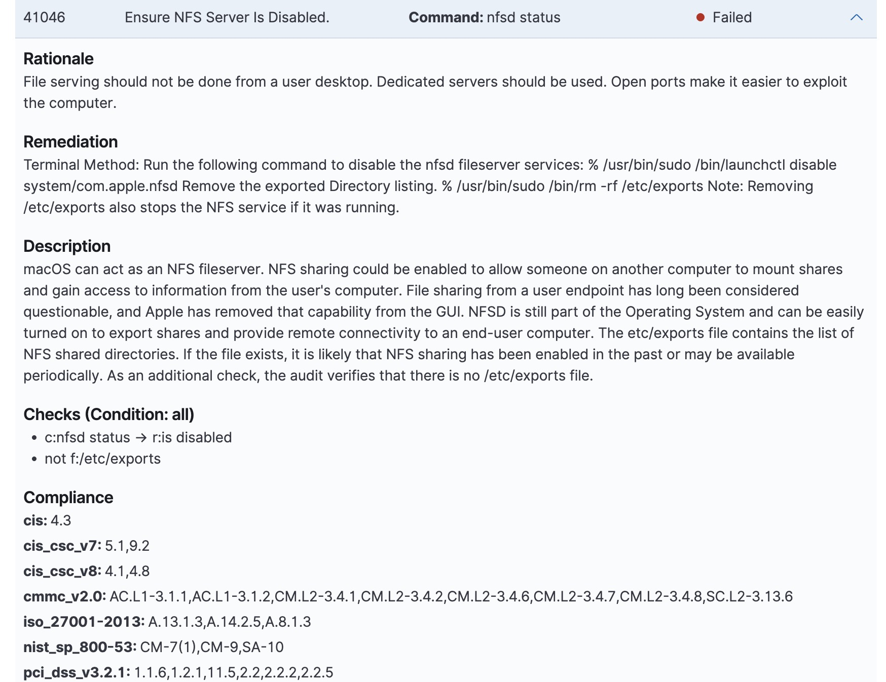

# Endpoint Security: Hardening macOS Against the CIS Benchmark with Wazuh

*A hands-on walkthrough of reading, understanding, and manually remediating CIS benchmark findings on macOS. No MDM required.*

So after installing the Wazuh agent and Wazuh Manager, the next step was exploring Endpoint Security Configuration Assessment, and honestly, I find it amazing. Later on, let's automate everything, but for the moment I'm trying to build a basic understanding of how a SIEM actually works, not just clicking buttons.

Security Configuration Assessment (SCA) tools are only half the job. Wazuh, an open-source SIEM/XDR platform, can scan a macOS endpoint against the [**CIS Apple macOS Benchmark**](https://www.cisecurity.org/) and tell me exactly what's misconfigured, but the dashboard doesn't fix anything for me. That gap between "**here's what's wrong**" and "**here's how I fixed it**" is exactly where I wanted to spend time.

This is my documentation of walking through that gap on an endpoint (macOS 26 Tahoe), starting from a **65% compliance score** and manually remediating findings one at a time. With 21 failed checks to work through, I read why each one mattered, since I'm doing this on my own laptop as a starting point, and documented what worked, what didn't, and why. By the end of this process the score moved to **72%**.

The real goal wasn't the percentage. It was understanding *how* we do it, *why*, and what all that gibberish in the remediation field actually means.

## How to Read a Wazuh SCA Finding

Every failed check in Wazuh's SCA module follows the same anatomy:






| Section | What it tells me |
|---|---|
| **ID / Title** | A short human-readable name for the setting being tested |
| **Command** | The exact script Wazuh ran on the endpoint to read the current state |
| **Rationale** | Why this setting matters from a security standpoint |
| **Description** | Background/context, often including OS-version caveats |
| **Remediation** | The actual fix, usually a Terminal command or a configuration profile |
| **Check (Condition)** | The regex the command's output must match to pass |
| **Compliance** | Which frameworks this check maps to (CIS, NIST 800-53, CMMC, ISO 27001, PCI-DSS, HIPAA…) |

The compliance mapping is worth pausing on. A single macOS setting like disabling NFS isn't just a CIS checkbox, it usually maps to several other frameworks at once. That's exactly why SCA scanning is efficient: fixing one setting can satisfy multiple audits simultaneously.

### Reading CIS Remediation Text

CIS benchmark documents use `%` to represent a terminal prompt. It is **never part of the command itself**. Commands are also frequently followed by an **applicability tag** with no delimiter, like:

```
% /usr/bin/sudo /usr/bin/pmset -a powernap 0 Internal Only - General.
```

Here, the real command ends at `0`. "Internal Only, General" is CIS metadata indicating the check only applies to Macs with an internal battery (laptops). It's not part of what you type. This tripped me up the first time.

**Rule of thumb:**

- If it ends in a bare word or number, check whether the text that follows looks like a category label (*Internal/External, General, Enterprise, macOS Only*) rather than a valid flag. If so, that's a tag, not a command.
- Drop redundant full paths (`/usr/bin/sudo` → `sudo`, `/bin/launchctl` → `launchctl`).
- Multiple `%` symbols in one remediation block mean **multiple separate commands**, each needing its own `sudo`. Don't concatenate them into one line.

## Two Remediation Methods

Wazuh/CIS findings generally point to one of two fix types:

1. **Terminal Method**: A direct shell command (`launchctl`, `pmset`, `rm`, `cp`, etc.)
2. **Profile Method**: A configuration profile (`.mobileconfig`) that sets a value under a specific `PayloadType` and key, installed via `System Settings → Profiles`

Profile-based fixes exist because many of these settings live inside `NSUserDefaults` domains that Apple doesn't expose through any GUI toggle.

---

## Terminal Method: Disabling NFS File Sharing

**Check:** Ensure NFS Server Is Disabled

**Remediation text from CIS:**
> Run the following command to disable the nfsd fileserver services: `% /usr/bin/sudo /bin/launchctl disable system/com.apple.nfsd` Remove the exported Directory listing. `% /usr/bin/sudo /bin/rm -rf /etc/exports`

**Parsed commands (two separate lines):**
```bash
sudo launchctl disable system/com.apple.nfsd
sudo rm -rf /etc/exports
```

**NFS** is a legacy file-sharing protocol with a long history of weak access control. An unattended, listening NFS daemon expands the endpoint's attack surface for no benefit on a typical workstation.

**Caveat:** `rm -rf` is destructive. If `/etc/exports` contained genuine custom NFS shares, they're gone. Always read a remediation command for what it *does*, not just what it fixes, before you run it.

---

## Profile Method: On-Device Dictation

**Check ID 41039:** Ensure On-Device Dictation Is Enabled

**Command Wazuh runs to check state:**
```bash
osascript -l JavaScript -e "$.NSUserDefaults.alloc.initWithSuiteName('com.apple.applicationaccess').objectForKey('forceOnDeviceOnlyDictation')"
```
Passing condition: `r:^true$|^1$`

**Remediation:**
> PayloadType: `com.apple.applicationaccess` · Key: `forceOnDeviceOnlyDictation` · Value: `<true/>`

**Why:** macOS Dictation can send audio to Apple's Siri servers for transcription unless explicitly forced to stay on-device. For any workflow involving confidential material, legal, healthcare, or source code, and honestly for my own data privacy too, that's not a data path I'm comfortable with. This setting keeps voice data local.

**Built `.mobileconfig`:**

```xml
<?xml version="1.0" encoding="UTF-8"?>
<!DOCTYPE plist PUBLIC "-//Apple//DTD PLIST 1.0//EN" "http://www.apple.com/DTDs/PropertyList-1.0.dtd">
<plist version="1.0">
<dict>
    <key>PayloadContent</key>
    <array>
        <dict>
            <key>PayloadType</key>
            <string>com.apple.applicationaccess</string>
            <key>PayloadIdentifier</key>
            <string>com.yourcompany.applicationaccess.dictation</string>
            <key>PayloadUUID</key>
            <string>{generate-with-uuidgen}</string>
            <key>PayloadEnabled</key>
            <true/>
            <key>PayloadDisplayName</key>
            <string>Force On-Device Only Dictation</string>
            <key>forceOnDeviceOnlyDictation</key>
            <true/>
            <key>allowDictation</key>
            <false/>
        </dict>
    </array>
    <key>PayloadDisplayName</key>
    <string>CIS - Dictation Controls</string>
    <key>PayloadIdentifier</key>
    <string>com.yourcompany.cis.dictation</string>
    <key>PayloadUUID</key>
    <string>{generate-with-uuidgen}</string>
    <key>PayloadType</key>
    <string>Configuration</string>
    <key>PayloadVersion</key>
    <integer>1</integer>
    <key>PayloadScope</key>
    <string>System</string>
</dict>
</plist>
```

**A design decision worth documenting:** the profile above combines two keys, `forceOnDeviceOnlyDictation: true` (what CIS 41039 technically requires) and `allowDictation: false` (my own stricter choice, to disable dictation entirely). Worth flagging: **the second key makes the first technically redundant**, since there's no dictation left to keep on-device once it's disabled outright. I kept both for documentation clarity, and it satisfies the Wazuh check either way, since `forceOnDeviceOnlyDictation` remains `true` in the profile. But it's a small example of a bigger idea: passing the audit and what I actually want for my machine can diverge slightly, and that gap is worth calling out rather than hiding.

**Install steps:**

1. Run `uuidgen` twice in Terminal, once per placeholder
2. Replace the two `{generate-with-uuidgen}` placeholders in the `.mobileconfig` with the generated values
3. Save the file with a `.mobileconfig` extension
4. Double-click it, this opens **System Settings → Profiles**
5. Click **Install**, authenticate
6. Verify: re-run the `osascript` check command above. It should return `true`
7. Force a fresh Wazuh scan: `sudo /Library/Ossec/bin/wazuh-control restart`

---

## A Deprecated Control: When Remediation Fails (auditd)

**Check ID 41040:** Ensure Security Auditing Is Enabled

**Remediation text:**
> `% /usr/bin/sudo /bin/launchctl load -w /System/Library/LaunchDaemons/com.apple.auditd.plist`
> `% /usr/bin/sudo /bin/cp /etc/security/audit_control.example /etc/security/audit_control`

**What happened on macOS 26 Tahoe:**

The `cp` step succeeded. `/etc/security/audit_control` was created. But loading the daemon failed:

```
$ sudo launchctl load -w /System/Library/LaunchDaemons/com.apple.auditd.plist
Load failed: 5: Input/output error
```

Trying the modern `bootstrap` syntax produced the identical error:

```
$ sudo launchctl bootstrap system /System/Library/LaunchDaemons/com.apple.auditd.plist
Bootstrap failed: 5: Input/output error
```

**Why this is expected, not a mistake I made:** Wazuh's own check description says it outright. Apple deprecated `auditd` as of macOS 11 Big Sur, and as of macOS 14 Sonoma it's no longer enabled by default; the recommended replacement is a third-party tool built on Apple's EndpointSecurity API. The repeated I/O error strongly suggests Apple has gone further on macOS 26, and now blocks `auditd` from being manually loaded at all, likely enforced at the SIP/kernel level.

---

## Where to Find Ready-Made Profiles (So You're Not Building Every Payload From Scratch)

Hand-writing `.mobileconfig` files works for learning, but it doesn't scale. The community maintained reference for this is:

- **[usnistgov/macos_security](https://github.com/usnistgov/macos_security)**: a NIST/industry open-source project that generates ready-to-use `.mobileconfig` profiles, remediation scripts, and audit checks for CIS, NIST 800-53, and DISA STIG baselines. You pick a baseline and it outputs everything needed.
- **The official CIS Benchmark PDF** (cisecurity.org): the authoritative source. Wazuh's remediation text is drawn directly from it, and its appendix includes raw profile XML.
- **[Apple's Device Management documentation](https://developer.apple.com/documentation/devicemanagement)**: the canonical list of every `PayloadType` and key Apple supports, useful for double checking a key actually exists before building a profile around it.

## MDM

Everything above was done manually, one Mac at a time, deliberately, to understand what each fix does before automating it. That's the right approach for a single machine, or for learning. It doesn't scale to a fleet.

In a managed environment, these same `.mobileconfig` payloads get uploaded once into an MDM (Jamf, Kandji, Mosyle, Apple Business Manager plus a compatible MDM, etc.) and pushed automatically to every enrolled device, with compliance re-checked continuously instead of via manual `wazuh-control restart` cycles. The profile content is identical. MDM just changes the distribution mechanism, not the underlying fix. Walking through each payload manually first, the way I did here, is what makes it possible to actually trust what's about to be pushed fleet-wide.

## Verifying a Fix Landed

After any remediation, profile or terminal command, the same three-step loop applies:

1. **Re-run the exact check command** Wazuh uses (visible in the finding detail) directly in Terminal, to confirm the value actually changed.
2. **Force a fresh SCA scan** rather than waiting for the schedule:
   ```bash
   sudo /Library/Ossec/bin/wazuh-control restart
   ```
3. **Reload the Wazuh dashboard** and check that the specific ID moved from Failed to Passed.

## Final Thoughts 

Starting score: **65%** (42 passed / 22 failed / 2 not applicable). After manually reviewing, understanding, and selectively remediating findings, including consciously leaving the deprecated `auditd` control as a documented exception rather than forcing a broken fix: **72%**.

I deliberately didn't apply every single control. For this first exercise, the goal was just understanding Wazuh by doing some remediations, not chasing 100%.

Honestly, it gave me a completely different view of my own endpoint. It's macOS, so a lot of what surfaced is really about Apple's own privacy settings. I learned more about Apple itself, its controls, and what kind of information is quietly going to Apple's servers by default, than I expected going in.

Wazuh, so far: gold. Nice.

Be your own guru.