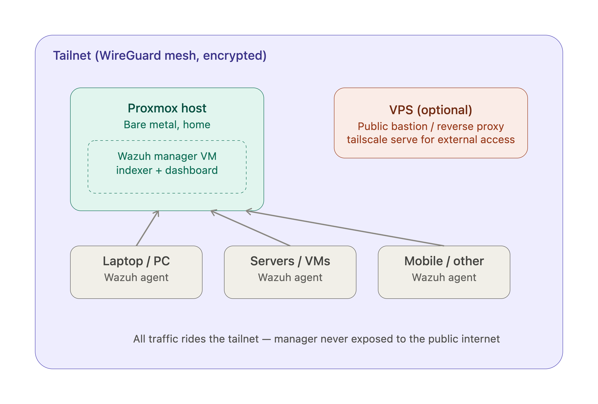
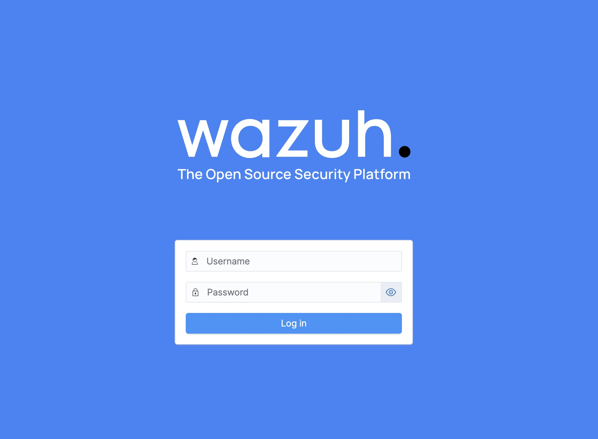
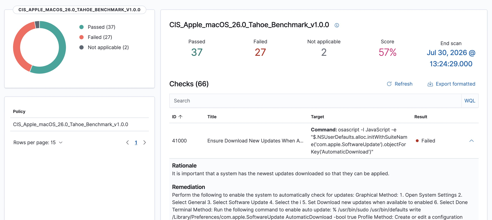
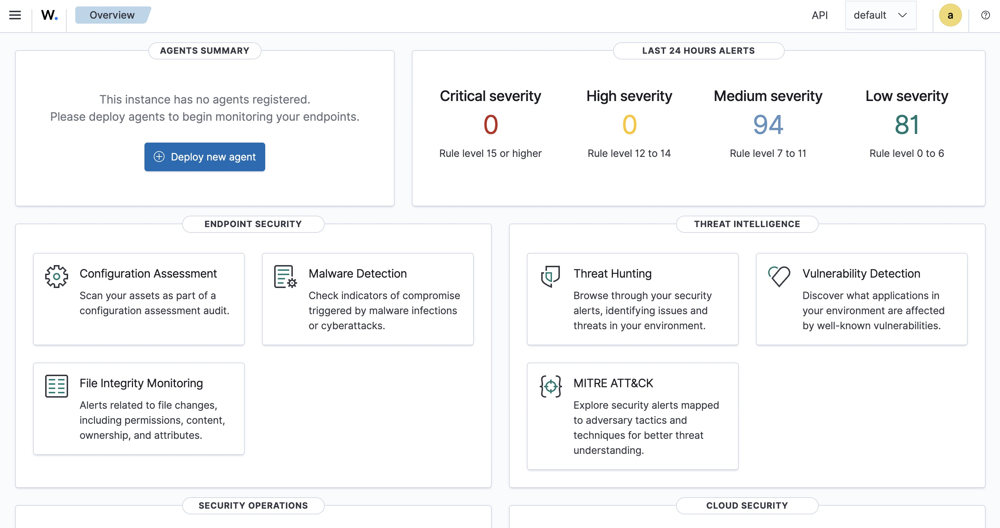

# Building a Home SOC: Centralized Security with Wazuh, Proxmox, and Tailscale.


**Goal**: Deploy a Security Operations Center at home, something monitoring my own infrastructure: a bare-metal hypervisor (Proxmox) at home and two VPS I run elsewhere.


This article walks through my approach to building a complete SIEM pipeline at home with Wazuh with security intent at every decision point, from network architecture to agent enrollment to post-deployment hardening.

**The Problem**: Log Sprawl and Detection Blind Spots


[**A SIEM**](https://wazuh.com/platform/siem/) (Security Information and Event Management) is a system that collects logs and telemetry from many machines, servers, laptops, network devices and centralizes them so I can detect suspicious activity across my whole environment from one place, instead of tailing logs on each box individually.

Wazuh is an open-source [SIEM](https://wazuh.com/platform/siem/)/[XDR](https://wazuh.com/platform/xdr/) platform: it runs a manager that receives data from lightweight agents installed on each monitored machine, indexes everything (via OpenSearch), and gives me a dashboard to search, alert on, and respond to security events.

I chose Wazuh over alternatives for a few security-minded considerations:

**Open-source and self-hosted**. My security telemetry logs, alerts, host baselines, vulnerability scans stays on infrastructure I control. Sending that data to a third-party SaaS platform means handing over a map of my own vulnerabilities to an external entity.

**Agent-based architecture**. Wazuh agents run on each host with file system access, enabling File Integrity Monitoring, rootkit detection, and process auditing that network-only tools can’t achieve.

**Active response capability**. Wazuh doesn’t just detect it can act. Built-in active response scripts can auto-block malicious IPs at the firewall level in response to triggered rules. That moves the platform from passive monitoring to automated defense.

**Open source**: I can test, learn and build freely.

### The Architecture Decision: Tailscale Over Raw WireGuard



My original plan was a LXC acting as a [WireGuard](https://medium.com/@nyb.an/love-triangle-over-vpn-proxmox-wireguard-kali-a-mac-346614235e16) server, since I don’t have admin access to my home router and configuring Wireguard is a headache and I love it, but it’s complicate in a home proxmox too. So [Tailscale](https://www.tailscale.com/) semmed to be the best choise (after the recommedation of one friend) .

A SIEM that’s internet-accessible is a target inversion: the system designed to detect breaches becomes the breach vector. By keeping the entire control plane on a private mesh network, I eliminate the attack surface entirely. No ports to scan, no credentials to brute-force, no dashboard to enumerate. The only way in is through Tailscale’s identity provider which brings its own authentication boundary (more on that in hardening).


## Hardware and sizing

My Proxmox host: an Intel Celeron N5105 mini PC, 4 cores, 11.5GB RAM, ~209GB total storage. Modest, but enough for a lab at my scale (3 agents: 2 VPS + my laptop).

Sizing I landed on for the Wazuh VM:

| Setting | Value |
|---|---|
| vCPU | 3 |
| RAM | 6GB |
| Disk | 80GB on `local-lvm` |
| OpenSearch JVM heap | capped at 2GB explicitly |
| Index retention | 90 days |
| Agent enrollment | pre-shared key, not autoenrollment |

One thing worth explaining since it tripped me up early: Proxmox has two default storage pools, `local` and `local-lvm`. `local` is just a directory on the host's root filesystem — used for ISOs, backups, templates. `local-lvm` is an LVM thin pool used specifically for VM disks — faster I/O, no filesystem overhead, and it's what you want for anything doing real disk work, like an OpenSearch indexer.


# The Proxmox VM (Wazuh Manager)

[Ubuntu Server](https://ubuntu.com/download/server) : Server is headless and lightweight, which is all a Wazuh manager needs.

**After first boot:**

```
bash sudo apt install qemu-guest-agent
sudo apt update && sudo apt upgrade -y
sudo apt install curl
```
Without this, Proxmox can’t report the VM’s actual IP or resource stats in its dashboard.


## Tailscale, Everywhere

Installed on: the Wazuh manager VM [proxmox] , VPSs + 1 Laptop.

```
curl -fsSL https://tailscale.com/install.sh | sh
sudo tailscale up --hostname=wazuh-manager --ssh

# adjust hostname per endpoint
```

Each command prints a login URL.

```
To authenticate, visit:
    https://login.tailscale.com/a/xxxxxxxxxxxx
```

**I copy that entire URL**, paste it into a browser, log into your Tailscale account if prompted, and hit Authorize.

Verify connectivity

Back in the admin console (https://login.tailscale.com/admin/machines), I see all 4 devices online with 100.x.x.x addresses. Quick test from my laptop:

`tailscale ping wazuh-manager`


## Locking down the tailnet with ACLs

By default, every device on a tailnet can reach every other device on every port. That's not what you want for a SIEM's control plane.

I tagged devices and wrote an access policy:


```json
{
  "tagOwners": {
    "tag:soc-manager": ["autogroup:admin"],
    "tag:soc-agent":   ["autogroup:admin"]
  },
  "acls": [
    {
      "action": "accept",
      "src":    ["tag:soc-agent"],
      "dst":    ["tag:soc-manager:1514", "tag:soc-manager:1515"]
    },
    {
      "action": "accept",
      "src":    ["autogroup:admin"],
      "dst":    ["tag:soc-manager:443", "tag:soc-manager:55000", "tag:soc-manager:22"]
    },
    {
      "action": "accept",
      "src":    ["autogroup:admin"],
      "dst":    ["tag:soc-agent:22"]
    }
  ]
}
```

**The security intent**: agents (VPS, laptop) can only reach the manager, and only on Wazuh's own ports :

* **1514 Agent → Manager event data (TCP/UDP)** : This is where Wazuh agents stream their actual telemetry: log events, file integrity monitoring alerts, syscall data. Without this port open from agent → manager, agents can connect and enroll but nothing they collect ever reaches the manager.
* **1515 Agent enrollment/registration (TCP)**: Separate from 1514. This is used once (or occasionally) when an agent first registers itself with the manager and gets issued a key/certificate for authenticated future connections on 1514.
* **55000 Wazuh API (HTTPS)**: Separate from the dashboard this is the [REST API](https://www.redhat.com/en/topics/api/what-is-a-rest-api) the manager exposes for programmatic control: querying agent status, managing rules, triggering active response, etc. The dashboard itself actually calls this API behind the scenes, and you'd also use it directly if you ever script anything (e.g. a health-check cron job, or integrating with other tools later). Agents don't need it only admin access.
* **443**: Wazuh dashboard (HTTPS)


So, they can't talk to each other laterally if one agent is ever compromised, the blast radius doesn't extend to my other machines. Only I can reach the dashboard, the API, or SSH into anything. Everything else is denied by default.

This **is zero-trust segmentation applied at the network layer**: explicit allowlists, least-privilege scoping, and implicit denial of anything not explicitly permitted.


### Troubleshooting #1: Tagging My Laptop Blocked Admin Access

After setting up the initial ACLs, my laptop couldn't reach the Wazuh dashboard despite ping working. The issue : I'd mistakenly tagged my laptop as `soc-agent`.

Tagging a device changes its identity in ACL purposes. Once tagged `soc-agent`, Tailscale stopped seeing it as "me" (`autogroup:admin`) and started seeing it purely as "an infrastructure agent device"


## Installing Wazuh-Manager 

On the manager VM[Proxmox], using the offline [installer script](https://documentation.wazuh.com/current/deployment-options/offline-installation/) (more reliable than piecing together package URLs by hand):


```
curl -sO https://packages.wazuh.com/4.14/wazuh-install.sh
chmod 744 wazuh-install.sh
sudo bash wazuh-install.sh -a
```
At the very end, it prints something like:

```
INFO: --- Summary ---
...
User: admin
Password: <randomly generated>
```
**Note**: Save that password immediately, it’s shown once and won’t be retrievable afterward without a reset process.

Once it’s done, before pointing any real load at it, I still need to cap the OpenSearch heap given my RAM constraints:

```
sudo nano /etc/wazuh-indexer/jvm.options

#Find and set:
-Xms2g
-Xmx2g

sudo systemctl restart wazuh-indexer

```
Now that install is done , let’s verify the whole stack is healthy

```bash
sudo systemctl status wazuh-manager
sudo systemctl status wazuh-indexer
sudo systemctl status wazuh-dashboard
```

start it on apple

```
sudo launchctl bootstrap system /Library/LaunchDaemons/com.wazuh.agent.plist
```

Test dashboard access:

https://<wazuh-manager-tailnet-ip>




## Enrolling agents


[Wazuh Documentation](https://documentation.wazuh.com/current/installation-guide/wazuh-agent/wazuh-agent-package-linux.html)

**macOS :**
```bash
curl -O https://packages.wazuh.com/4.x/macos/wazuh-agent-4.14.7-1.arm64.pkg
sudo installer -pkg wazuh-agent-4.14.7-1.arm64.pkg -target /
sudo launchctl bootstrap system /Library/LaunchDaemons/com.wazuh.agent.plist
```

**VPS (Debian/Ubuntu-based), via the official repo rather than a hand-guessed package URL:**
```bash
curl -s https://packages.wazuh.com/key/GPG-KEY-WAZUH | sudo gpg --no-default-keyring --keyring gnupg-ring:/usr/share/keyrings/wazuh.gpg --import
sudo chmod 644 /usr/share/keyrings/wazuh.gpg
echo "deb [signed-by=/usr/share/keyrings/wazuh.gpg] https://packages.wazuh.com/4.x/apt/ stable main" | sudo tee /etc/apt/sources.list.d/wazuh.list
sudo apt update
sudo WAZUH_MANAGER='<manager-tailnet-ip>' apt install wazuh-agent
sudo systemctl daemon-reload
sudo systemctl enable wazuh-agent
sudo systemctl start wazuh-agent
```

`sudo cat /Library/Ossec/etc/ossec.conf | grep -A2 "<server>"`

Should show your manager’s tailnet IP under **<address>**. If it’s blank or wrong, the launchctl step may not have taken effect on the actual config so I needede to edit *ossec.conf* directly:

**Note**: By default, all agent files are stored in /Library/Ossec/ after the installation.

```
sudo nano /Library/Ossec/etc/ossec.conf

#Find `<server><address>` and set it to the manager's tailnet IP manually.
```

check

`sudo cat /Library/Ossec/etc/client.keys`

Restart the agent after enrolling

```
sudo launchctl bootout system /Library/LaunchDaemons/com.wazuh.agent.plist
sudo launchctl bootstrap system /Library/LaunchDaemons/com.wazuh.agent.plist
```

Re-check on the wazuh-manager

`sudo /var/ossec/bin/agent_control -l`


## Hardening, after the pipeline worked

**Closed port 1515 to agents.** Once all agents were enrolled, there was no reason to keep the enrollment port reachable by tagged agent devices — only by admin, in case I add a device later:
```json
{
  "action": "accept",
  "src":    ["tag:soc-agent"],
  "dst":    ["tag:soc-manager:1514"]
}
```
(1515 dropped from the agent rule, kept only in the admin rule)

**Pre-shared enrollment secret**, instead of relying purely on network-level access control for future enrollments:
```bash
sudo nano /var/ossec/etc/authd.pass
```
Any future `agent-auth` call now requires the `-P '<secret>'` flag to succeed — a second layer beyond the ACL gate.

**MFA reality check.** Since the dashboard is tailnet-only, my actual MFA boundary is Tailscale's own login whoever can authenticate into my tailnet can reach the dashboard. So the meaningful step here wasn't adding a separate login to Wazuh, it was confirming 2FA is enabled on the identity provider account backing my Tailscale login.




A SIEM is the backbone of detection and response. On its own, it tells me something is happening. Combined with active response rules, it becomes automated defense. Combined with File Integrity Monitoring, it becomes change detection. Combined with vulnerability scanning, it becomes risk visibility.


## Where I'm taking this next

The pipeline **agents → manager → indexer → dashboard**, entirely over a private mesh, nothing public is stable. From here, the plan is to make it actually function as a SOC rather than just a working pipe:

- **File Integrity Monitoring** on the VPS (`/etc`, `/usr/bin`, `/usr/sbin`, and any web app directories)
- **SSH brute-force detection with active response** (auto-blocking source IPs after repeated failed logins, using Wazuh's built-in rule 5720 and the `firewall-drop` active-response script)
- **Vulnerability detection** against installed packages on every agent
- Eventually, expanding beyond host-based monitoring a network IDS (Suricata/Zeek) feeding into the same manager.

**Be your own guru**

