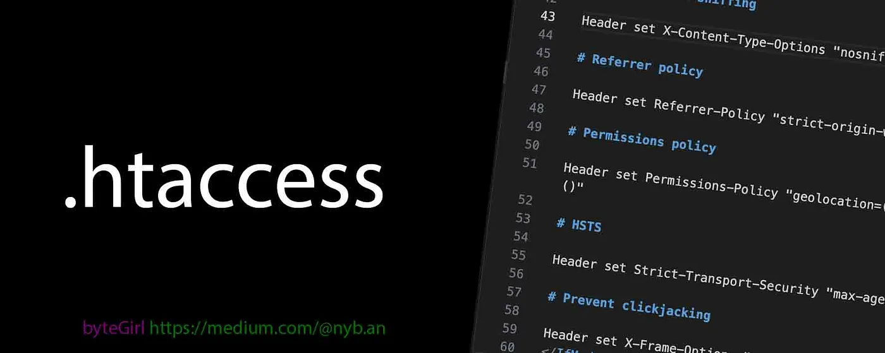
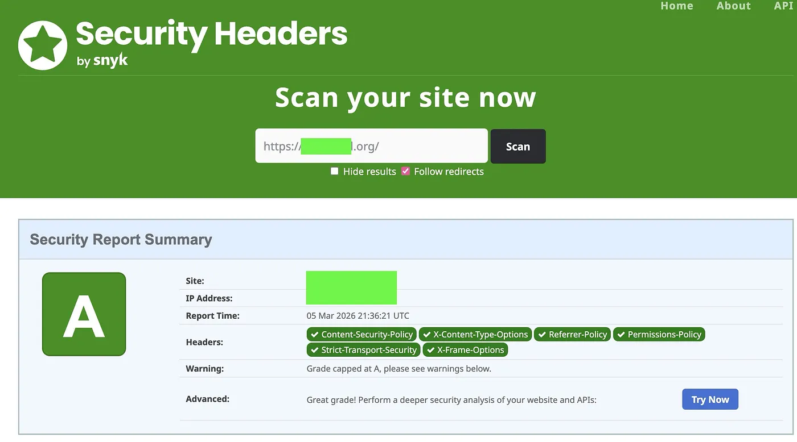

# Hardening Your Website with .htaccess



### Why Securing `.htaccess` Matters

`.htaccess` is a configuration file used by the Apache web server to control directory-specific settings. It allows you to override the main server configuration for a specific directory and its subdirectories, enabling features like URL rewriting, custom error pages, password protection, and access control.

The `.htaccess` control how a website behaves.

With it you can:

* enforce HTTPS
* control browser caching
* define security headers
* block malicious behaviors
* optimize performance

A well-configured `.htaccess` file improves:

* security
* performance
* SEO
* user privacy

## Force HTTPS

```
RewriteCond %{HTTPS} !=on
RewriteRule ^ https://%{HTTP_HOST}%{REQUEST_URI} [R=301,L]
```
This section forces all visitors to use HTTPS instead of HTTP.

**RewriteCond %{HTTPS} !=on**

* RewriteCond means rewrite condition.
* %{HTTPS} checks if the connection uses HTTPS.
* !=on means if HTTPS is NOT enabled.

So this condition triggers **only when the request is HTTP**.

**RewriteRule ^ https://%{HTTP_HOST}%{REQUEST_URI} [R=301,L]**


* RewriteRule defines the rule applied when the condition is true.
* ^ matches any request path.
* https://%{HTTP_HOST} keeps the same domain.
* %{REQUEST_URI} keeps the same page path.

example:

```
http://yourdomain.com/blog
↓
https://yourdomain.com/blog

```

Flags:

* R=301 → permanent redirect (good for SEO)
* L → stop processing further rewrite rules

**Security benefit**

* prevents man-in-the-middle attacks
* ensures encrypted traffic

##  Enable Browser Caching

```
<IfModule mod_expires.c>
  ExpiresActive On
```

This activates **browser caching rules** if the Apache module mod_expires is enabled.

**Why it matters**

Caching improves:

* page speed
* server performance
* user experience

## HTML Cache Policy

`ExpiresByType text/html "access plus 0 seconds"`


* ExpiresByType defines caching rules per MIME type
* text/html refers to HTML pages

"access plus 0 seconds" means:

* HTML must always be revalidated
* browsers should check the server before using a cached version

**Why?**

HTML often changes frequently.

## CSS & JavaScript Caching

```
ExpiresByType text/css "access plus 1 year"
ExpiresByType application/javascript "access plus 1 year"
ExpiresByType text/javascript "access plus 1 year"
```
These rules cache CSS and JS files for one year.

Benefits:

* faster page loads
* fewer server requests
* better performance scores

 This works well when you use **versioned assets**, like:

```
style.v2.css
app.3f9a.js
```
##  Image Caching

```
ExpiresByType image/jpeg "access plus 1 year"
ExpiresByType image/png "access plus 1 year"
ExpiresByType image/gif "access plus 1 year"
ExpiresByType image/svg+xml "access plus 1 year"
ExpiresByType image/webp "access plus 1 year"
```
Images rarely change, so they are cached for one year.

Supported formats include:

JPEG
PNG
GIF
SVG
WebP

This dramatically reduces:

* bandwidth usage
* page load time

## Font Caching

```
ExpiresByType font/woff "access plus 1 year"
ExpiresByType font/woff2 "access plus 1 year"
ExpiresByType font/ttf "access plus 1 year"
ExpiresByType font/eot "access plus 1 year"
```

These rules cache web fonts for one year.

Common formats include:

WOFF |
WOFF2 |
TTF |
EOT |

Since fonts rarely change, long caching is ideal.

## Security Headers

`<IfModule mod_headers.c>`

This section only runs if the Apache headers module is enabled.

Security headers help protect against:

* XSS attacks
* clickjacking
* data leaks
* browser vulnerabilities

## Content Security Policy (CSP)
 
```
Header set Content-Security-Policy "default-src 'self'; script-src 'self' 'unsafe-inline' https://cdn.jsdelivr.net; style-src 'self' 'unsafe-inline' https://fonts.googleapis.com; font-src 'self' https://fonts.gstatic.com; img-src 'self' data: https:; media-src 'self' https://res.cloudinary.com; connect-src 'self'; frame-ancestors 'none';"

```
CSP controls which resources a browser is allowed to load.

Example protections:

* prevents malicious scripts
* blocks unauthorized domains
* mitigates XSS attacks 

Key rules:

* default-src 'self' → only allow resources from your domain
* script-src → allow scripts from trusted CDNs
* style-src → allow styles from Google Fonts
* font-src → allow fonts from Google Fonts CDN
* img-src → allow images from HTTPS sources
* frame-ancestors 'none' → prevent embedding in iframes

This protects against content injection attacks.

## Prevent MIME Type Sniffing

`Header set X-Content-Type-Options "nosniff"`

**What it does**
Prevents browsers from guessing file types.

Why this matters:

Attackers could disguise malicious files as safe ones.

Example:

`malware.js disguised as image.png`

This header blocks that behavior.

## Referrer Policy

`Header set Referrer-Policy "strict-origin-when-cross-origin" `

**What it controls**

Defines how much referrer information is shared when users click links.

`strict-origin-when-cross-origin` means:

* full referrer sent to same-origin pages
* only domain sent to external sites
* protects sensitive URL data

## Permissions Policy

```
Header set Permissions-Policy "geolocation=(), microphone=(), camera=(), fullscreen=()"
```
Disables access to sensitive browser features.

Blocked APIs:

* geolocation
* microphone
* camera
* fullscreen

This reduces the risk of malicious scripts accessing hardware.

## HSTS (HTTP Strict Transport Security)

```
Header set Strict-Transport-Security "max-age=31536000; includeSubDomains"
```

Forces browsers to always use HTTPS.

Details:

* max-age=31536000 → enforce for 1 year
* includeSubDomains → applies to all subdomains

Benefits:

* prevents SSL stripping attacks
* guarantees encrypted communication

## Prevent Clickjacking


`Header set X-Frame-Options "DENY"`

Blocks your site from being embedded in an `<iframe>`.

Why?

Attackers can overlay invisible frames to trick users into clicking elements.

This header prevents **clickjacking attacks**.

```
# 🔐 Force HTTPS

RewriteCond %{HTTPS} !=on
RewriteRule ^ https://%{HTTP_HOST}%{REQUEST_URI} [R=301,L]

# Enable mod_expires

<IfModule mod_expires.c>
  ExpiresActive On

# HTML: short cache, always revalidate

ExpiresByType text/html "access plus 0 seconds"

# CSS & JS: long cache, immutable

ExpiresByType text/css "access plus 1 year"
ExpiresByType application/javascript "access plus 1 year"
ExpiresByType text/javascript "access plus 1 year"

# Images: long cache, immutable

ExpiresByType image/jpeg "access plus 1 year"
ExpiresByType image/png "access plus 1 year"
ExpiresByType image/gif "access plus 1 year"
ExpiresByType image/svg+xml "access plus 1 year"
ExpiresByType image/webp "access plus 1 year"

# Fonts: long cache, immutable

ExpiresByType font/woff "access plus 1 year"
ExpiresByType font/woff2 "access plus 1 year"
ExpiresByType font/ttf "access plus 1 year"
ExpiresByType font/eot "access plus 1 year"
</IfModule>

<IfModule mod_headers.c>
  # Content Security Policy
  Header set Content-Security-Policy "default-src 'self'; script-src 'self' 'unsafe-inline' https://cdn.jsdelivr.net; style-src 'self' 'unsafe-inline' https://fonts.googleapis.com; font-src 'self' https://fonts.gstatic.com; img-src 'self' data: https:; media-src 'self' https://res.cloudinary.com; connect-src 'self'; frame-ancestors 'none';"

# Prevent MIME-sniffing

Header set X-Content-Type-Options "nosniff"

# Referrer policy

Header set Referrer-Policy "strict-origin-when-cross-origin"

# Permissions policy

Header set Permissions-Policy "geolocation=(), microphone=(), camera=(), fullscreen=()"

# HSTS

Header set Strict-Transport-Security "max-age=31536000; includeSubDomains"

# Prevent clickjacking

Header set X-Frame-Options "DENY"
</IfModule>
```

**Testing**

[Analyse your HTTP responde Headers](https://securityheaders.com/)



### Final Thoughts

A secure .htaccess configuration helps you achieve three critical goals:

🔐 Security — protect users and data

⚡ Performance — improve caching and speed

🌐 Reliability — enforce modern web standards


