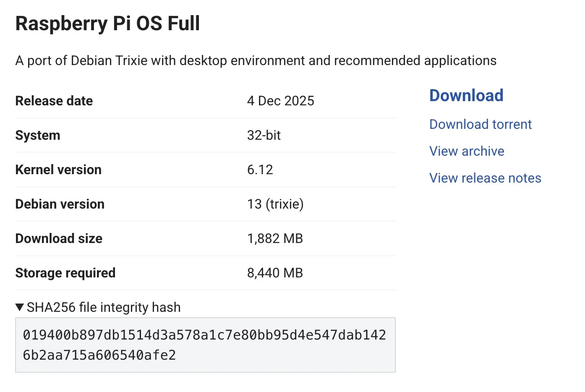
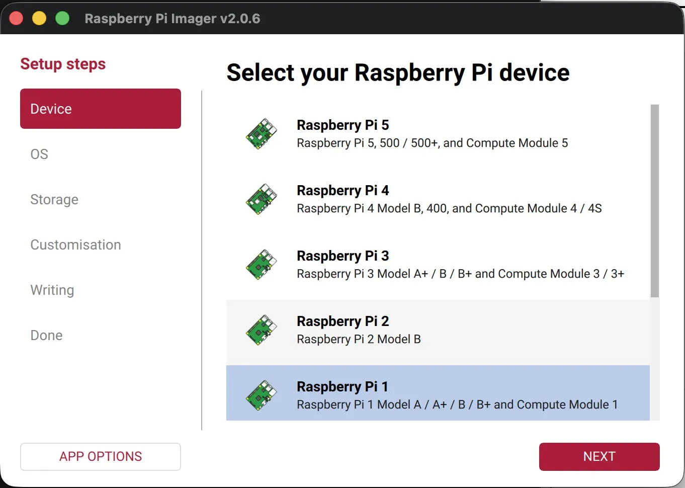
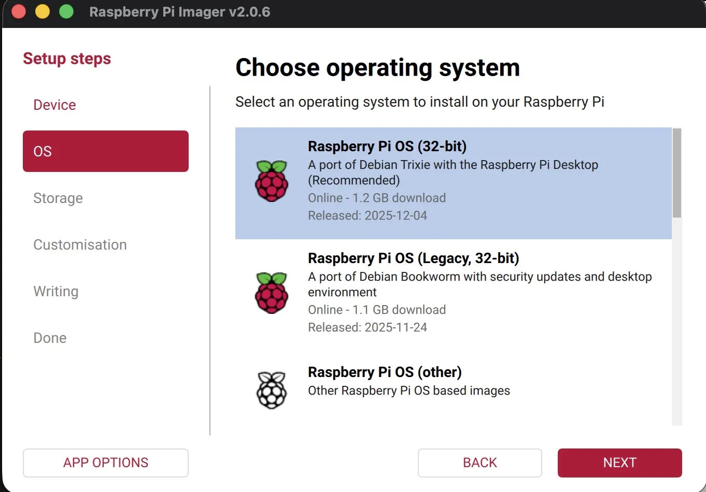
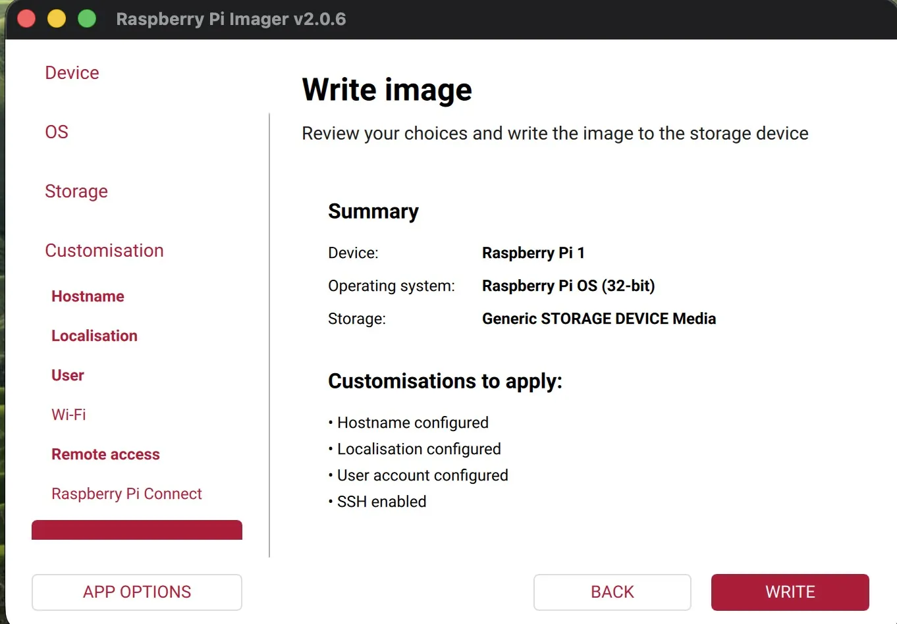
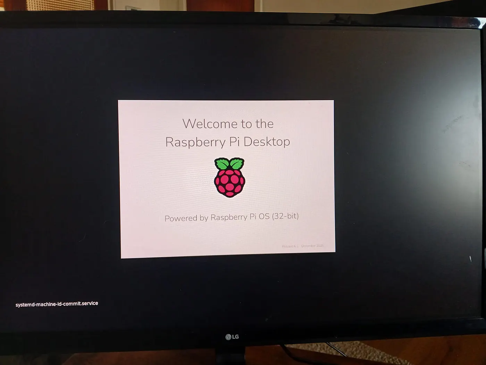
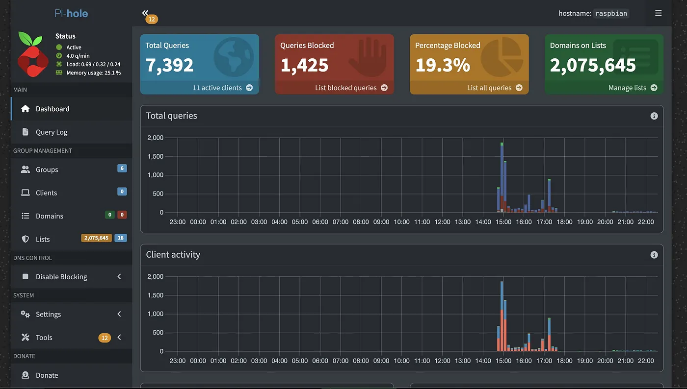
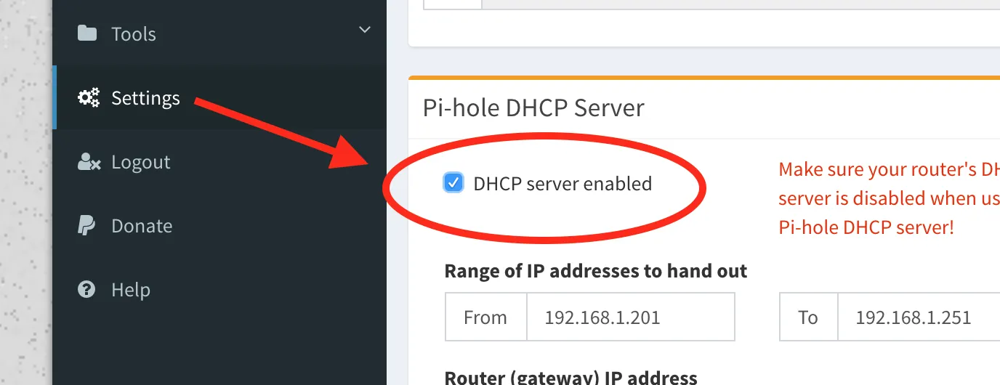
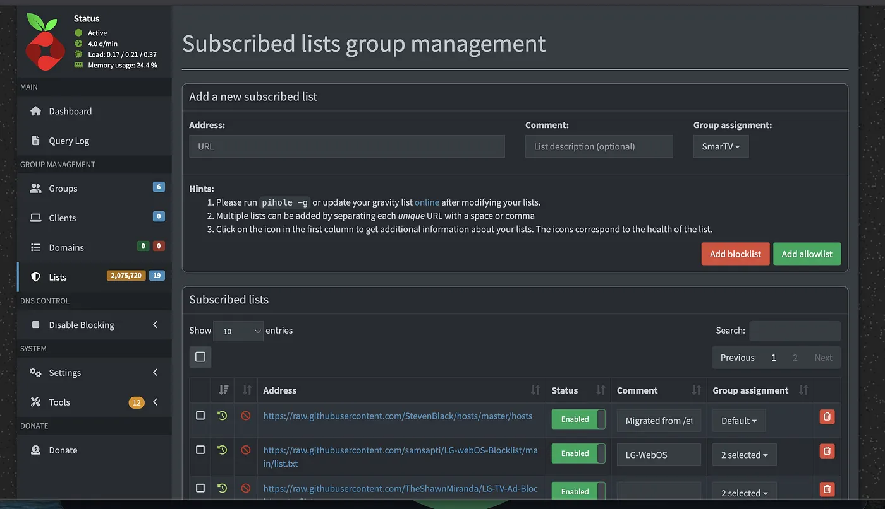
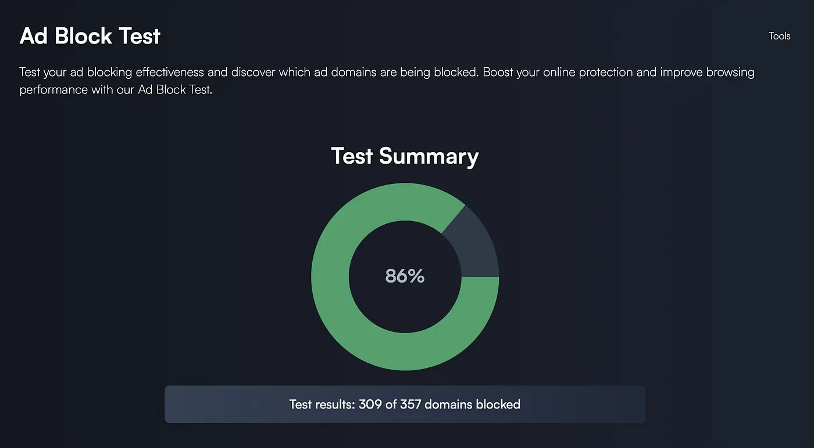

# From Dusty Pi to Network-Wide Ad Blocker: Give Me My Privacy Back, Please!

In a drawer at home, I still had my first-generation Raspberry Pi B, lying there, living a rather uneventful life. Imagine it 512MB of RAM, painfully slow by today’s standards, and forgotten for years in my cabinet.

Recently, I’d been struggling with my Smart TV, and honestly I’m quite concerned about the kind of data I might be giving away to LG without fully realizing it. That thought really bothered me.

I tried NextDNS, but it didn’t work as well as I expected, maybe I just have high standards. That’s when I remembered my old Raspberry Pi 1, Model B and thought: What if this little machine could still be useful?

As someone who cares about privacy, open source, and learning by building, I decided to give it a second life.

And that’s how I discovered Pi-hole, it was love at first glance.


## Pi-hole — Network-Wide Ad Blocking

Pi-hole is essentially a DNS sinkhole that blocks ads and trackers for every device on your network.

The magic is simple: instead of installing ad blockers on every phone or device, this open-source project promised to protect all my digital devices including my smart TV by blocking unwanted domains directly at the network level.

What impressed me immediately was how elegant the project is and you can really feel the love and care that the creators and volunteers put into it.

### Features

* Network-wide ad blocking: every device on my network is automatically protected.
* Improved privacy: trackers and analytics domains are blocked before they even reach my devices.
* Faster browsing: by caching DNS queries, pages load more quickly.
* Flexible DNS : I can combine block lists with my preferred upstream DNS provider (like OpenDNS) for added reliability.
* Completely open source ❤

And the best part? It can run on very modest hardware.

## First Things First: The Documentation

Whenever I experiment with a new tool, I always start with the documentation.

[Pi-hole’s documentation](https://docs.pi-hole.net/) is excellent and very beginner-friendly. It explains everything clearly, from installation to advanced configuration.

**Hardware Requirements**

Pi-hole barely needs any resources:

* Minimum 2GB free storage
* 512MB RAM

Which means my old Raspberry Pi B was actually perfect for the job. Not bad for a computer released more than a decade ago.


### Bringing My Raspberry Pi Back to Life

The first step was installing [Raspberry Pi OS](https://www.raspberrypi.com/). I chose the [32-bit version](https://www.raspberrypi.com/software/operating-systems/), which works perfectly with older Raspberry Pi models.

Before installing any system image, I always make sure to verify the file’s integrity to ensure it hasn’t been corrupted or tampered with.

`sha256sum filename`

If the checksum matches the official hash, I know the file hasn’t been tampered with.

In love, yes! but security always comes first! ❤️



## Raspberry Pi Imager

For me, the quickest and easiest way to install [Raspberry Pi OS](https://www.raspberrypi.com/software/operating-systems/) or any compatible operating system onto a microSD card is [Raspberry Pi Imager](https://www.raspberrypi.com/software/). It prepares the card ready to use with your Raspberry Pi in just a few clicks.

On macOS, I installed it using Homebrew:

`brew install --cask raspberry-pi-imager`

I have to admit, I love this tool. The interface is simple, clean, and fancy.





### First Boot

When I powered on my Raspberry Pi, it took at least 10 minutes to fully boot. Then I remembered: this little machine only has **512MB of RAM**. Patience was definitely required.

As usual, the [documentation](https://www.raspberrypi.com/documentation/) was easy to find and pretty clear. You can even find simple, logical instructions like how to connect the Pi.



## Giving the Raspberry Pi a Fresh Start

Once the system finally booted, the first thing I did was update everything. Even if the image is recent, I like starting from a clean and fully updated system.

So I ran:

```
sudo apt update
sudo apt full-upgrade
```
Honestly, grab a movie and a cup of tea, because this step takes a while…

One small detail I learned while reading the documentation: on Raspberry Pi OS it’s better to use `full-upgrade` instead of the standard `upgrade`. Since the system is under continuous development, dependencies sometimes change, and full-upgrade ensures everything stays consistent.

### Prerequisites: Giving My Raspberry Pi a Static IP

Before installing Pi-hole, there was one important thing I needed to do: give my Raspberry Pi a static IP address.

Pi-hole acts as the DNS server for the whole network, which means every device needs to know exactly where to send its DNS requests. If the Raspberry Pi’s IP address changed after a reboot, the whole setup would break.

First, I checked my current network configuration:

`ip a`

I looked for something like this:

```
eth0: ...
inet 192.168.xx.xx/24
```
In my case, the interface was `eth0`, because my Raspberry Pi is connected via Ethernet. This is actually preferable for a network service like Pi-hole since it provides a more stable connection than Wi-Fi.

Next, I checked the gateway used by my router:


`ip route`

Which returned something like:

`default via 192.168.xx.xx dev eth0`

### Editing the Network Configuration

To configure the static address, I edited the DHCP configuration file:

`sudo nano /etc/dhcpcd.conf`

At the bottom of the file, I added something like this:

```
interface eth0
static ip_address=192.168.xx.xx/24
static routers=192.168.xx.x
static domain_name_servers=127.0.0.1 1.1.1.1
```
Here’s what these settings mean:

`static ip_address`The IP address my Raspberry Pi will always use.
`/24`The subnet mask (255.255.255.0)
`static routers`My router's IP address
`domain_name_servers` DNS servers used by the Pi


The 127.0.0.1 entry is important because once Pi-hole is installed, the system will start using **itself as the DNS resolver**.


Restarting the Network

Once the configuration was saved, I simply rebooted the service:


`sudo systemctl restart pihole-FTL`

When the Pi came back online, the static IP was active.

Now my little Raspberry Pi finally had a permanent place on my network.

### Installing Pi-hole

One thing I love about this project is how simple the installation is. The developers provide a one-line automated installer that handles almost everything.

So I simply ran:

`sudo curl -sSL https://install.pi-hole.net | bash`

The installer launches a guided setup process in the terminal. It checks the system, detects the network configuration, and walks through a few simple choices.

In my case, it automatically detected the **static IP address** I had configured earlier, which made things even easier.

Within a few minutes, Pi-hole was installed and ready to go.

### Adding your local user to the ‘pihole’ group

`sudo usermod -aG pihole $USER`

### Accessing the Pi-hole Dashboard

Once the installation finished, Pi-hole provided the address of its web interface. Normally, you would access it directly from the Raspberry Pi, but my little device is very old and can’t really handle modern web browsers anymore.

So instead, I opened the dashboard from my main computer using the Raspberry Pi’s IP address:

`http://192.168.xx.xx/admin`

And there it was the Pi-hole dashboard.



A clean interface showing DNS queries, blocked domains, and real-time statistics about what was happening on my network.

This tiny computer that had been sitting forgotten in a drawer was now protecting my entire network.


### Making your Pi-hole host use Pi-hole

Pi-hole will not be used by the host automatically after installation. To have the host resolve through Pi-hole and your configured blocking lists, you can make the host use Pi-hole as upstream DNS server:

**Important: When You Cannot Change LAN/DHCP Options In Your Router/modem.**


 Some routers and sometimes even **ISP** do not allow you to change the DNS settings. Unfortunately… that was my case.
 
 Luckily, Pi-hole has a clever workaround. It can also act as a [**DHCP server**](https://wiki.debian.org/DHCP_Server). 
 
1. **Disable the DHCP server on your router** (this is a critical step — you will see red warning text when you enable the checkbox)
2. Enable Pi-hole’s DHCP server on the **Settings page**
It looked something like this:

Press enter or click to view image in full size



Technically, this is all you need to do, as DHCP is meant to be easy for clients to get an address; if a DHCP server is on your network, network devices will find it.

Important: The Pi’s static IP **must be outside the DHCP range** to avoid conflicts. This way, no other device on the network will ever be assigned the same address by the DHCP server.


### Adding the Block Lists

Once Pi-hole was running, I started exploring one of its most powerful features: **block lists**. You can find plenty of lists on the internet and customize them to your own needs.

In my case, I began with tracker lists and of course, anything related to LG or other devices that might compromise privacy.

After adding my block lists, I ran:

`pihole -g`

This updates the **Gravity list**, making sure all the new domains are being blocked.



Then I ran a few tests there are plenty of online ad-block testing sites to see if everything is working. It’s satisfying to watch ads disappear and trackers get blocked in real time.



### A Small Security Note

Since this Raspberry Pi is now providing DNS services to my entire network, I also made sure the necessary firewall ports were open.

Start by installing UFW and setting default policies to Deny In, Allow Out. Restrict access to critical services:

```
sudo apt install ufw
sudo ufw default deny incoming
sudo ufw default allow outgoing

```
```
ufw allow 80/tcp
ufw allow 443/tcp
ufw allow 53/tcp
ufw allow 53/udp
ufw allow 67/tcp
ufw allow 67/udp

```

The use of pihole-FTL on ports 67 or 547 is optional, but required if you use the **DHCP functions of Pi-hole**. The use of port 123 is required when using pihole-FTL as NTP-Server.

All benefiting from the same simple idea: filtering DNS requests before ads and trackers even have a chance to load.

**SSH: Allow only from my local network**

`sudo ufw allow from 192.168.xx.xx/24 to any port 22 proto tcp`

**DNS (Port 53): Restrict to local network.**

`sudo ufw allow from 192.168.xx.xx/24 to any port 53 proto tcp`

**Fail2ban**

I installed and configure Fail2ban to protect against brute-force attacks.

```
sudo apt update
sudo apt-get install -y fail2ban geoip-bin geoip-database
```

### Configure Fail2Ban for Pi-hole DNS Logs

I create a custom filter to detect DNS query attacks:

`sudo nano /etc/fail2ban/filter.d/pihole-dns.conf`

```
[Definition]
_daemon = dnsmasq
failregex = ^.*dnsmasq\[\d+\]: query\[(A|ANY)\] .* from <HOST>
ignoreregex =

```

I create a jail configuration to monitor Pi-hole logs:

`sudo nano /etc/fail2ban/jail.d/pihole-dns.conf`

```
[pihole-dns]
enabled  = true
filter   = pihole-dns
action   = iptables-allports[name=DNS]
logpath  = /var/log/pihole/pihole.log
bantime  = 3600
findtime = 600
maxretry = 10 
```

Tested the configuration:

```
sudo fail2ban-regex /var/log/pihole/pihole.log /etc/fail2ban/filter.d/pihole-dns.conf
```
Enable pihole logging

` sudo pihole logging on`

`sudo systemctl restart fail2ban`


Testing it

From a client machine, run repeated queries to Pi-hole to see if the IP gets banned after maxretry times.

`for i in {1..12}; do dig @192.168.xx.xx google.com A; done`

`sudo fail2ban-client set pihole-dns unbanip 192.168.xx.xx`

### Final Thoughts

I didn’t buy new hardware. I didn’t need any expensive services.

Instead, I revived an old device, learned more about **DNS, networking, and Raspberry Pi OS**, and ended up with something genuinely useful, all while having a lot of fun in the process.

Projects like Pi-hole are a perfect example of what makes **open source so powerful**: simple ideas, well executed, and shared freely with the world.

There’s so much I could share about this project. I spent hours reading the documentation and, believe me, I ran into some setbacks while installing it. But I always learned something new, practiced patience, and documented everything for myself.

And now, somewhere on my shelf, my old Raspberry Pi is quietly doing its job blocking ads and protecting my privacy.

**Be your own guru.**


