# Proxmox, Mon Amour!

Compute, network, and storage in a sigle solution! one mini PC at a time.


While exploring ideas for a home lab, I stumbled upon Proxmox VE. I had heard about Type-1 hypervisors but never experimented with one, so this was my chance. Proxmox is a full operating system that lets you manage virtual machines, containers, storage, and networking all from a single, clean web interface. Too good to be true? The best part: it’s completely open-source.

With Proxmox, I can set up an IDS, a honeypot, or other isolated experiments all on the same machine, safely separated. For someone like me who learns by tinkering, it’s a playground that actually solves real problems.

In this article, I’ll share my first steps installing Proxmox VE, explain why it’s such a fascinating tool for a home lab, and give a sneak peek at two projects I’m building, which I’ll dive into in future posts.

## Understanding Proxmox VE Structure

Before I started creating virtual machines, I wanted to understand what Proxmox actually is and how it sits on my mini PC. **how it actually runs multiple systems on a single mini pc.**

### What is a Bare Metal hypervisor ?

A bare metal hypervisor, also known as a Type 1 hypervisor, is virtualization software installed directly on a server’s physical hardware.

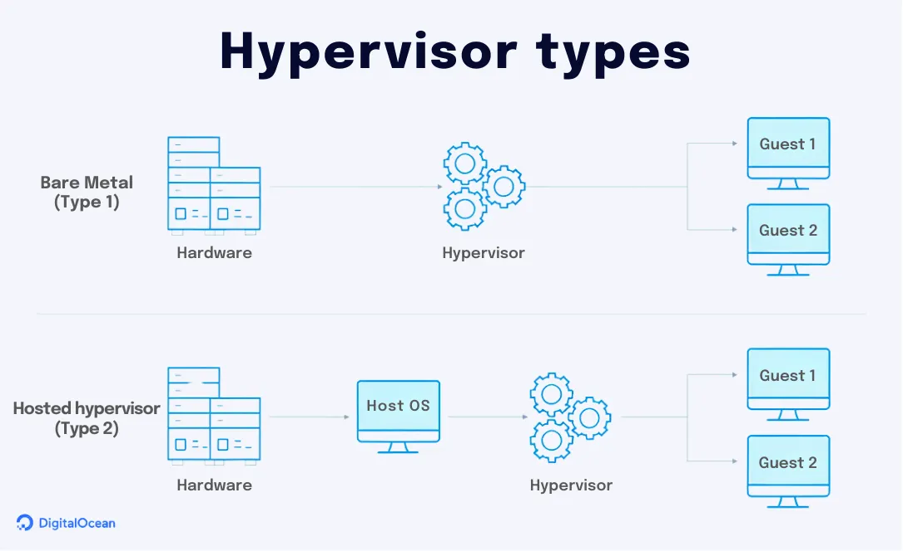
> source image: DigitalOcean


This structure allows me to experiment freely without worrying about breaking anything. Every VM or container is isolated, but I can still control them from a single, easy-to-use web interface.

### Kernel-based Virtual Machine (KVM)
[KVM](https://linux-kvm.org/page/Main_Page) is an open-source virtualization software that turns the Linux kernel into a hypervisor, enabling it to manage multiple VMs to run on the same physical server, each with its own operating system (OS) and resources.

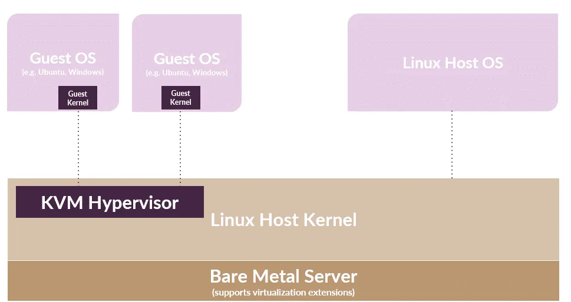
> KVM-based Virtualization Architecture (source-image lighbits)

Each virtual machine gets its own:

* Operating System
* virtual CPU
* Memory
* Disk
* Network interfaces

From the VM’s perspective, it believes it is running on real hardware, even though everything is virtualized.

### Container-Based Virtualization (LXC)

LXC is an operating system-level virtualization method for running multiple isolated Linux systems (containers) on a control host using a single Linux kernel.

Containers are lighter than virtual machines because they **share the host’s Linux kernel** instead of running their own operating system.

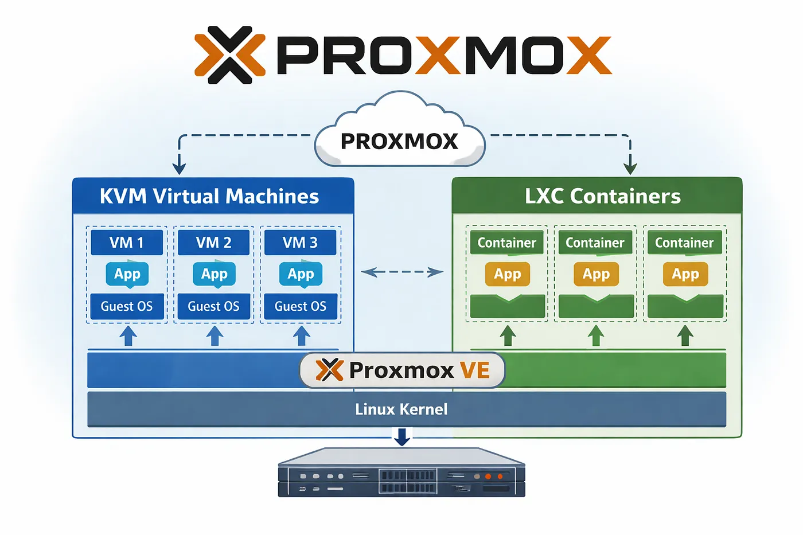
> Proxmox : Virtualization diagram

## Get Started

First things first: [Documentation](https://pve.proxmox.com/pve-docs/chapter-pve-installation.html)

**Minimum Hardware (Home Labs)**

* CPU: 64bit (Intel 64 or AMD64)
* Intel VT/AMD-V capable CPU/Mainboard (for KVM full
* virtualization support)
* Minimum 1 GB RAM
* One NIC (network interface controller)


### Installing Proxmox VE

The installer will guide you through the setup, allowing you to partition the local disk(s), apply basic system configurations (for example, timezone, language, network) and install all required packages. This process should not take more than a few minutes. Installing with the provided ISO is the recommended method for new and existing users.

### Prepare Installation Media

Download the installer ISO image from: [Proxmox official repository](https://www.proxmox.com/en/downloads/proxmox-virtual-environment/iso)

The flash drive needs to have at least 1 GB of storage available.

```
Do not use UNetbootin. It does not work with the Proxmox VE installation image.

```

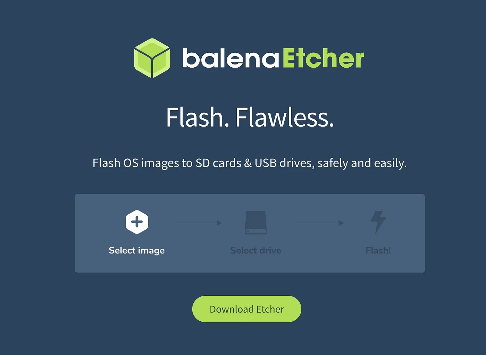


Once the USB is ready, the next steps are simple:

* Insert the USB into the mini PC
* Boot from the USB device
* Launch the Proxmox VE installer

**Install Proxmox VE (Graphical)**

The first step is to read our EULA (End User License Agreement). Following this, you can select the target hard disk(s) for the installation.

During the installation you will configure a few important things:

* The target disk
* Your timezone
* The root password
* The network configuration

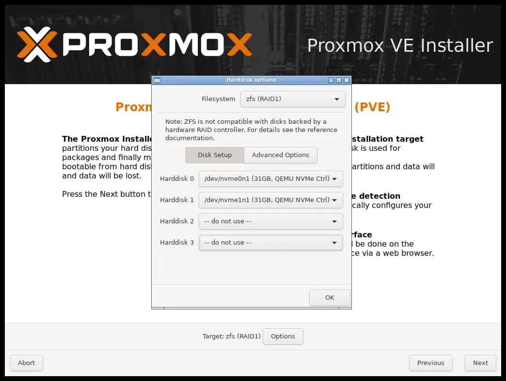

### Network Configuration

During the installer, Proxmox asks for a few networking details. Here’s an example configuration for a typical home network:

**Management interface** : `eth0` but it can also be `NIC0` and `NIC1`

**Hostname (FQDN)**
**Fully Qualified Domain Name** is simply the complete name of your server on the network.

Example :

* Hostname: mini
* Domain: home.local
* FQDN: mini.home.local


For a home lab, something simple like:

`mini.local`

works perfectly fine, as long as it is **unique on your network.**


#### IP Address and CIDR

You also need to assign a **static IP address** to the server so it doesn’t change every time it reboots.

Your network:

`192.168.1.0/24`

Your Proxmox server example:

`192.168.1.10`

The **CIDR** simply means the subnet mask: /24

`255.255.255.0`

Your **gateway** is usually your router, for example:

`192.168.x.x`

## First Boot

Once the installation finishes, the system will reboot. After reboot, Proxmox displays a message on the console telling you where to access the management interface.

It looks something like this:


```
Welcome to the Proxmox Virtual Enviroment. Please use your web browser to 
configure this server - connect to:
https://192.168.1.10:8006/
```

From another computer on your network, open a browser and navigate to that address.

* safari, firefox or chrome
* Unfortunately is incompatible with [brave](https://brave.com/)

```
Username: root
Password: (the one you set during installation)
```


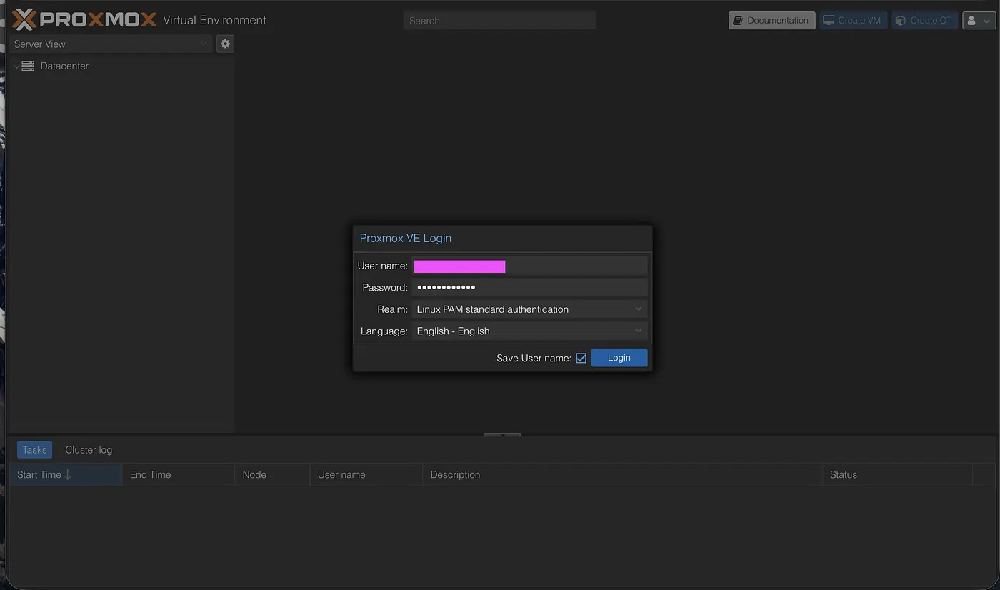
> Your control center for virtual machines, containers, networking, and storage.

At this point, it already feels powerful, but there are a couple of things I like to configure right away.


### Switching to the No-Subscription Repository

By default, Proxmox is configured to use the**Enterprise repository**, which requires a paid subscription.

For a home lab or personal experiments, the **No-Subscription repository** works perfectly fine. It provides updates for security fixes, bug fixes, and new features, even though the packages are not tested as extensively as the enterprise ones. So the first thing I did was switch repositories.

Proxmox documents this very clearly here: [Package Repositories](https://pve.proxmox.com/wiki/Package_Repositories) and [chapter sysadmin](https://pve.proxmox.com/pve-docs/chapter-sysadmin.html)

Disable the Enterprise Repository

Inside the Proxmox web interface:

* Go to Datacenter
* Select Repositories
* Locate the pve-enterprise entry
* Disable it

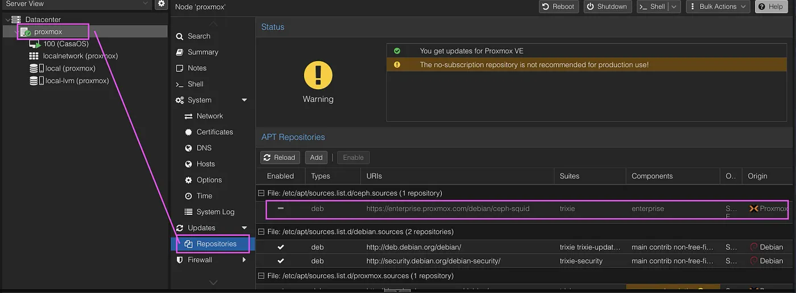

**Add the No-Subscription Repository**

Then I added the free repository by editing the following file:

`/etc/apt/sources.list.d/proxmox.sources`

Example configuration:

```
Types: deb
URIs: http://download.proxmox.com/debian/pve
Suites: trixie
Components: pve-no-subscription
Signed-By: /usr/share/keyrings/proxmox-archive-keyring.gpg

```

**Updating the System**

Once the repository is configured, it’s time for the classic step: **update everything.**

From the Proxmox shell or via SSH:

```
apt update
apt dist-upgrade
reboot

```
After the reboot, the system is updated and ready for the fun part: creating virtual machines and containers.

### Why I Appreciate the Proxmox Documentation?

One thing I appreciated while learning all this is the quality of the Proxmox documentation.

It’s detailed, well structured, and explains not only _how_ to configure things but also _why they work the way they do_. For someone learning virtualization step by step, that makes a difference.

You can explore it here: [https://pve.proxmox.com/pve-docs/index.html](https://pve.proxmox.com/pve-docs/index.html)

### Creating My First Virtual Machine

In the Proxmox interface, there’s a button called **“Create VM”**. Clicking it opens a wizard that guides you through the process step by step. Even without much experience in virtualization, the interface makes things approachable.

Every virtual machine in Proxmox has a few basic properties.

Press enter or click to view image in full size

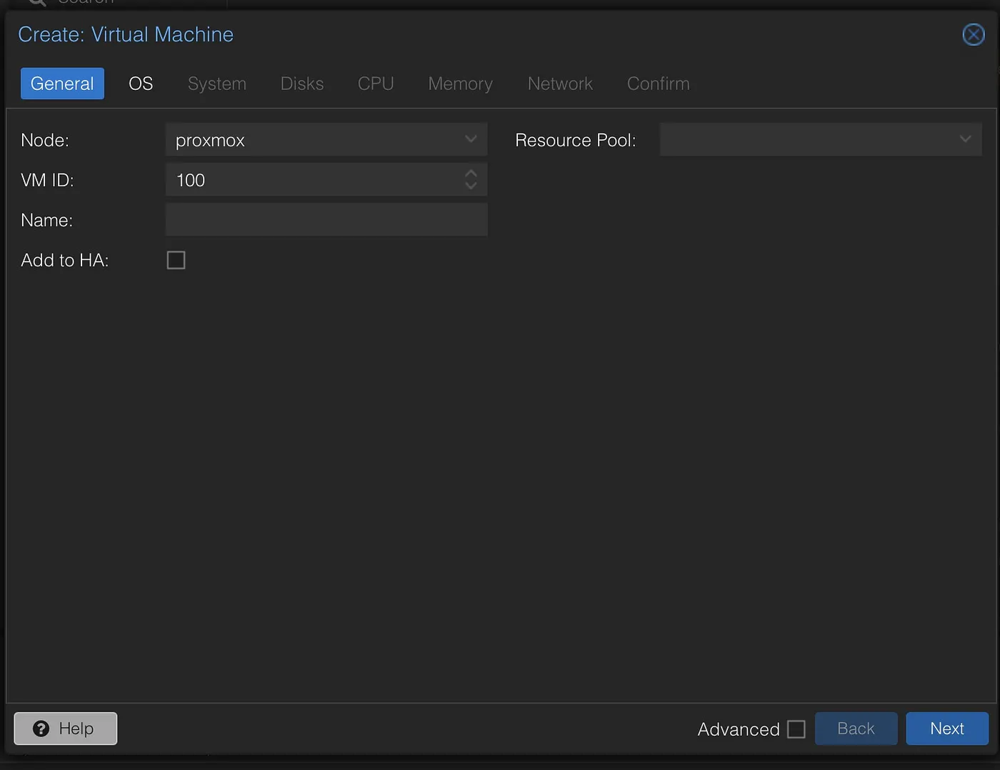

**Node:** The physical server where the VM runs
**VM ID:** A unique identifier for the VM
**Name:** A label to help you remember what the VM is for.
**Resource Pool:** Optional grouping of VMs

### Uploading the Operating System

Before creating the VM itself, I needed an [operating system ISO image](https://cdimage.debian.org/cdimage/archive/12.0.0/amd64/iso-cd/). For this project, I chose [Debian 12](https://www.debian.org/), which is stable, lightweight, and widely supported. The ISO is around 800 MB, so the download is fairly quick.


### Verifying the ISO

Whenever I download system images, I like to verify the file integrity using the **SHA256 checksum.**

`sha256sum debian-12.iso`

If the checksum matches the official one, I know the file hasn’t been corrupted or modified.

One important thing to understand is that **Proxmox cannot see files on your personal computer.**

The ISO must first be uploaded to Proxmox storage so the hypervisor can use it.

Here’s how it works:

* Open the Proxmox web interface
* Select the node in the left panel
* Click local storage
* Select ISO Images
* Click Upload

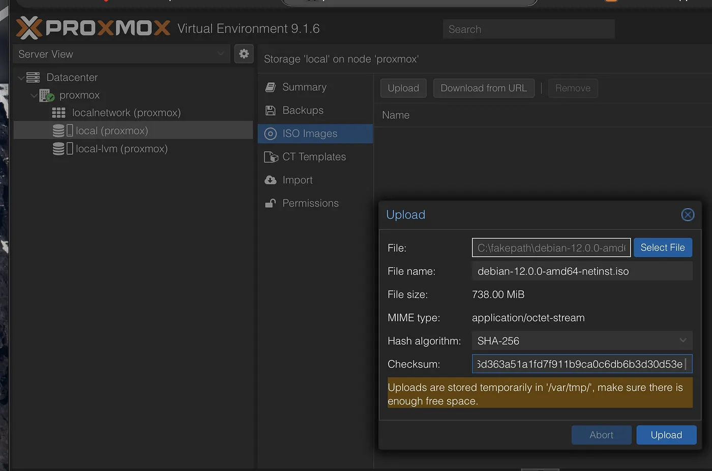

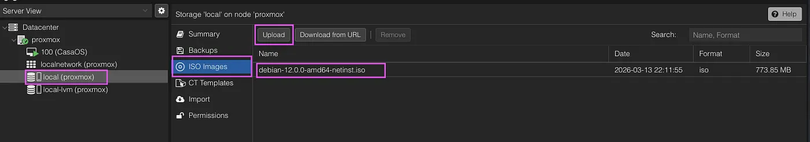

### Configuring the VM Operating System

During the **OS configuration step**, Proxmox asks which type of operating system you plan to install.

This allows Proxmox to optimize certain low-level settings automatically. Since I’m installing **Debian**, I selected the Linux option and attached the Debian ISO I uploaded earlier.

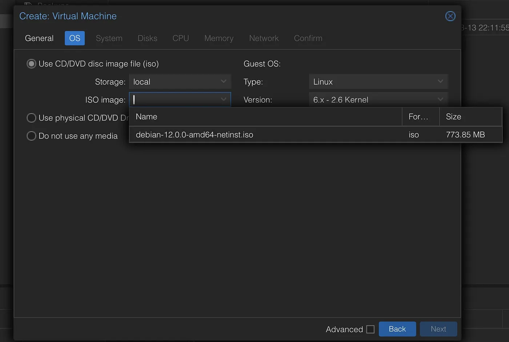

**Allocating Resources**

When creating a virtual machine, you also decide how many resources it can use from the host system. For this project I chose something modest:


* CPU: 2 cores
* RAM: 4GB
* Disk: 60 GB

My idea is to run several different experiments later, so I wanted to divide my storage carefully.

For example:

```
60GB  - Debian
60GB  - IDS
40GB  - honeypot
rest  - Proxmox system and snapshots
```

**System Settings**

One of the first options you’ll see is the display type, which defines how the graphical console of the VM will be rendered. For most server installations (like Debian in my case), the default option works perfectly fine since I’m mostly interacting through SSH later.

**QEMU Guest Agent (Quick Emulator)**

This is worth mentioning; If the operating system inside the VM supports it, enabling this option allows Proxmox to communicate more intelligently with the virtual machine.

**SeaBIOS** — the traditional BIOS system (default)
**OVMF** — modern UEFI firmware


For my setup, I kept the default settings for now and focused on getting the first VM running.


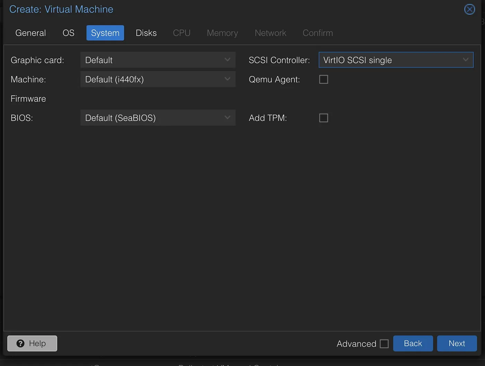

**Choosing the Disk Controller**

The recommended option for modern **Linux systems is VirtIO SCSI**, which provides better performance and is well supported.

VirtIO devices are paravirtualized, meaning the operating system knows it is running inside a virtual environment and communicates more efficiently with the hypervisor.

In most cases, sticking with the **default VirtIO configuration** is the best choice.


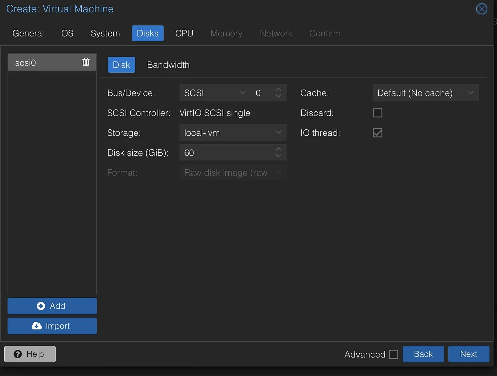

### Network Configuration

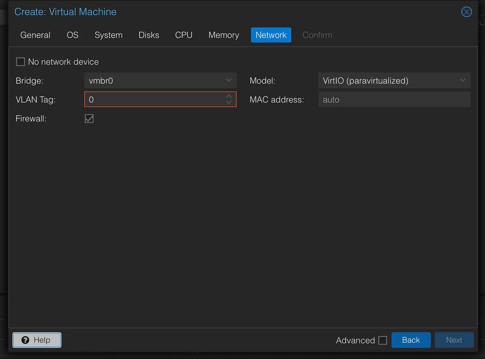

The final important step is configuring the virtual machine’s network interface. Proxmox connects VMs to a **virtual bridge**, usually called vmbr0.

This makes the virtual machine appear like a normal device on your local network, which is extremely convenient. For the network model, I initially chose **VirtIO**, which is fast and optimized for virtualization.

However, during installation I discovered that my Debian prefers more universally compatible drivers.

So I temporarily switched the network device to:


`Realtek 8129`

This older model is widely supported and ensures the installer detects the network interface correctly. Once the system is installed, it’s easy to switch back to **VirtIO for better performance**.

### Installing the System

Once everything looked good, I clicked **Next → Finish**, and the VM was created. Then the Debian installer started inside the virtual machine.

To keep things minimal and I’m always working on ssh/terminal, I selected only the essential components:

```
✔ SSH server
✔ Standard system utilities
```

No desktop environment, just a clean, lightweight server ready for experimentation.


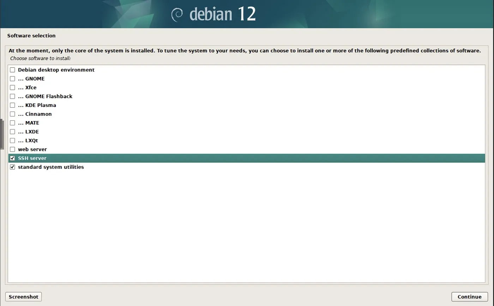

### Why Virtual Machines Are Perfect for Security Experiments.


After the installation finished, Debian booted without any issues. The virtual machine was running smoothly, the network worked, and I could connect through SSH without problems. For a first attempt with Proxmox, everything went well.

What I appreciate is how easy it is to create isolated environments. Instead of dedicating a full physical machine to each project, virtualization allows me to run several systems on the same hardware while keeping them completely separated.

That’s exactly what makes Proxmox such an interesting platform for experimentation.

With virtual machines, I can safely explore different ideas without worrying about breaking my main system or interfering with other services on my network. If something goes wrong, I can simply stop the VM, revert a snapshot, or rebuild it from scratch.

For someone who enjoys learning by doing, this flexibility is valuable.

For now, this was my first step into the world of Proxmox and virtualization. Honestly… I understand now why so many home lab enthusiasts love Proxmox.

**Be your own guru!**


