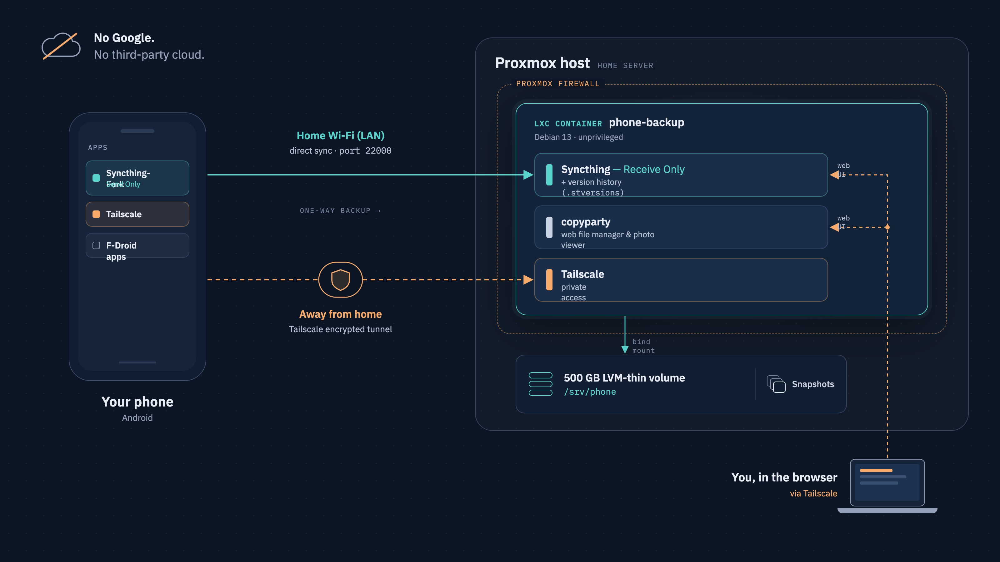
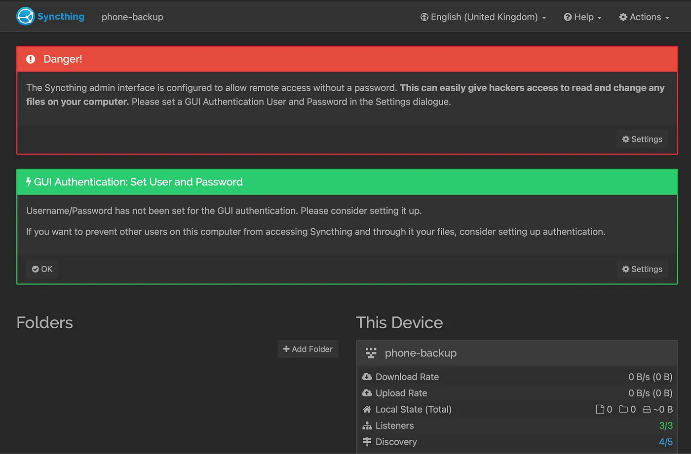
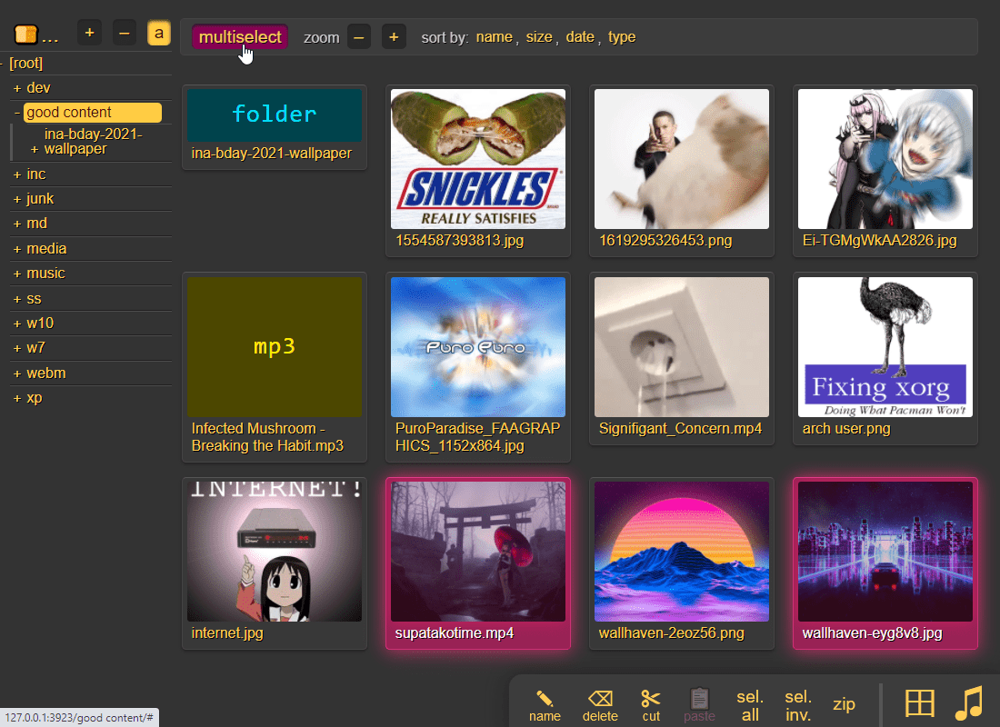

# Ditch Google Backup: Take Control of Your Phone's Data with Proxmox

Your data is yours alone. You deserve to choose where it's stored, who it's shared with, and how it travels over the internet.



I built my own phone backup on my Proxmox server. Building this kind of project is my hobby, and this one turned out to be lightweight, private and useful.

## Features

- My phone's photos, videos and documents syncing automatically to my own server
- A version history, so anything deleted on the phone is kept on the server
- A web interface to browse, view and manage my files

The whole core setup runs in one small Debian container using about 200 MB of RAM.

One unprivileged Debian 13 container on Proxmox runs three small services. The phone pushes files to it, and I manage them through a browser.

- **Syncthing** is a continuous file synchronization program. It synchronizes files between two or more computers in real time, safely protected from prying eyes.
- **copyparty** is a portable file server with accelerated resumable uploads, dedup, WebDAV, SFTP, FTP, TFTP, zeroconf, media indexer, thumbnails and more, all in one file.

Everything installs Google-free: the phone apps come from F-Droid.

## Create the container and its storage

Keep the backups off Proxmox's small root partition. On a default install, `pve-root` is only around 100 GB, and filling it can stop Proxmox itself. The large LVM-thin pool (`local-lvm`) is the right place. A volume there can also be snapshotted, which a bind mount can't.

- **Hostname:** `phone-backup`
- **Unprivileged:** yes
- **Template:** Debian 13 (Trixie)
- **Disk:** 25 GB
- **CPU:** 1 core
- **RAM:** 1024 MB, swap 512 MB
- **Network:** a static IP, e.g. `192.168.3.50/24`, with your router as Gateway
- **DNS:** set it explicitly

### Add a data volume

On the Proxmox host, replacing `101` with your container ID:

```bash
pct set 101 -mp0 local-lvm:200,mp=/srv/phone,backup=1
```

This creates a 200 GB thin volume mounted at `/srv/phone`. It only uses space as data arrives, and you can grow it later with `pct resize`.

### First boot

```bash
pct start 101
pct enter 101
apt update && apt full-upgrade -y
apt install -y curl gpg unattended-upgrades
adduser --disabled-password --comment "" syncthing
chown syncthing:syncthing /srv/phone
mkdir -p /srv/phone/syncthing && chown syncthing:syncthing /srv/phone/syncthing
```

The `syncthing` user has no password, so nobody can log in as it. All three services run as this user, never as root.

## Syncthing

### Install it in the container

Debian 13 ships Syncthing 1.x, but the official repository gets updates sooner, so I use that:

```bash
mkdir -p /etc/apt/keyrings
curl -L -o /etc/apt/keyrings/syncthing-archive-keyring.gpg https://syncthing.net/release-key.gpg
echo "deb [signed-by=/etc/apt/keyrings/syncthing-archive-keyring.gpg] https://apt.syncthing.net/ syncthing stable-v2" > /etc/apt/sources.list.d/syncthing.list
apt update && apt install -y syncthing
systemctl enable --now syncthing@syncthing
```

### Open the web interface

By default the web UI only listens on localhost. Change that, then restart:

```bash
systemctl stop syncthing@syncthing
sed -i 's|127.0.0.1:8384|0.0.0.0:8384|' /home/syncthing/.local/state/syncthing/config.xml
systemctl start syncthing@syncthing
```

Open `http://<container-IP>:8384`. Later, the firewall and Tailscale will restrict who can reach it.



### First settings

1. Set a GUI username and password under **Actions → Settings → GUI**. Do this first.
2. Decline anonymous usage reporting.
3. Remove the **Default Folder** (click it → Edit → Remove).
4. Under **Settings → General**, set **Default Folder Path** to `/srv/phone/syncthing/`.

### Set up the phone

1. Install **Syncthing-Fork** from F-Droid.
2. Set it to **Unrestricted** under Settings → Apps → Syncthing-Fork → Battery, or Android may kill it.
3. Under **Run Conditions**, choose Wi-Fi only for now.

### Pair the phone

1. In the web UI, open **Actions → Show ID** to display a QR code.
2. In the app, go to **Devices → +** and scan it. Name the device `proxmox`.
3. Accept the "new device" prompt in the web UI.
4. In the app, edit the `proxmox` device and set **Addresses** to `tcp://192.168.3.50:22000` (the container's IP). A fixed address is more reliable than discovery.

This `tcp://` address is for the app only. It's not a web address, so a browser can't open it.

### Share folders the safe way

For each folder (DCIM, Pictures, Documents, Download…), on the phone:

1. **Folders → +**, pick the folder, label it e.g. `phone-DCIM`.
2. Set **Folder Type** to **Send Only**.
3. Tick the `proxmox` device and save.

Then accept it in the web UI and, before saving:

1. Check the path is `/srv/phone/syncthing/phone-DCIM`.
2. **Advanced → Folder Type: Receive Only.**
3. **File Versioning: Staggered**, maximum age e.g. 365 days.
4. **Advanced → Minimum Free Disk Space: 10 %.**

Versioning is what turns a sync into a backup. Delete a photo on the phone, and the server moves it into `.stversions` instead of deleting it. Send Only and Receive Only mean changes only ever flow from phone to server.

### Verify

```bash
du -sh /srv/phone/syncthing/*
ls -la /srv/phone/syncthing/phone-DCIM/.stversions
```

Take a photo, check it appears on the server, delete it on the phone, and confirm it lands in `.stversions`.

## copyparty, a web file manager

copyparty lets you browse, view, download and delete your backups from any browser. It's a single Python file.

### Install

```bash
apt install -y python3 python3-pil ffmpeg
mkdir -p /opt/copyparty
curl -L -o /opt/copyparty/copyparty-sfx.py https://github.com/9001/copyparty/releases/latest/download/copyparty-sfx.py
chown -R syncthing:syncthing /opt/copyparty
```

`python3-pil` and `ffmpeg` generate thumbnails, so you can view photos and videos in the browser instead of downloading them.

### Configure

Create `/etc/copyparty/copyparty.conf` with `nano`:

```ini
[global]
  p: 8081

[accounts]
  admin: YOUR-STRONG-PASSWORD

[/]
  /srv/phone
  accs:
    rwmd.: admin
```

```bash
chown -R syncthing:syncthing /etc/copyparty
chmod 600 /etc/copyparty/copyparty.conf
```

The permissions are `r` read, `w` upload, `m` move, `d` delete, and `.` show hidden files such as `.stversions`. Only `admin` gets access. Keeping the password in a `chmod 600` file keeps it out of the process list.

### Run it as a service

Create `/etc/systemd/system/copyparty.service`:

```ini
[Unit]
Description=copyparty file server
After=network-online.target
Wants=network-online.target

[Service]
User=syncthing
Group=syncthing
ExecStart=/usr/bin/python3 /opt/copyparty/copyparty-sfx.py -c /etc/copyparty/copyparty.conf
Restart=on-failure

[Install]
WantedBy=multi-user.target
```

```bash
systemctl daemon-reload
systemctl enable --now copyparty
```

Open `http://<container-IP>:8081` and log in as `admin`. Switch to grid view (press **G**) for thumbnails, and click a photo to open the viewer. Multiselect in the toolbar lets you delete several files at once.



### How deleting works

- **Deleting in copyparty never deletes from the phone.** Syncthing will flag "Local Changes" on that folder. Don't press **Revert Local Changes**, or the files come back.
- **Deleting on the phone** moves the file into `.stversions` on the server.
- **To free space**, clear old files from `.stversions`, or let staggered versioning expire them.

## Hardening

The attack surface is small: three services and a handful of ports.

### Automatic updates

```bash
dpkg-reconfigure -plow unattended-upgrades
```

To include Syncthing's repository, add this line inside the `Unattended-Upgrade::Origins-Pattern { … };` block of `/etc/apt/apt.conf.d/50unattended-upgrades`:

```
        "site=apt.syncthing.net";
```

### Removing what I don't need

You can always reach the container with `pct enter 101`, so SSH isn't needed. The Debian template also ships a mail server:

```bash
systemctl disable --now ssh ssh.socket 2>/dev/null
apt purge -y postfix && apt autoremove -y
```

In the Syncthing web UI, under **Settings → Connections**, untick **NAT traversal**, **Global Discovery** and **Relaying**, and keep **Local Discovery**. I did the same in the app. With fixed addresses, the devices don't need public discovery.

Now `ss -tulnp` should only show 8384, 8081, 22000 and 21027.

### HTTPS

In Syncthing, tick **Settings → GUI → Use HTTPS for GUI**. copyparty also answers on `https://` with a self-signed certificate. Accept the browser warning once.

### Snapshots

Because the data lives on an LVM-thin volume, you can snapshot the whole container before any change:

```bash
pct snapshot 101 before-update
pct rollback 101 before-update
```

Snapshots live on the same disk, so they're an undo button, not a backup. Keep an eye on the pool's fill level with `lvs`.

## Tailscale

Tailscale lets the phone sync from anywhere and keeps the web interfaces off the LAN. Install it inside the container, even if the host already runs Tailscale. The host's Tailscale only reaches the host itself, and running it per container exposes only what you need.

Take a snapshot first:

```bash
pct snapshot 101 before-tailscale
```

### Give the container a tunnel device

On the host:

```bash
pct set 101 -dev0 /dev/net/tun
pct reboot 101
```

### Install and log in

Inside the container:

```bash
curl -fsSL https://tailscale.com/install.sh | sh
tailscale up
tailscale ip -4
```

Open the login link, then note the `100.x.y.z` address.

### Tag it and allow access

If your tailnet uses tags and a custom ACL, a new machine gets no access until a rule allows it. Define the tag and add a rule in **Access controls**:

```json
"tagOwners": {
    "tag:phone-backup": ["autogroup:admin"]
},
"acls": [
    {
        "action": "accept",
        "src":    ["autogroup:admin"],
        "dst": [
            "tag:phone-backup:8384",
            "tag:phone-backup:8081",
            "tag:phone-backup:22000"
        ]
    }
]
```

Then in **Machines → ⋯ → Edit ACL tags**, add `tag:phone-backup` to the container.

## Where this leaves you

Your phone now backs itself up to hardware you own. Photos sync within seconds at home and through Tailscale anywhere else. Deleted files wait in version history. The web interfaces are private, password-protected and firewalled, and no Google account is involved anywhere.

Two copies (phone and server) protect against losing either one. They don't protect against both failing together, such as a fire or theft.

**My data, my hardware, my rules.**

---

