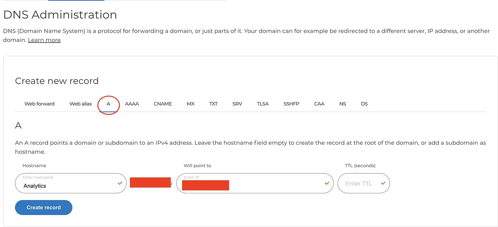
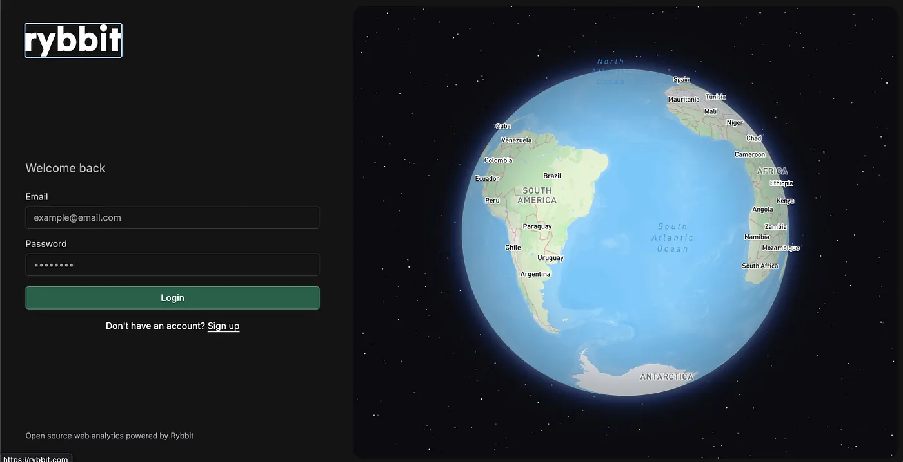
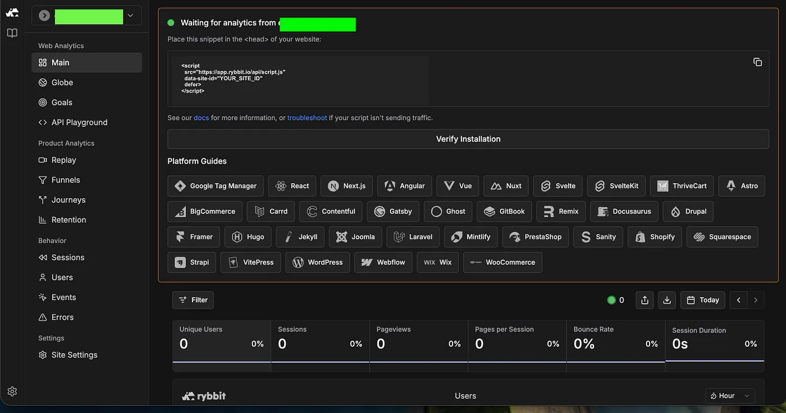

# Ditch Google Analytics: Self-Host Your Data with Rybbit

ByteGirl loves local, DIY, European, and GDPR-friendly solutions. If you’re like me and already run Docker on your VPS with Caddy, setting up Rybbit is straightforward.

**Prerequisites**

* A Server — 2GB RAM or more recommended
* Domain Name — e.g., tracking.yourdomain.com, pointed to your VPS. HTTPS is required.
* Docker & Docker Compose installed
* Basic Docker knowledge — environment variables, port mapping
* A bit of patience

Before starting, I always check the documentation. In this case, the Rybbit docs are clear, straightforward, and easy to understand.

[https://rybbit.com](https://rybbit.com/)


## Step 1: Configure DNS

The first thing I did was point my domain (or subdomain) to the public IP address of my VPS.

DNS propagation can take a little time, so I usually verify that everything is working using **DNS Checker**.



## Step 2: Install Docker Engine

In my case, Docker was already installed on my VPS, but if you’re starting from scratch you’ll need to install it first.

You can connect to your server via SSH and follow the official Docker Engine installation guide for your Linux distribution.

To keep things organized, I created a new project directory in ~/projects/.

I cloned the project repository from GitHub (Git is usually pre-installed on most server distributions):

```
git clone https://github.com/rybbit-io/rybbit.git
cd rybbit

```

After that, I created a `.env` file in the root of the project and added the following settings.

### Create Environment File

```
# Required: Your domain and base URL
DOMAIN_NAME=your.domain.com
BASE_URL=https://your.domain.com

# Required: Authentication secret (generate a random 32+ character string)
BETTER_AUTH_SECRET=your-very-long-random-secret-string-here

# Optional: Disable new user signups after creating admin account
DISABLE_SIGNUP=true

# Optional but recommended: Mapbox token for globe visualizations
MAPBOX_TOKEN=your_mapbox_token

# Optional: Custom ports (only needed if you want different ports)
# HOST_BACKEND_PORT="3001:3001"
# HOST_CLIENT_PORT="3002:3002"

# Optional: Database credentials (defaults work fine)
# CLICKHOUSE_PASSWORD=frog
# POSTGRES_USER=frog
# POSTGRES_PASSWORD=frog
# POSTGRES_DB=analytics
# CLICKHOUSE_DB=analytics
```

Setting up my `.env`

To generate a secure `BETTER_AUTH_SECRET`, I used:

This generates a strong random key used by the authentication system.

`openssl rand -hex 32`

To prevent random users from creating accounts on my analytics dashboard, I also disabled public signups:


`DISABLE_SIGNUP=true`

### Mapbox for Visualizations

ybbit can display some nice geographic visualizations using **Mapbox**, a location platform widely used by developers and many modern applications.

**So of course… I had to try it.**

I created a Mapbox account and generated a token, which enables the globe visualizations inside the Rybbit dashboard.

[Mapbox](https://www.mapbox.com/)

## About Custom ports

I’m adding this section because I actually ran into a few hiccups with ports during my setup.

I don’t have decades of experience running complex infrastructures, and when several services share the same VPS, things can get a little confusing. So I decided to include the small things I learned along the way. If you’re exploring self-hosting like I am, this might save you a bit of troubleshooting time.

### Service Architecture

Rybbit consists of these services:

* client: Next.js frontend (port 3002)
* backend: Node.js API server (port 3001)
* postgres: User data and configuration
* clickhouse: Analytics data storage
* caddy: Reverse proxy with automatic SSL

### Rybbit Docker Mapping

| Service        | Container Port | Purpose             |
| -------------- | -------------- | ------------------- |
| rybbit-backend | 3001           | API, authentication |
| rybbit-client  | 3002           | Web frontend        |

Because I already run several services on my VPS, I needed to use different host ports.

```
HOST_BACKEND_PORT="8080:3001"
HOST_CLIENT_PORT="8081:3002"
```

**This Format:** `HOST_PORT:CONTAINER_PORT` → The port on the left is the one exposed on your server, while the port on the right is the one used inside the container.

With my `.env` configuration in place, I was ready to start the containers.

**Initialize Containers**

`home/proyects/rybbit`

```
docker compose down
docker compose up -d
docker ps

```
Before setting up the reverse proxy, I double-check which ports my frontend and backend containers were actually using. Honestly, I learned this the hard way while setting up this project !

## Configuring Caddy as a Reverse Proxy

[Caddy](https://caddyserver.com/) makes reverse proxying surprisingly simple, and I love that it handles **automatic HTTPS** out of the box. It’s one of the reasons I chose it for this project — no fiddling with certificates or extra setup.


**Caddyfile example:**

```
analytics.yourdomain.com {
    # Backend proxy for API
    reverse_proxy /api/* localhost:3001

    # Frontend proxy for all other requests
    reverse_proxy /* localhost:3002

     header {
                Strict-Transport-Security "max-age=31536000; includeSubDomains; preload"
                X-Content-Type-Options "nosniff"
                X-Frame-Options "SAMEORIGIN"
                Referrer-Policy "no-referrer"
                X-Robots-Tag "noindex, nofollow, noarchive"
                # Remove server header
                -Server
        }
        # Disable all browser features
        header Permissions-Policy "geolocation=(), microphone=(), camera=(), payment=(), usb=(), fullscreen=(), accelerometer=(), gyroscope=()"
        respond /robots.txt 200 {
                body "User-agent: *\nDisallow: /"
        }

}
```

I’ve also included the security headers in my Caddy configuration. I won’t go into all the details here you can read more in my article about [hardening headers](https://github.com/rootGirly/Projects/tree/main/htaccess) if you’re curious but having them in place gives my Rybbit setup an extra layer of protection.

**Commands to validate and reload Caddy:**

```
caddy validate --config /etc/caddy/Caddyfile
sudo caddy fmt --overwrite /etc/caddy/Caddyfile
sudo caddy reload --config /etc/caddy/Caddyfile
```
>**Note:** Do not proxy database ports through Caddy; only frontend web ports should go through it.

### Quick Review of Ports

When using Docker with Caddy, I realized there are really two types of ports to keep in mind:

Two roles for ports when using Docker + Caddy:

* **Public ports** — traffic from clients to Caddy.
Example: 80 for HTTP, 443 for HTTPS
* **Upstream ports** — traffic from Caddy to the app.
Example: 3001 for the backend, 3002 for the frontend


So for my setup, `analytics.yourdomain.com` points to Caddy, which then forwards requests to the appropriate container ports. This little distinction saved me some confusion when I was first experimenting with multiple services.

### Create Admin Account

Next, I navigated to [https://analytics.mydomain.com/signup](https://analytics.mydomain.com/signup) to create my admin account.






## Adding Rybbit to My Astro Site


To track visits, I created a small component for my site called `AnalyticsRybbit.astro`:

I added this snippet to a common layout, which I recommend because it automatically includes the tracking script on every page:

```
<script
  src="https://app.rybbit.io/api/script.js"
  data-site-id="YOUR_SITE_ID"
  defer
></script>
```

[Added the Snippet to a Common Layout or Page Head](https://rybbit.com/docs/guides/astro#add-the-snippet-to-a-common-layout-or-page-head)

Using a Common Layout (Recommended):

```
---
import AnalyticsRybbit from "../components/common/AnalyticsRybbit.astro";
---
<!doctype html>
<html lang="en">
  <head>
    <meta charset="UTF-8" />
    <meta name="description" content="Astro description" />
    <meta name="viewport" content="width=device-width" />
    <link rel="icon" type="image/svg+xml" href="/favicon.svg" />
    <meta name="generator" content={Astro.generator} />
    <title>{title}</title>
  </head>
  <body>
    <slot />
    <!-- Rybbit Tracking Snippet -->
    <AnalyticsRybbit />
  </body>
</html>

```
Once my site was built and deployed, I checked my Rybbit dashboard to make sure data was coming through. Everything was working fine!

## Final Thoughts

I really enjoyed building this project. Self-hosting means you don’t pay anything, but it does take time, patience, and a little trial and error. The real reward isn’t just a working analytics dashboard it’s everything I learned along the way.

I ran into a few bumps with port mapping after all, I haven’t spent much time tinkering with reverse proxies but Caddy made it almost effortless. Its simplicity and elegance turned something that could have been frustrating into a smooth experience. Rybbit itself is beautifully documented, clear, and wonderfully designed a joy to set up.

I ❤ creating my own tools, experimenting, and exploring the possibilities of open source. This project reminded me why I enjoy building things from scratch: every challenge is a lesson, every fix a little victory.

Now that Rybbit is running, I can’t wait to experiment more, test its full potential, and share what I discover in another story later this year.


