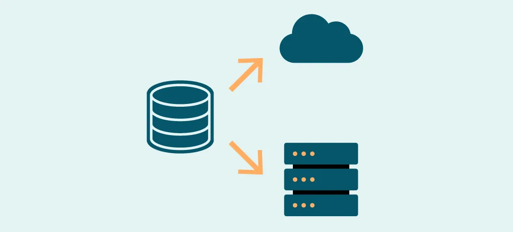
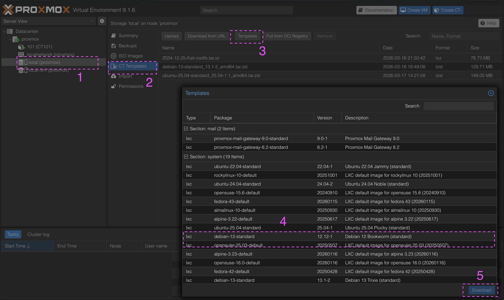
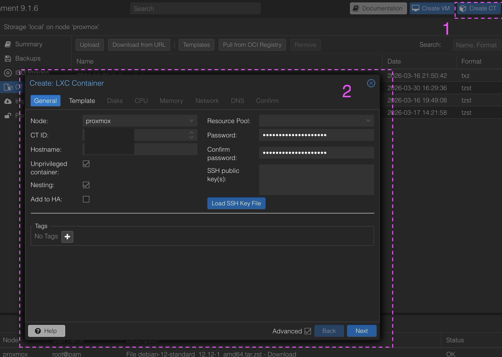

# Secure Offsite Backups: Restic + SFTP over WireGuard

Goal: Build a resilient, encrypted, and isolated backup system that survives total server failure.




In cybersecurity, **availability** is one pillar of the [CIA triad](https://www.fortinet.com/resources/cyberglossary/cia-triad). A backup stored on the same server is not a backup; it's just a copy. To ensure true **disaster recovery**, I needed an offsite solution that is:

* Encrypted: Data is unreadable without the key.
* Isolated: The backup server cannot be compromised via the main VPS.
* Automated: No manual intervention required.

To achieve this, I built a custom architecture using [Proxmox](https://proxmox.com/en/) LXC, [WireGuard](https://www.wireguard.com/), and [Restic](https://restic.net/).

**The Architecture**

Instead of exposing my backup server directly to the internet, I created a secure tunnel. This ensures that even if the VPS is compromised, the attacker cannot pivot to the backup server without the WireGuard keys.


```
[VPS (Ubuntu)]  <-- WireGuard Tunnel -->  [LXC (Debian)]
   |                                            |
   | (Restic Client)                            | (Restic Repository / SFTP)
   |                                            |
   +--------------------------------------------+
              (Private 10.10.0.0/24 Network)
              
```

**Why this design?**

**Security:** The backup LXC is never exposed to the public internet. Only the WireGuard port (UDP 51820) is open on the modem.

**Isolation:** The WireGuard Gateway LXC acts as a buffer. If the VPS is compromised, the attacker hits the Gateway first.

**Control:** All backup traffic is tunneled through a private network.
              

## The Backup Server (Proxmox LXC)

I created a lightweight Debian 12 LXC container to act as the dedicated backup vault.

**Resources:** 1 CPU, 1GB RAM, 50GB Disk, Static IP.


>Creating a template on promox Web GUI


>Creating a LXC


### Create Dedicated User
 
I follow the Principle of Least Privilege. I do not use root.

```
# Create user
adduser backupuser

# Create repository directory
mkdir -p /srv/restic-repo
chown -R backupuser:backupuser /srv/restic-repo
chmod 700 /srv/restic-repo

```

**User Constraints:**

* No sudo access
* No admin rights
* Only access to /srv/restic-repo
* Only SSH/SFTP access

### Enabling SSH

```
apt update && apt upgrade
apt install openssh-server -y
systemctl enable ssh
systemctl start ssh
```

## The Secure Tunnel (WireGuard)

To connect the VPS to the backup LXC securely, I deployed WireGuard inside a separate, minimal LXC container. This ensures that if the VPN configuration breaks, it doesn't crash the Proxmox host.


**Topology:**

* WireGuard LXC (Gateway): 10.10.0.2 (Handles routing/NAT)
* VPS (Client): 10.10.0.1 (Initiates backup)
* Backup LXC: 192.168.x.xx (Reachable via Gateway)

## Install WireGuard on Both Systems

**On WireGuard LXC:**

```
apt update
apt install wireguard -y
apt install iptables
wg --version
```
**On VPS:**

`apt install wireguard -y`


**Generating Keys (Securely)**

I ran this on both the VPS and the WireGuard LXC:

```
umask 077
wg genkey | tee privatekey | wg pubkey > publickey
chmod 600 privatekey
chmod 644 publickey
```

**unmask 077:** Avoid leaving the private key exposed during creation, This ensures the private key is created with secure permissions from the start.

**Correct permissions:**

privatekey → must be readable only by root

`chmod 600 privatekey`

publickey → can be world-readable (not sensitive)

`chmod 644 publickey`


## Configuring WireGuard Gateway (LXC)

I installed WireGuard and configured wg0.conf to act as a router.


```
# /etc/wireguard/wg0.conf
[Interface]
Address = 10.10.0.2/24
ListenPort = 51820
PrivateKey = <LXC_PRIVATE_KEY>

# Enable routing and NAT
PostUp = iptables -A FORWARD -i wg0 -o eth0 -j ACCEPT; iptables -A FORWARD -i eth0 -o wg0 -m state --state RELATED,ESTABLISHED -j ACCEPT; iptables -t nat -A POSTROUTING -o eth0 -j MASQUERADE
PostDown = iptables -D FORWARD -i wg0 -o eth0 -j ACCEPT; iptables -D FORWARD -i eth0 -o wg0 -m state --state RELATED,ESTABLISHED -j ACCEPT; iptables -t nat -D POSTROUTING -o eth0 -j MASQUERADE

[Peer]
PublicKey = <VPS_PUBLIC_KEY>
AllowedIPs = 10.10.0.1/32

```

**Enabling IP Forwarding:**

```
echo "net.ipv4.ip_forward=1" >> /etc/sysctl.conf
sysctl -p
```


## Configure VPS (Client)
On the VPS, I configured WireGuard to connect to the Gateway.

```
# /etc/wireguard/wg0.conf
[Interface]
Address = 10.10.0.1/24
PrivateKey = <VPS_PRIVATE_KEY>

[Peer]
PublicKey = <LXC_PUBLIC_KEY>
Endpoint = <YOUR_PUBLIC_IP>:51820
AllowedIPs = 10.10.0.2/32, 192.168.x.xx/32
PersistentKeepalive = 25

```
>**Note:** AllowedIPs is restricted to the backup LXC IP only, preventing lateral movement to the rest of the LAN.


### Start WireGuard on Both

```
# Start the tunnel
wg-quick up wg0

# Enable at boot
systemctl enable wg-quick@wg0

```
### Modem Configuration
[Port Forwarding](https://en.wikipedia.org/wiki/Port_forwarding): Forward UDP 51820 to the WireGuard LXC's local IP.

```
# Get your public IP
curl -4 ifconfig.me
```


## Secure Authentication (SSH Keys)

Restic over SFTP requires key-based authentication. Passwords are too risky for automation.

**Generate Key on VPS**

`ssh-keygen -t ed25519 -C "restic-backup" -f ~/.ssh/restic-backup`

**Copy Key to Backup LXC**

`ssh-copy-id -i ~/.ssh/restic-backup.pub backupuser@192.168.1.xx`


**Verify Permissions**

```
# On VPS
chmod 700 ~/.ssh
chmod 600 ~/.ssh/restic-backup

# On Backup LXC
chmod 700 /home/backupuser/.ssh
chmod 600 /home/backupuser/.ssh/authorized_keys

```

## SSH Config Helper (Optional but Useful)
To make future connections easier, I added this to ~/.ssh/config on the VPS:

`nano ~/.ssh/config`

```
Host restic
    HostName 192.168.x.xx
    User backupuser
    IdentityFile ~/.ssh/restic-backup
    
``` 

Now I can simply run: 

`ssh restic`


## Initialising and Running Restic

Now that the tunnel is up and keys are exchanged, I initialized the repository.

### Install Restic on VPS

`apt install restic -y`


**Initialising and Running Restic**

```
export RESTIC_REPOSITORY="sftp:backupuser@192.168.x.xx:/srv/restic-repo"
export RESTIC_PASSWORD_FILE="/root/.restic-password" # Store password in a file with 600 perms
restic init
```
This creates the repository structure:

```
config
index
data
snapshots
```

**Verify Repo Exists**

`restic -r sftp:backupuser@192.168.x.xx:/srv/restic-repo snapshots`

**First Real Backup**

`restic -r sftp:backupuser@192.168.x.xx:/srv/restic-repo backup /etc`

### Automate with Script

```
mkdir -p /root/scripts/
cd /root/scripts/
nano backup.sh
```

```
#!/bin/bash
export RESTIC_REPOSITORY="sftp:backupuser@192.168.x.xx:/srv/restic-repo"
export RESTIC_PASSWORD_FILE="/root/.restic-password"
restic backup /etc /home /var/www
restic forget --keep-daily 7 --keep-weekly 4 --keep-monthly 3 --prune

```
```
# Make executable
chmod +x /root/scripts/backup.sh

# Schedule via Cron (daily at 2 AM)
crontab -e
# Add: 0 2 * * * /root/scripts/backup.sh
```

> Scheduled via Cron: 0 2 * * * /root/scripts/backup.sh


### Testing the Backup Script

`bash /root/scripts/backup.sh`

**Expected Output:**

```
Applying Policy: keep 7 daily, 4 weekly, 3 monthly snapshots
keep 2 snapshots:
ID        Time                 Host        Tags        Reasons           Paths
------------------------------------------------------------------------------
####  2026-04-17 23:20:26       ########               daily snapshot    /etc
                                                       weekly snapshot
                                                       monthly snapshot
------------------------------------------------------------------------------
```


### Verification Results

Before moving to hardening, I verified the system works as intended

* **Connectivity:** ping 192.168.x.xx from VPS works only via WireGuard.
* **Authentication:** SSH login works with keys only (password auth is currently enabled but will be disabled in the next phase).
* **Backup:** restic snapshots lists successful backups.
* **Isolation:** The backup LXC is not reachable from the public internet.


### Lessons Learned

This was my first time dealing with offsite backups, WireGuard, and Restic together. Here's what I learned:

* **WireGuard Must NOT Control System Networking:** I initially tried to install WireGuard directly on the Proxmox host, but it took control of my LAN. Solution: Run WireGuard inside a separate LXC container for isolation.
* **SSH Keys Are Essential for Automation:** Restic fails with password authentication. Lesson: Always use SSH keys for automated backups.
* **One User, One Purpose:** I initially confused myself with multiple users Lesson: Standardize on one user (backupuser) for clarity and security.
* **Test Before You Trust:** I ran restic restore to verify backups are actually recoverable. Lesson: A backup you haven't tested is not a backup.
* **Document as You Go:** I learned this the hard way, without notes, I couldn't remember/mixed which IP belonged to which container. Lesson: Write it down as you configure.

### Next Steps: Hardening

Now that the system is functional, the next phase is hardening:

* Disable SSH password authentication.
* Restrict backupuser shell access.
* Tighten WireGuard AllowedIPs.
* Implement intrusion detection (Fail2Ban).

**Be your own guru**