# Security Assessment with Trivy: From Vulnerability Detection to Remediation

**Goal:** Establish a systematic vulnerability assessment workflow for my Docker infrastructure and host system using Trivy, covering detection, analysis of vulnerability standards (CVSS/SCAP), and remediation.

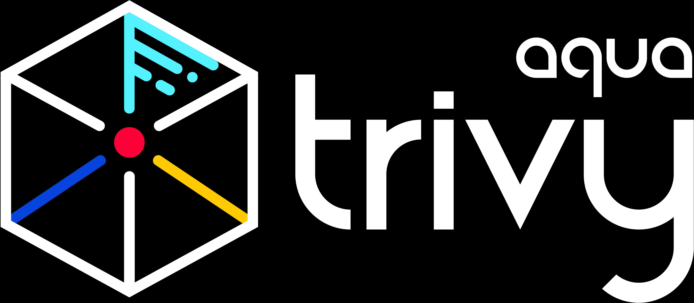


In a multi-service architecture, security is only as strong as the weakest link. Whether it’s an outdated library in a Docker container, a leaked API key in a config file, or a misconfigured permission on the host server, risks exist at every layer.

[Trivy](https://trivy.dev/) (by Aqua Security) is the engine I chose for internal infrastructure validation. It is a full-stack scanner capable of detecting:

* Vulnerabilities (CVEs) in OS packages and language dependencies.
* Misconfigurations in Dockerfiles, Kubernates, etc..
* Secrets (hardcoded passwords, API keys) in my source code.


This article documents how I used Trivy to assess my infrastructure, interpret the results using CVSS, and execute precise remediation.

### Installation & Setup

```
# Via Snap (Linux)
sudo snap install trivy

# Via Docker (Portable)
docker pull aquasec/trivy:canary
```

### Phase 1: The Assessment

**Scanning Docker Images**

My stack consists of multiple services, each with its own attack surface. I scan each image individually to isolate risks.

**List Images:**

`docker compose images`

**Scan a Specific Image:**

`sudo docker run --rm aquasec/trivy image postgres:17.4`

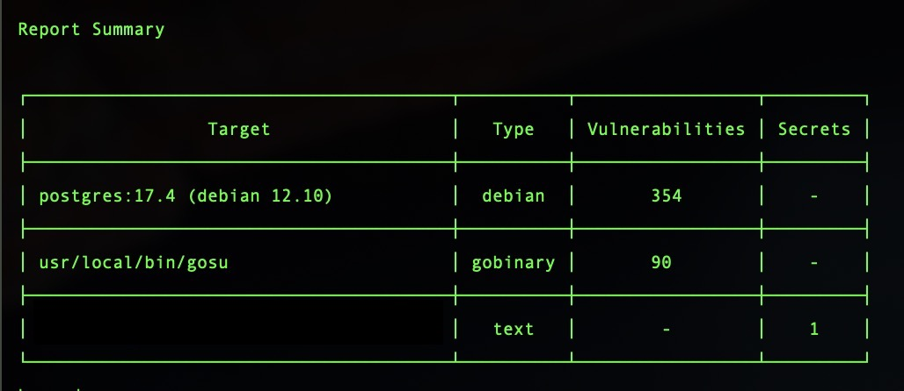


**Scanning the Host Filesystem**

Containers are only part of the story. The host OS itself must be secured.

```
# Mounts host root into the scanner container
sudo docker run --rm -v /:/rootfs aquasec/trivy fs /rootfs

```
**Warning:** Scanning the entire root filesystem is resource-intensive. In production, I restrict this to critical directories (e.g., /etc, /opt).

### Scanning for Misconfigurations

Beyond CVEs, I scan for hardcoded secrets and bad configurations.

```
# Scan for secrets
trivy fs --scanners secret .

# Scan for misconfigurations
trivy config .
```

### Detection Capabilities:

* Insecure Docker Compose settings
* Exposed ports
* Weak permissions
* Hardcoded API keys, tokens, passwords


## Phase 2: Understanding the Results (CVSS Analysis)

Before fixing vulnerabilities, we must understand how to prioritize them. Trivy reports include **CVE IDs** and **CVSS scores**, but interpreting them requires understanding the underlying standards.


### The SCAP Standard
[Security Content Automation Protocol](https://csrc.nist.gov/projects/security-content-automation-protocol) (SCAP) ( release 1.4)


* [**Common Configuration Enumeration (CCE):**](https://ncp.nist.gov/cce): Provides a standard nomenclature for discussing system configuration issues.
* [**Common Platform Enumeration (CPE):**](https://csrc.nist.gov/Projects/security-content-automation-protocol/Specifications/cpe): Describes product names and versions
* [**CVE (Common Vulnerabilities and Exposures**)](https://www.cve.org/): Unique identifiers for software flaws
* [**CVSS (Common Vulnerability Scoring System**)](https://nvd.nist.gov/vuln-metrics/cvss): Measures severity (0–10)
* [**XCCDF (Extensible Configuration Checklist Description Format**)](https://csrc.nist.gov/Projects/security-content-automation-protocol/Specifications/xccdf): A language for specifying checklist and reporting checklist results.
* [**Open Vulnerability and Assesment Language (OVAL):**](https://oval.mitre.org/) : A language for specifying low-level testing procedures used by checklist.


## Deep Dive: Manual CVSS Calculation

To understand risk, I manually calculated the score for a critical finding in my PostgreSQL container: [CVE-2025–68973](https://avd.aquasec.com/nvd/2025/cve-2025-68973/) (affecting dirmngr/GnuPG).

**The Vulnerability**

* Package: dirmngr
* Version: 2.2.40-1.1 (Vulnerable)
* Fixed Version: 2.2.40-1.1+deb12u2

**The CVSS 3.1 Vector:** AV:L/AC:H/PR:L/UI:N/S:U/C:H/I:H/A:H

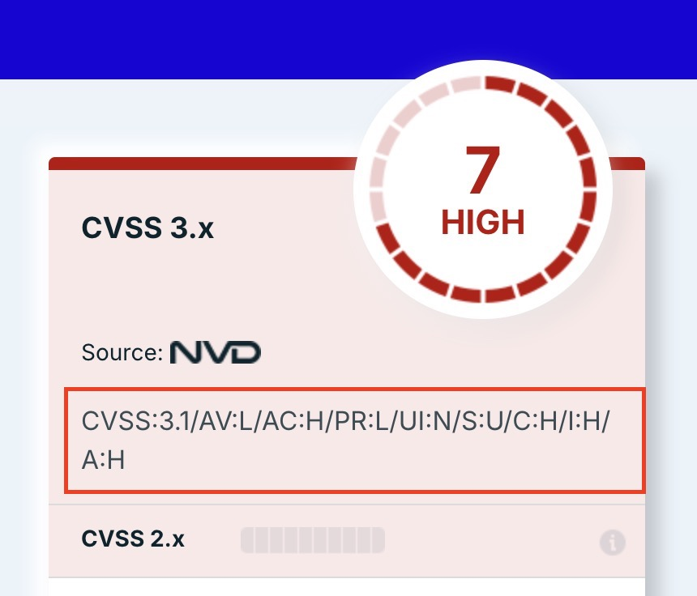

We start by rating the vulnerability on 8 differents measures.

* The first 4 measures evaluate the exploitability of the vulnerability.
* The last 3 the impact of the vulnerability


# Exploitability Metrics

### Attack Vector (AV)

Describes how an attacker would exploit the vulnerability.

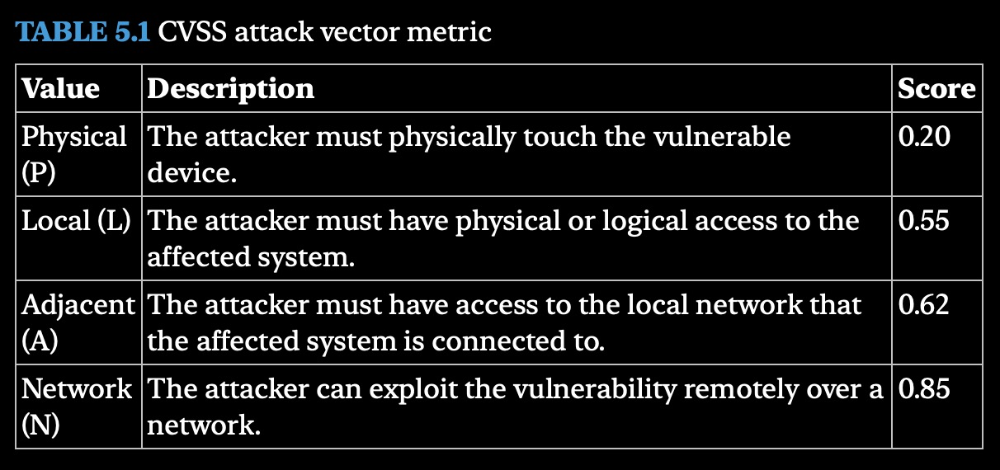


### Attack Complexity Metric (AC)

Describes the difficulty of exploiting the vulnerability

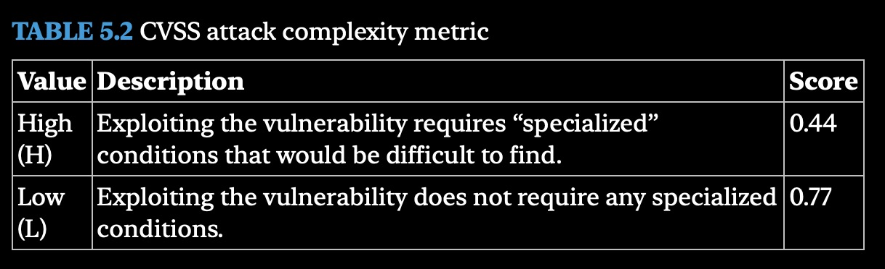

### Privileges Required Metric (PR)

Describes the type of account access that an attacker would need to exploit a vulnerability

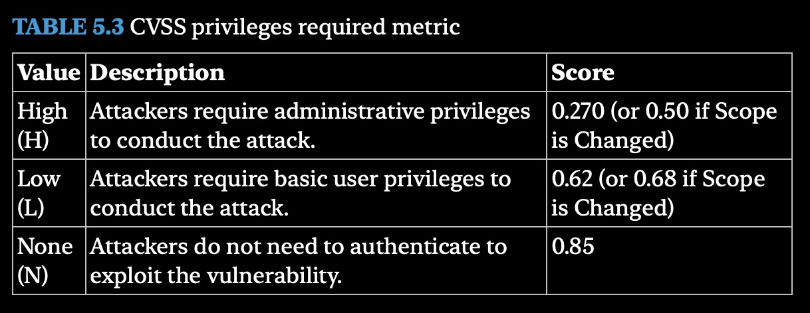

### User Interaction Metric (UI)

Describes whether the attacker need s to involved another human in the attack.

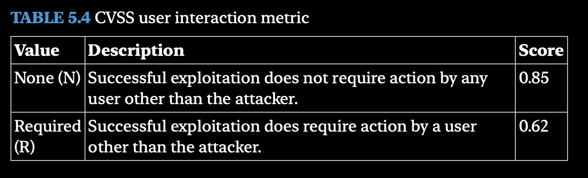

# Impact Metrics

### Confidentiality Metric  (C)

Describes the type of information disclosure that might occur if an attacker successfully exploits the vulnerability.

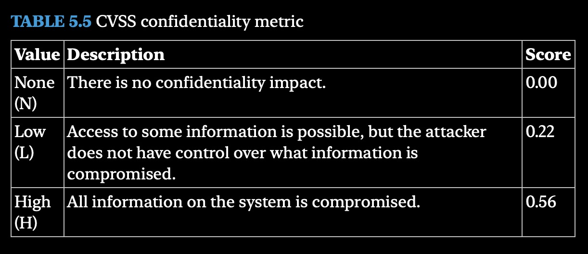

### Integrity Metric

Describes the type of information Alteration that might occur if an attacker successfully exploit the vulnerability.

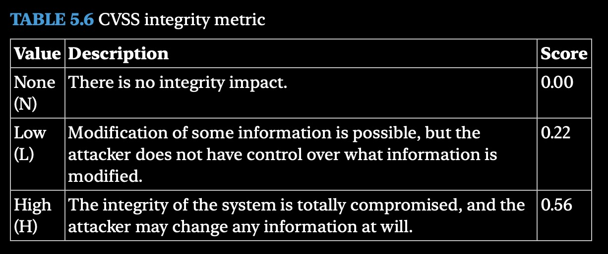

### Availability Metric 

Describes the type of disruption that might occur if an attacker successfully exploit the vulnerability.

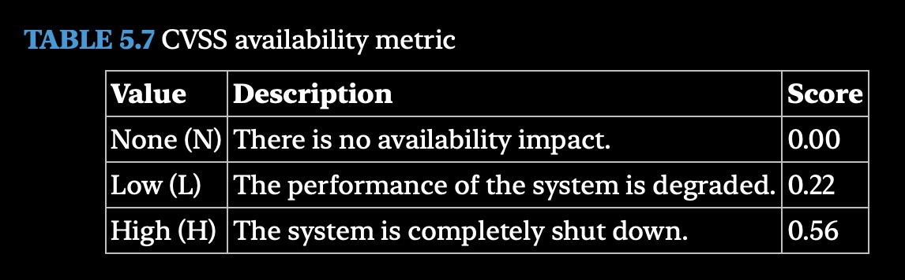


# Total Scope (S)


### Scope Metric

Describes whether the vulmnerability can affect system components beyond the scope of vulnerability.

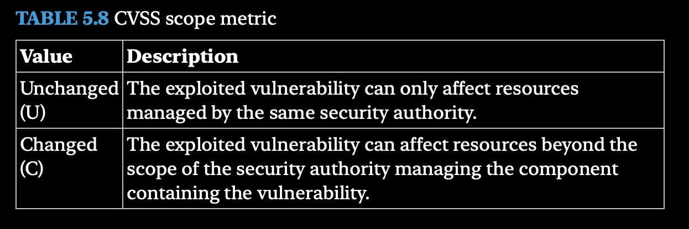


# Interpreting the CVSS Vector

For learning purposes I'll interpreted manually Vulnerability find early with trivy:  **CVE-2025-68973**


**The CVSS 3.1 Vector**: AV:L/AC:H/PR:L/UI:N/S:U/C:H/I:H/A:H

>**Note:** this is based on version CVSS 3.1
> Current Version: 4.0

* Attack Vector: Local (score: 0.55)
* Attack Complexity : High (score: 0.44)
* Privileges required: Low (score: 0.62 ( or 0.68 if Scope is change) 
* User Interaction: None (score: 0.85)
* Scope: Unchanged
* Confidentiality: High (score: 0.56)
* Integrity: High (score: 0.56)
* Availability: High (score: 0.56)

#### Summarizing CVSS Scores

I calculate the CVSS base score ; Which is a single number representing the overall risk posed by the vulnerability.

### Step A: Impact Sub-Score (ISS)

```
ISS = 1 - [(1 - C) × (1 - I) × (1 - A)]
ISS = 1 - [(1 - 0.56) × (1 - 0.56) × (1 - 0.56)]
ISS = 1 - [0.44 × 0.44 × 0.44] = 1 - 0.085 = 0.915
```

### Step B: Impact Score (Since Scope is Unchanged, multiplier is 6.42)

```
Impact = 6.42 × ISS = 6.42 × 0.915 = 5.87
```


### Step C: Exploitability Score

```
Exploitability = 8.22 × AV × AC × PR × UI
Exploitability = 8.22 × 0.55 × 0.44 × 0.62 × 0.85 = 1.05
```

### Step D: Base Score

```
BaseScore = RoundUp(Impact + Exploitability)
BaseScore = 5.87 + 1.05 = 6.92 → 7.0
```

### Risk Assessment & Contextual Analysis

Based on the CVSS calculation, this is a **HIGH severity** vulnerability **(Score: 7.0)**. The potential impact on Confidentiality, Integrity, and Availability is total if the vulnerability is exploited.

**Contextual Risk Analysis**: However, a raw score doesn’t tell the whole story. I must evaluate the likelihood of exploitation in my specific environment:

* **Attack Vector is Local:** The vulnerability requires an attacker to already have local access to the container or host.
* **Defense-in-Depth**: My infrastructure is already hardened:
* **Network Isolation:** The container is not exposed to the public internet (protected by UFW/WireGuard).
* **Least Privilege:** The container runs as a non-root user (after remediation).
* **Access Control:** SSH access to the host is restricted to key-only authentication.

**Conclusion:** While the **theoretical risk** is High, the practical risk in my current setup is **Low to Medium** because an attacker would first need to bypass my network and access controls to even reach this point.

**Decision:** Despite the lower practical risk, **I will still patch immediately for learning purposes and for security best practices.**

* **Reasoning:** In security, we assume the perimeter could be breached. If an attacker gains a foothold elsewhere, this vulnerability becomes a critical pivot point for lateral movement.
* **Strategy:** Patching now eliminates this risk vector entirely, ensuring my defense-in-depth strategy remains robust against future threats.

**Lesson:** CVSS scores provide a baseline, but context determines priority. Always analyze how an attacker could reach the vulnerable component before deciding on the urgency of the fix.


Note: For production use, I verify with the [CVSS calculator](https://www.first.org/cvss/calculator/4.0#CVSS:4.0/AV:L/AC:H/AT:N/PR:L/UI:N/VC:H/VI:H/VA:H/SC:N/SI:N/SA:N). ( No need to do the maths 😐)

Categorizing CVSS Base Scores

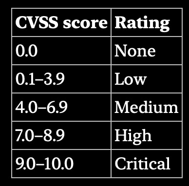


>CVSS always rounds UP, never normally.

### Phase 3: Remediation

Finding a vulnerability is useless without fixing it. Here is my standard operating procedure for patching.

### **Example 1:** OS Package Vulnerability (Docker Image)

Trivy Output: [dirmngr:](https://www.gnupg.org/documentation/manuals/dirmngr/)

```
dirmngr │ CVE-2025-68973 │ HIGH │ fixed │ 2.2.40-1.1 │ 2.2.40-1.1+deb12u2
```

**Breakdown:**

* **Package:** dirmngr
* **Location:** Inside the container’s OS layer
* **Action:** Update the image with the fixed version


### Patch Procedure:

```
# 1. Stop current services
docker compose down

# 2. Remove old images to force a fresh pull
docker image prune -a

# 3. Pull the latest images (with patched packages)
docker compose pull

# 4. Recreate services
docker compose up -d

```

### Verify the Patch:

```
# Enter the container
docker exec -it <postgres-container> bash

# Check the package version
dpkg -l | grep dirmngr
```

**Expected Output:** 2.2.40-1.1+deb12u2 (The fixed version)

Re-Scan to Confirm:

```
sudo docker run --rm aquasec/trivy image postgres:17.4

```
### Example 2: Weak Configuration (Dockerfile Hardening)

```
cd /path/to/project
trivy config .
```

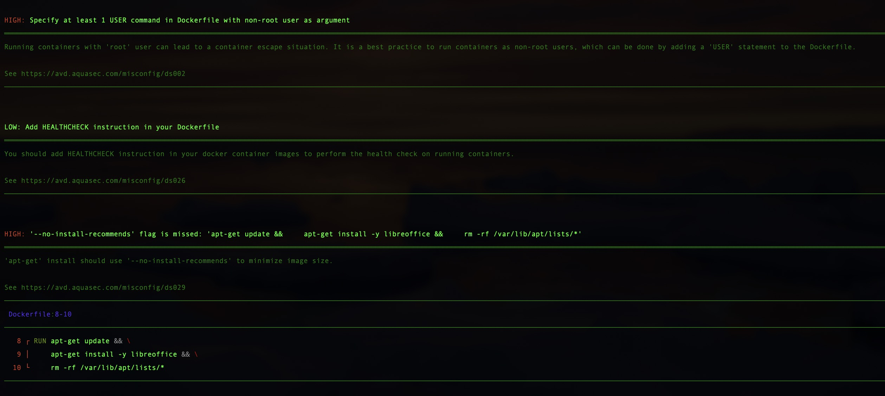


so I applied the suggestions:

```
#Dockerfile
FROM node:22-bullseye

WORKDIR /app

# Install dependencies with minimal footprint
RUN apt-get update && \
    apt-get install -y --no-install-recommends libreoffice curl && \
    rm -rf /var/lib/apt/lists/*

# Copy dependency files first
COPY package.json pnpm-lock.yaml ./

# Install pnpm + dependencies
RUN npm install -g pnpm && \
    pnpm install --frozen-lockfile

# Copy rest of the app
COPY . .

# Fix ownership for node user
RUN chown -R node:node /app

# Switch to non-root user
USER node

EXPOSE [port]

# Healthcheck
HEALTHCHECK --interval=30s --timeout=5s --start-period=10s \
  CMD curl -f http://localhost:[port] || exit 1

CMD ["node", "src/index.js"]

```

### Benefits:

* Runs as non-root user (reduces attack surface)
* Uses **--no-install-recommends** (smaller image)
* Includes **HEALTHCHECK** (better observability)
* **node user**: It is important to understand that the node user referenced in the Dockerfile does not exist on my host system. It is a user created exclusively within the container's isolated environment.
* **Filesystem Scope:** This user only has permissions to access files inside the container’s layers (e.g., /app, /tmp). It has no access to my host's /etc, /var, or other system directories unlessI explicitly mount them (which I avoid for security).

Apply Safely on my system:

```
# Rebuild
docker build -t your-app .

# Stop and remove old container
docker stop your-container
docker rm your-container

# Run new container
docker run -d \
  --name my-app \
  --env-file .env \
  -p 127.0.0.1:[port]:[port] \
  --restart unless-stopped \
  my-app
  
```

**Verify No Misconfigurations:**

`trivy config .`

```
# Output: No HIGH/MEDIUM/LOW findings triggered 
2026-04-23T16:14:54Z INFO Misconfiguration scanning is enabled
2026-04-23T16:14:55Z INFO Detected config files num=1
```

**Note:** Vulnerability scanners are useful but not foolproof. Always verify critical findings manually.

  
## Common Vulnerability Types

#### 1. Outdated Packages | Patch Management

```
#Examples
# OS Level
sudo apt update
sudo apt list --upgradable
sudo apt upgrade -y

# Python
pip list --outdated

# Node.js (inside container)
pnpm outdated
pnpm update --latest
```

### Weak Configuration

Vulnerability Scan may also highlight weak configuration, settings on systems

* The use of Default settings  that pose a security risk
* The presence of default credentials or unsecured accounts.
   * normal user account
   * unsecure root accounts with administrative privileges
   * Accounts with lack of strong authentication 	
* Open service ports that are not necessary to support normal Systems operations.
  * A system in general should expose only the minimun number of services necesary to carry out its function.
* Open permissions that allow users access that violates the principle of least privileges


3. Legacy Platforms
4. Error Messages
5. Insecure Protocoles
6. Weak Encryption

# Phase 4: Verification
Never trust the scan blindly. Always verify:

* Check Package Versions: Confirm the fixed version is installed
* Re-Scan: Run Trivy again to confirm the vulnerability is gone
* Test Services: Ensure the application still works after updates
* Check Logs: Monitor for any errors during the transition


This assessment was performed manually for learning purposes. In a production environment, security must be continuous and automated.

**Planned Automation (Ideas):**

* CI/CD Integration: Add trivy fs --scanners vuln,secret,misconfig . to GitHub Actions
* Scheduled Scans: Run Trivy via Cron daily/weekly
* Alerting: Pipe findings to Slack/Email when Critical/High vulnerabilities are detected
* Auto-Patching: Trigger automated rebuilds when vulnerabilities are found


**Conclusion**
Comparing my experience with Trivy to industry giants like Nessus offers a valuable perspective. Nessus remains the undisputed gold standard in enterprise security, widely cited in textbooks and platforms for its depth, comprehensive reporting, and ability to scan complex environments. I am confident that in a large-scale corporate setting, Nessus would uncover nuances and provide the granular reporting that a single-binary tool like Trivy might not yet match.

However, for my journey as a self-taught, Trivy provided something invaluable: accessibility.

* **Cost-Free Exploration:** It allowed me to test, break, and rebuild my infrastructure without the barrier of expensive licenses or complex activation keys.
* **Full-Stack Visibility:** I learned to scan not just for CVEs, but for secrets and misconfigurations, giving me a holistic view of my Docker and System security.
* It is a starting point, not the finish line.

Scanning tells me where the cracks might be. But does the wall actually hold? That is the question for the next phase.

**Be your own guru.**


 	


