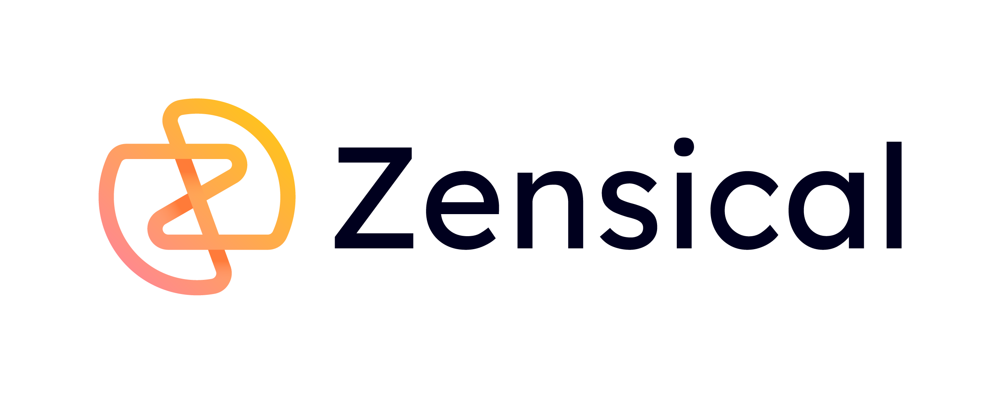

# Building a Technical Documentation Site with Zensical

I was looking for the best way to keep my documentation accessible and organized—rather than just scattered across my local hard drive



I keep a lot of notes. Homelab configs, hardening checklists, the exact `rsync` flag I most of the time forget. For a long time those lived scattered across Medium drafts and random GitHub gists. I wanted one home for them: searchable, version-controlled, mine.

I picked [**Official Zensical**](https://zensical.org/) a modern static site generator. I write Markdown, it gives me a polished, searchable docs site. 


## Installing Zensical

Zensical is a Python tool, so I keep it in a virtual environment.

```bash
mkdir docu && cd docu
python3 -m venv .venv
source .venv/bin/activate
pip install zensical
```

The `.venv` keeps Zensical and its dependencies isolated from the system Python. If you've ever broken a system Python by installing packages globally, you know why this matters.

## Initializing the project

```bash
zensical new .
```

This scaffolds the project:

```
docu/
├── docs/
│   ├── index.md
│   └── markdown.md
└── zensical.toml
```

`docs/` is where my Markdown lives. `zensical.toml` is the control panel for the whole site.

Confirm it builds before changing anything:

```bash
zensical build
```

That produces a `site/` folder the static output I'll eventually deploy.

## Configuring `zensical.toml`

This is where the site takes shape. Here's the config I landed on:

```toml
[project]
site_name = "Documentation"
site_description = "Security notes, homelab setup & methodology"
site_author = "Jane Doe"
site_url = "https://docu.yourdomain.com"

# Custom CSS to match my portfolio. Path is relative to docs_dir.
extra_css = ["stylesheets/extra.css"]

# Enables icons + emojis (shortcodes like :rocket:)
[project.markdown_extensions.attr_list]
[project.markdown_extensions.pymdownx.emoji]

[project.theme]
palette.scheme = "slate"      # dark mode by default
palette.primary = "custom"    # hand color control to my CSS
palette.accent = "custom"
font.text = "JetBrains Mono"
font.code = "JetBrains Mono"
```

The two lines that matter most for theming:

- `palette.scheme = "slate"` turns on dark mode.
- `palette.primary = "custom"` and `palette.accent = "custom"` tell Zensical to *stop* applying its own color and let my stylesheet drive everything.

The `markdown_extensions` block enables emoji and icon shortcodes useful if I want a little 🚀 or a shield icon in my pages.

## Theme it with `extra.css`

Zensical is built on Material's design system, which exposes its colors as **CSS custom properties**. The clean way to re-skin it is to override those variables for the dark scheme *not* to fight every element with brute-force `!important` rules.

Create `docs/stylesheets/extra.css`:

```css
/* Match the portfolio by overriding Material's dark-scheme variables */
[data-md-color-scheme="slate"] {
  --md-default-bg-color:        #111113;
  --md-default-fg-color:        #d4d4d4;
  --md-default-fg-color--light: #6b7280;
  --md-default-fg-color--lighter: #6b7280;
  --md-default-fg-color--lightest: #252528;
}

<!-- rest omitted -->
```

Swap the hex values for your own palette. The principle is what matters: **override the design tokens, not the elements.** Working *with* the framework keeps your CSS short and stops the theme from clawing its colors back on the next update.

## Writing my content

Drop Markdown files into `docs/`. Each page can carry frontmatter:

```md
---
title: Welcome
---

# ~/notes

Everything I figure out, written down so I don't have to figure it out twice.
```

With the emoji extension enabled, I can sprinkle icons and emojis right in the body `:material-shield-lock:`, `:rocket:`, or a plain 🚀 in a heading to give pages a little personality without touching the theme.

## Preview locally

Build the static output and serve it with Python's built-in server:

```bash
zensical build
zensical serve
```

Open `http://localhost:8000`. Serving the built `site/` folder directly is exactly how your production web server will treat it, so what you see here is what you'll ship.

## Publishing

The `site/` folder is plain static files, so hosting is simple any static host or your own server works. I run mine behind Caddy, deployed automatically through [GitHub Actions](https://docu.bytegirl.be/tools/zensical/Github_Zensical/). Caddy handles HTTPS automatically via Let's Encrypt, plus adds security headers with minimal config.

```
docu.yourdomain.com {
    root * /my/folder/docu
    file_server
    encode gzip
}

```

HTTPS server automatically. Push your Markdown, let CI build and sync the `site/` folder, and your docs are live.

[Adding security headers](https://github.com/rootGirly/Projects/tree/main/htaccess) 

---

## Result


Honestly, this setup is an excellent way to maintain my configuration documentation while strictly adhering to my threat model. I own the entire pipeline. Plus, I discovered Zensical it's surprisingly easy to configure, the documentation is straightforward, and automating the build with GitHub Actions means my knowledge base stays version-controlled and up-to-date without manual effort.

**Be your own guru, and don't forget to cheer for yourself!**

